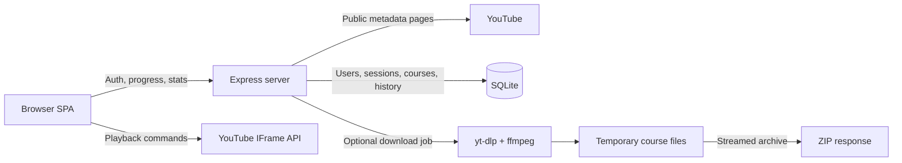

<div align="center">

# FocusTube

**Turn YouTube playlists and individual videos into focused, trackable courses.**

No recommendation feed. No comments. No unrelated rabbit holes.

[](https://nodejs.org/)
[](https://expressjs.com/)
[](https://www.sqlite.org/)
[](#validation)

</div>


*The screenshots show an earlier light-theme build with sample data. The feature guide below describes the current release, including Grid/List views, invitation-only accounts, Settings, and the updated notes pane.*

## Overview

FocusTube is a local-first web application that converts a public YouTube playlist or a single YouTube video into a distraction-free learning workspace. It combines a custom player, course progress, timestamped notebooks, profiles, streaks, analytics, certificates, and data export in one self-hosted application.

Discover videos and playlists by keyword, or import a YouTube link directly. The application does not require a YouTube Data API key. Search results, playlist data, and video metadata are read from public YouTube pages, while playback uses the YouTube IFrame API.

### What you can do

| Feature | What it does |
| --- | --- |
| Find and organize courses | Search YouTube or paste a link, choose Grid or List, pin favorites, and filter by learning progress. |
| Watch with fewer distractions | Use a focused player with saved progress, chapters, captions, playback controls, and a collapsible lesson list. |
| Take notes beside the video | Write formatted notes in a resizable, softly tinted area. In Read mode, select a paragraph to return to the video moment it came from. |
| Keep a course notebook | Review notes from every lesson together, recover unsaved drafts, and export Markdown or print to PDF. |
| Ask about a video | When enabled, stream transcript-grounded text answers and preview summaries before explicitly appending them to notes. |
| Capture from Chrome | When enabled, save a selected YouTube video from the extension to one chosen FocusTube environment without opening the app for every save. |
| Plan your learning | Create tasks, course checklists, and ordered roadmaps, then track progress, watch time, and streaks. |
| Manage a private account | Join with an invitation and email code, sign in with email or username, and update your profile or password in Settings. |
| Manage member invitations | Administrators create, list, edit expiry, and revoke member links; new links default to seven days. |
| Choose your workspace | Switch between light and dark themes. The browser remembers your navigation, course-panel, and appearance choices. |
| Keep ownership of your data | Export or restore courses, notes, planning data, and learning history without exporting passwords or session tokens. |
| Monitor your own installation | Administrators can view usage and health. Optional private metrics and logs can connect to an operator-configured monitoring service. |
| Report bugs and ideas | Use public/private forum threads, follow up with replies, and see administrator status updates. |

Video chat and extension capture are disabled by default. Their implementation is not a claim of hosted or real-provider verification; see the [V1 release contract and gates](docs/v1-release.md).

**Not included yet:** Google/GitHub sign-in, the replacement Board view, forgotten-password recovery, and self-service account deletion. Coming-soon controls do not call a sign-in provider. Course downloads remain an optional backend API, not a website button.

## Documentation

- [timeline.html](timeline.html): newest-first feature history, commit links, changed files, branch stages, bugs, and pending work.
- [docs/timeline.md](docs/timeline.md): timeline provenance and the `npm run timeline:update` refresh workflow.
- [Quick start](#quick-start): local installation, Docker, and the first-run workflow.
- [docs/youtube-search.md](docs/youtube-search.md): keyword search, filters, course creation, API examples, troubleshooting, and contributor verification.
- [docs/invite-only-auth-spec.md](docs/invite-only-auth-spec.md): account rules, invitations, email verification, migration, and acceptance checks.
- [docs/v1-release.md](docs/v1-release.md): canonical chat, confirmed-note, capture, and invitation contract; reported verification, pending gates, demo, and rollback.
- [docs/monitoring.md](docs/monitoring.md): private admin usage dashboard, structured logs, private metrics, opt-in Grafana collection, external uptime and alert setup.
- [public/policies.html](public/policies.html): public Terms and Privacy; [docs/policies-draft.md](docs/policies-draft.md) retains the operator review checklist.
- [Configuration](#configuration): ports, host validation, and hosted deployments.
- [API overview](#api-overview): metadata, authentication, search, profile, and download endpoints.

## Historical screenshots

<table>
  <tr>
    <td width="50%">
      
      <br /><strong>Course player</strong><br />Custom controls, progress, chapters, captions, quality, and completion tracking.
    </td>
    <td width="50%">
      
      <br /><strong>Learning dashboard</strong><br />Watch time, site time, streaks, course focus, heatmap, and history.
    </td>
  </tr>
  <tr>
    <td width="50%">
      
      <br /><strong>Account access</strong><br />Earlier sign-in screen, before invitation-only registration.
    </td>
    <td width="50%">
      
      <br /><strong>Earlier profile dialog</strong><br />Guest upgrade and JSON export before the current Settings and verified-email flows.
    </td>
  </tr>
</table>

## Features

The interface supports light and dark themes, with teal actions and restrained coral brand/streak accents. It follows the system theme until you save a choice. IBM Plex Sans, Manrope, and Lucide icons are served locally. Navigation has an optional glass effect; reading and writing surfaces stay solid.

### Course creation

- Searches YouTube by keyword with **All**, **Videos**, **Playlists**, and **Courses** filters, without an API key.
- Result-type filters appear only for non-empty keyword input. Empty input, whitespace, and direct video/playlist links hide them. Typing does not start a request; Search, Enter, or choosing a result type does. Clearing the input cancels pending search and removes its results without changing library filters.
- Shows up to 24 results with thumbnails, creators, available descriptions or lesson previews, durations, and playlist counts.
- Creates courses from search results without leaving the results. Saved items show **In library** and **Open course** instead of being added again.
- **Courses** refines the query with `full course` unless it already contains `course`; it can return videos and playlists. A **Course** label on an individual result reflects YouTube's metadata, not an automatic quality or topic-match guarantee.
- Accepts public YouTube playlist URLs, watch URLs, `youtu.be` links, Shorts, live and embed URLs, and playlist IDs for direct import.
- Treats plain text, including raw video IDs, as a search so eleven-character keywords are not mistaken for links. Use a video URL for immediate import; the metadata API still accepts raw video IDs directly.
- Supports both full playlists and single-video courses.
- Handles long playlists through YouTube continuation tokens.
- Skips private and deleted videos.
- Refreshes playlists manually or automatically to discover newly added videos without losing progress.

### Course library

- Browse the same courses in **Grid** or **List** using the layout icons. The choice is saved in the profile; legacy Board preferences fall back to Grid. List rows retain thumbnails, titles, creators, lesson counts, durations, status, completion progress, and bookmark/remove actions, with wrapped metadata on small screens.
- Filter by **All courses**, **Not started**, **In progress**, or **Completed**. Not started means no recorded playback or completed lessons. In progress includes positive saved playback time or partial lesson completion. Completed requires every current lesson to be marked complete and at least one lesson to exist; adding lessons reopens a completed course. Opening a course alone does not mark it started.
- **Pinned** is independent of progress status and combines with it. Both layouts keep pinned courses first, then newest additions. Status-option counts reflect the pinned filter; summary totals describe the entire library. The results count shows matching courses out of all saved courses, and an empty filtered view offers **Clear filters**.
- Library status and bookmark filters survive in-app navigation and layout changes, but reset on reload or sign-out. Clearing YouTube search does not clear these library filters.
- Total duration is calculated from current lesson metadata, without fetching every video on library load. Complete metadata shows a duration; partial metadata shows **At least**, and absent metadata shows **Duration unavailable**. Hover over the duration for its available detail.
- Course titles and thumbnails open the player. Bookmark and remove controls are separate keyboard-accessible buttons; rebuilding the results preserves useful keyboard focus. Removing a course retains its notebook.

### Distraction-free player

- The navigation toggle sits immediately before the FocusTube logo in the taskbar on every signed-in screen. During playback it controls Course content, and the taskbar shows the course title, total duration, streak, and profile. The logo returns to the library. Notes and Ask sit beside the completion button below the video; no course-tools rail remains. Playlist refresh stays inside Course content. Very narrow screens keep the app symbol without its wordmark.
- **Ask** opens private, transcript-grounded video chat when the administrator enables the pilot. It shares the study area with Notes without discarding the note editor or drafts. Chat is disabled by default; see [Video chat](#video-chat) for setup, permission requirements, costs, and limitations.
- Custom play/pause, previous/next, seek, +/-10 seconds, volume, mute, and fullscreen controls.
- Playback speed menu from `0.25x` to `4x`.
- Quality selector populated from the levels available to the embedded player.
- YouTube captions toggle and keyboard shortcuts.
- Pausing lightly dims the video. When the toolbar is hidden, a centered Play symbol offers resume; when the toolbar is visible, only its Play symbol is shown. Playback events and periodic state checks keep that icon synchronized, and buffering clears a stale paused overlay immediately. Player controls appear on pointer activity, keyboard focus, or playback changes, then hide when idle. Start, completion, and error states have their own actions.
- On touch devices, the first video tap reveals hidden controls without pausing. Player buttons keep 44px tap targets, and speed/quality selects have wider tappable areas. The controls remain visible while a touched select is active; choosing a value resumes the normal hide timer. Compact toolbars scroll horizontally without shrinking their controls.
- Remembers playback position and preferred speed per course.
- Keeps playback inside the official YouTube embed. YouTube may still display its own paused-frame elements; FocusTube does not promise to remove every embedded overlay.

> [!NOTE]
> YouTube may clamp embedded playback to `2x` and may override a requested quality when bandwidth or content restrictions require it. FocusTube detects the applied speed and reports the actual value.

### Learning workflow

- **Course content**, immediately before the app logo in the taskbar, opens the current course's lesson list, including numbered lessons, durations, watched status, progress, remaining time, checklist, and certificate. Desktop places it beside the player; at 1200px and below it overlays the player and closes with its close button, Escape, the backdrop, or lesson selection. Keyboard focus returns to the taskbar toggle when the panel closes. Collapsing it leaves no icon rail or reserved left column.
- Below the video, **Mark complete / Completed**, **Notes**, and **Ask** share one action group. Notes toggles the existing writing pane; Ask opens video chat for approved accounts when configured. Narrow player panes put this group below the lesson title without shrinking touch targets.
- Manual and automatic completion tracking.
- Per-course progress, time remaining, and completion timestamps.
- Automatic next-video countdown.
- Full descriptions with safe external links.
- YouTube chapters and description timestamps as clickable seek targets.
- Chapter markers on the seek bar and live current-chapter display.
- Confetti rewards and a downloadable PDF completion certificate.

### Video chat

V1 is streamed text chat using the official Google Gen AI SDK with `gemini-3.1-flash-lite`, minimal thinking, no tools, and no automatic generation retries. It answers from permitted spoken captions, not unseen slides, code, diagrams, audio, or video frames. Citation validation checks that referenced segments exist, not that every claim is correct. This is not voice chat, live-stream ingestion, or chat with other viewers.

Configure these server environment variables only after approving provider billing and transcript processing:

| Variable | Default | Purpose |
| --- | --- | --- |
| `VIDEO_CHAT_ENABLED` | `0` | Set to `1` to enable the pilot. |
| `GEMINI_API_KEY` | Unset | Server-side Google API key; never sent to the browser or included in exports. |
| `VIDEO_CHAT_MODEL` | `gemini-3.1-flash-lite` | Only this model is accepted because the spending policy uses its rates. |
| `VIDEO_CHAT_MONTHLY_BUDGET_USD` | Native/local `5`; production Compose `4`; development Compose `1` | UTC-month generation budget shared by accounts in one database; `0` disables generation. |
| `VIDEO_CHAT_ALLOWED_USER_IDS` | Empty | Comma-separated registered account IDs. Administrators are allowed; guests are not. |
| `VIDEO_CHAT_AUTO_CAPTIONS` | `0` | Opt in to best-effort public YouTube caption retrieval only when permitted. |

The app does not load `.env` automatically; native runs need an explicitly supplied environment or Node's `--env-file` option. All three Compose files now pass these variables into the container. Keep secrets out of tracked files. Hosted features are not enabled automatically.

Production and development use separate SQLite ledgers. The `$4 + $1` defaults are an allocation, **not a globally enforced $5 cap** across environments or a shared API key. A common `.env` or shell value for `VIDEO_CHAT_MONTHLY_BUDGET_USD` overrides both defaults; the example's `5` would give each deployment its own $5 limit. Use separate environment settings, account for any local $5 instance too, and configure provider-side limits. Recheck the effective nonsecret settings before enabling billing.

- Confirm source permission before loading captions or uploading timed `.srt`/`.vtt` text. Sources are limited to four hours, 1 MiB, and 10,000 ordered segments. Each account can retain 50 active transcripts and 10 MiB of transcript/conversation data. Subtitle parsing uses the `subtitle` package's SRT/partial-WebVTT support.
- Automatic caption access uses `youtube-transcript-plus`, an unofficial interface. Missing tracks, content restrictions, and network/IP blocking can prevent retrieval. There is no private-video credential, cookie/proxy bypass, audio download, or background transcription fallback; upload permitted subtitles instead. Prior local caption probes do not verify this release's hosted coverage.
- After explicit provider consent, the server sends the question, video title, available captured playhead, selected caption context, and conversation context to Google Gemini. Existing notebook content, account credentials, and other videos are not automatically included. Text you put in the question is sent, so do not paste secrets. Google's account-specific data-use and retention terms apply; this is not a locally running model.
- **Current moment** selects caption segments overlapping the window from 120 seconds before to 60 seconds after the playhead captured at Send. A later seek does not retarget the request, and a missing playhead is not treated as zero. **Whole video** uses the full permitted transcript. Normal follow-ups include the last four completed exchanges; older saved turns are not implicit model memory.
- **Discussion** snapshots all completed exchanges in the current UI discussion and their referenced caption segments. The API can bind an explicit set of completed message IDs. It does not silently summarize only the last four or discard earlier selected messages to fit the limit.
- Input counting allows at most 100,000 tokens including a conservative instruction/format allowance; output is capped at 1,024 tokens. Oversized context is rejected with a smaller-scope action, not silently truncated. Questions are limited to 2,000 characters and threads to 100 completed answers.
- Streamed text is **provisional** until the complete JSON, answer, references, and any note proposal pass validation. Only a validated final response is persisted and gets actionable citations or **Add to notes**. Interrupted, blocked, malformed, or unsupported output cannot become an insertable preview. The client negotiates NDJSON; the existing final-JSON response remains available.
- At the rates used by this pilot ($0.25/million input and $1.50/million output tokens, including thinking), 50,000 input tokens plus 500 total output tokens cost about $0.01325. Provider prices can change; verify the [current pricing](https://ai.google.dev/gemini-api/docs/pricing) before enabling the feature. The application cap does not cover other applications using the key, hosting, taxes, or independently enabled services.
- SQLite reserves the maximum generation cost before a call and reconciles usage when available. Failed or canceled calls with unknown provider usage conservatively retain their reservation. Clearing chat, restoring a backup, restarting, or removing an account does not reset spending. The ledger stores identifiers and cost metadata, not transcript or conversation text.
- One answer may be pending per thread, with five requests per account per minute and **20 per account per UTC day**, including administrators. Newly reserved attempts count even if they later fail. The daily cap is hardcoded, not an environment setting. Reusing a request ID never starts a second generation; Stop, disconnect, timeout, source/video changes, and stale sessions are guarded.
- Timestamp buttons use stored segment times rather than model-supplied URLs or seconds, including time zero. If evidence is missing, the UI displays an insufficient-evidence answer. Model output is rendered as text, never raw HTML.
- **Summarize** requests a note proposal for the selected context. **Add to notes** on an existing supported answer opens a preview without another generation. The editable preview names its course/video and sources; only **Append to notes** authorizes insertion. Asking the model to save, or canceling the preview, never writes notes automatically.
- Confirmation appends to the latest note for that exact account/course/video. It preserves existing text, source anchors, Read/Edit mode, and editor history; an immediate Undo removes only the appended group. Source-backed paragraphs use validated source times, including zero; discussion-only text need not have a timestamp. Conflicts, text composition, changed sources, and quotas block unsafe insertion. Stable proposal/block IDs prevent duplicate confirmation or save retries from appending twice.
- **Saved to notes** means the normal notebook write was acknowledged. A failed save keeps the existing local recovery draft and offers retry without regenerating. Cancel before append writes nothing; closing an already appended preview does not undo its note content. Chat and Notes share the study pane without destroying the editor; fullscreen stays video-only.
- Chat is private to an authenticated account/course/video. **Clear chat** removes messages but retains captions; **Remove transcript** removes both. Replacing a source requires confirmation and clears its old conversation. Removing a course preserves its stored chat for backup; archived chats are not listed in a separate UI in this pilot.
- Schema-version-3 backups include transcripts, completed conversations, context, and validated optional proposals, not provider keys or the spending ledger. Older messages without proposals remain accepted. Import checks chat revisions and rejects pending requests. Versions 1 and 2 remain accepted with an explicit chat-clearing warning.

Automated checks use fake providers and intercepted SDK requests, not paid inference. Real structured streaming, HTTPS proxy delivery, answer quality, hosted caption coverage, and provider latency remain release gates in [docs/v1-release.md](docs/v1-release.md).

### Chrome capture

The Manifest V3 extension supports **Chrome 127 or newer in a regular browser profile**. Right-click **Add to FocusTube** on a supported YouTube link/page, or use the toolbar popup and **Save**. Each action targets Production (`https://focustube.neuralnest.co.in`), Development (`https://dev-ft.neuralnest.co.in`), or the temporary **Local testing** preview (`http://127.0.0.1:3110`), never multiple environments. Accounts, databases, connections, and pending operations are separate by environment; each Chrome profile has its own extension storage and sign-in. Use a separate test browser profile for acceptance checks. Incognito, Firefox, mobile extensions, and whole-playlist capture are outside V1.

| Variable | Default | Purpose |
| --- | --- | --- |
| `EXTENSION_ENABLED` | `0` | Enable capture only after the selected HTTPS environment and installed ID are configured. |
| `EXTENSION_ALLOWED_IDS` | Empty | Comma-separated exact 32-character Chrome IDs (`a` through `p`); no wildcard. |
| `EXTENSION_PUBLIC_ORIGIN` | Empty for native/local Compose | Production Compose fixes the production HTTPS origin; development Compose fixes the development HTTPS origin above. |
| `EXTENSION_ALLOW_LOOPBACK_HTTP` | `0` | Native local testing only: opt in to `http://127.0.0.1:3110` with `HOST=127.0.0.1`, `AUTH_ALLOW_LOOPBACK_HTTP=1`, and no trusted proxy. |

Hosted extension use requires one of the two HTTPS environments. Local testing is an explicit exception for the native loopback-only preview, not arbitrary HTTP hosts or ports; other origins, LAN listeners and trusted proxies are rejected. Enabling capture without a supported origin/ID fails startup. Do not add `chrome-extension://` origins to `AUTH_PUBLIC_ORIGINS` or broaden ordinary API CORS. The configured ID permits only enumerated extension endpoints; it is not authentication.

For the running local preview, reload the extension at `edge://extensions` (or `chrome://extensions`), sign in at `http://127.0.0.1:3110`, select **Local testing**, and choose **Connect FocusTube**. Approve access to `127.0.0.1`. Use the local preview account, not the hosted account. Browser host permissions cover that host across ports, but extension code and CSP send requests only to port 3110, and the server additionally requires the loopback opt-in. AI and email remain disabled in this preview.

To retire Local testing, disconnect it first, disable `EXTENSION_ALLOW_LOOPBACK_HTTP` and local capture, remove the `local` entries from the worker/popup/consent/backend origin lists and the popup option, remove `http://127.0.0.1/*` from optional permissions and port 3110 from CSP, then rebuild/reload the package. Production and Development stay intact; do not remove their connections or learning data.

- Permissions are `contextMenus`, `activeTab`, `storage`, and `identity`, plus optional access requested for the selected exact FocusTube host. There is no cookies, history, tabs, scripting, or all-sites permission, content script, or background browsing-history capture. Only the chosen video is captured; title/thumbnail preview is not a copy of the FocusTube profile or browser history.
- Session reuse is tried first through credentialed requests in the same Chrome profile; JavaScript never reads the HttpOnly cookie. If browser cookie policy prevents reuse, **Connect FocusTube** opens first-party sign-in/consent once and uses PKCE S256, state, and the exact Chrome callback. This is a scoped FocusTube connection, not Google sign-in. Per-save app windows are unnecessary; **Open in FocusTube** is optional after a receipt.
- Authorization codes are hashed server-side, single-use, and expire within five minutes. The opaque grant is hashed server-side and permits only minimal identity, capture, and its own disconnect. It expires no later than its parent session and at most 30 days, with no refresh token. Logout, password/email session rotation, browser account/session replacement, disabled/deleted accounts, parent expiry, and successful **Disconnect** invalidate the affected connection. Cookie/grant account or session mismatches require reconnection.
- The grant lives in `chrome.storage.local` with trusted-context access, not sync storage or an encrypted secret vault. PKCE state/verifier live in `chrome.storage.session`. An offline Disconnect pauses saves but cannot promise server revocation until retried successfully; signing out the parent session also invalidates its grant. Removing the extension alone does not confirm server revocation.
- Captures add one unstarted single-video course, preserving progress, settings, notes, chat, and workspace data. Existing matches anywhere in the library return **Already in library**, preferring a standalone match. A receipt and profile-revision increment commit atomically; repeated identical request IDs do not add another course or fetch metadata again. A retained receipt for a subsequently removed course reports that it is no longer present instead of resurrecting it.
- Up to **20 pending operations across environments/accounts** are retained for **24 hours**, bound to their original account/environment before dispatch. Popup closure or worker suspension does not authorize another account's retry. Reopen to Retry or Discard; there is no unlimited background queue. Success requires a server receipt, not merely a local queued item. Server receipts become eligible for bounded cleanup after **30 days**, capped at **10,000 per account / 100,000 per database**; capacity refuses new receipts instead of evicting recent ones. Pending expiry or Discard does not undo a save that may already have committed.

#### Package and install

1. With the existing locked dependencies available, run `npm run extension:package`. [scripts/package-extension.js](scripts/package-extension.js) generates local fonts, Lucide assets, PNG icons and licenses under `extension/assets/`, and writes **`extension/focustube-1.0.0.zip`** for the current manifest. It prints the path, version, SHA-256, and file inventory. The ZIP contains an explicit extension-file allowlist, not server files, secrets, or user data.
2. In a separate regular Chrome test profile, open `chrome://extensions`, enable Developer mode, and **Load unpacked** from the `extension/` directory after packaging (or a fixed directory containing the extracted ZIP). Record the actual installed ID and configure the corresponding server allowlist before enabling capture.
3. Keep that unpacked directory stable between reloads. The current manifest has no public `key`, so the archive does not establish a universal stable Chrome ID across paths/machines. Before wider distribution, establish a stable public manifest key/store identity and allowlist that exact ID; never distribute a private signing key. Store submission/publication is a later gate, not delivered by a ZIP.
4. Permit the selected host from the popup, verify the displayed environment/account, connect if needed, and save a permitted public video. Repeat acceptance separately for both hosted domains and with third-party cookies blocked. Local testing does not verify a hosted deployment. Recorded packaging, browser and runtime coverage is in [docs/v1-release.md](docs/v1-release.md).

### Learning workspace

- Compact navigation, a 50px taskbar row, smaller desktop controls, and tighter notes spacing leave more room for content without reducing text sizes. On phones the taskbar keeps the brand, streak, theme, and profile; Tasks and Sign out remain in the sidebar, and the logo returns to the library. Touch controls retain 44px targets, dividers use hairlines on high-density displays, and focus indicators remain distinct. Browser zoom and notebook print/PDF sizing are unchanged.
- Outside course pages, the taskbar toggle expands or collapses the workspace rail below the header. Expanded navigation shows icons and labels in a 176px rail; collapsed navigation keeps the same controls in a 52px icon rail with hover and keyboard-focus labels. Library, Roadmaps, Notebooks, Tasks, Dashboard, profile controls, and a disabled Board entry remain available. Only the lower pane changes size; the logo and taskbar stay fixed. Course pages omit this rail entirely; their taskbar toggle controls only the lesson list, and returning to the workspace restores its independent navigation preference.
- At 900px and below, workspace navigation defaults to the icon rail unless a preference was saved. Expanding opens a drawer and backdrop below the taskbar, leaving its toggle usable. Escape, the toggle, the backdrop, or choosing a destination closes the drawer; keyboard traversal includes the taskbar toggle and drawer links. Course pages instead use the separate Course content panel. At 360px and below, the taskbar keeps the app symbol without its wordmark to leave room for the toggle, streak, theme, and profile; the logo still returns to the library.
- **Board** is marked **Coming soon** in the global workspace. The previous library Kanban and sprint interface is retired; this entry does not open it. Existing columns, card ordering, overrides, and sprint data are retained rather than deleted.
- Track tasks with notes, priority, due dates, status, and optional course association in the task page or quick panel.
- Add per-course checklists and ordered roadmaps with combined progress and a continue-learning action.
- Save tasks, checklists, and roadmaps in the revisioned profile. Exports and imports continue to include their data and any retained legacy board/sprint data.

### Course notebooks

- Narrow note editors keep formatting tools in one horizontally scrollable row instead of wrapping over the writing area. The heading control uses its native select menu; formatting, keyboard access, and autosave are unchanged.
- Each course has a private notebook with one optional rich-text document per video. Opening an empty editor does not create a saved document.
- Write beside the video, or below it when there is not enough space. The writing area has a soft mint accent inside the blue notes pane, with a darker equivalent in dark mode. Empty, Read, and Edit states share the borderless surface; the editor shows an outline only while focused. Drag the divider to adjust width and the bottom grip to adjust height. Width is bounded to keep the video usable; smaller screens use full-width notes with adjustable height. Dimensions are remembered in this browser when local storage is available.
- Both resize grips support arrow keys, Shift for larger steps, Home/End for limits, and Enter or double-click to reset that dimension. **Notes**, beside the completion button below the video, hides or reopens the pane without discarding edits, dimensions, or Read/Edit mode. On narrow screens, opening Notes dismisses an overlapping lesson list and brings stacked notes into view. Resizing never seeks the video or changes note content. Headings, bold, italic, lists, links, inline code, and code blocks are supported by a locally served Quill editor.
- A new paragraph captures the matching video's playback time when you first type into it. The timestamp is hidden metadata, not visible note text. Wrapped screen lines are not separate paragraphs.
- Editing, formatting, splitting, and undo/redo preserve existing anchors. New notes written without a matching ready player have no timestamp; the app never guesses one from saved progress.
- Notes open in **Read** mode. Click or keyboard-activate a paragraph to open its source moment without switching to Edit. Choose **Edit** explicitly to write; video changes preserve your selected mode. Authored hyperlinks retain their own destination.
- Open **Course notebook** while watching, or **Notebooks** in the library, to read all written video documents without starting the player.
- Notes autosave after 800 ms of inactivity. **Saved** means the server acknowledged that document. Failed saves retain a per-profile, per-tab local draft for reload recovery when browser storage is available. Conflicting edits require **Keep my draft** or **Use saved version**; they are never silently merged.
- Playlist changes and course removal do not delete notes. Removed courses remain as archived notebooks. **Delete notebook** explicitly clears their documents. Guest notes follow the existing 90-day inactive-profile retention policy.
- **Export Markdown** creates one portable course document with video source links. **Print / Save PDF** opens the browser print dialog with a clean notebook layout. Code blocks and paragraphs containing authored links use separate Source links where necessary. Link destinations include playback seconds even though displayed text has no time labels.

Limits are 256 KiB, 2,000 paragraphs, and 10,000 document operations per video; 5 MiB of active note content and 20,000 distinct video-note keys per profile. Cleared records keep small revision markers to prevent stale tabs from resurrecting deleted notes. Notes are stored separately from board/task data and have independent save revisions. Manual note-taking uses no AI/transcript service or external editor CDN. Optional chat proposals use the explicit preview-and-append flow above; existing notebooks are not sent to the model by default.

### Profiles and persistence

- The profile button opens **Settings**, with separate Account, Appearance, Data, Terms & Privacy, and administrator-only sections. Account details support display-name editing and adding/changing a username. Username changes require the current password; uniqueness is case-insensitive and enforced atomically on Save. Existing user IDs, sessions, email verification and learning data stay intact. Basic [Terms and Privacy](public/policies.html) are public without sign-in and linked from Settings and account access. The original [policy draft and deployment checklist](docs/policies-draft.md) remain available for operator/legal review; the baseline notices are not a compliance certification.
- **Account > Change password** requires the current password, a different new password of 8-128 characters, and matching confirmation. Credentials and sessions rotate in one transaction: all old sessions are revoked, the current browser receives a replacement cookie, and pending account email challenges are cleared. Learning data and email verification stay intact. Five attempts per account per 15 minutes are allowed; password values are never saved to browser storage. Forgotten-password recovery is not included.
- Course content and notes start closed unless an explicit choice was saved for that account and course. Their choices remain independent of the workspace rail preference; old course-tools rail preferences are no longer used. Browser layout/appearance preferences are not synchronized to other devices or included in server data exports. The notes surface is tinted in both themes; existing editor mode, resizing and autosave behavior remain.
- A restrained glass effect and soft cursor sheen are limited to the topbar, workspace rail and settings navigation. Main views, course/roadmap cards, video, notes and dialog content have no cursor reflection. The navigation sheen stops when idle and is disabled for touch, reduced motion, increased contrast or reduced transparency. Appearance switches are saved per account/browser. Unsupported browsers use ordinary opaque navigation surfaces.
- Invitation-only registration with an emailed code, matching password confirmation, and a required unique username, using the existing scrypt password hashing. Username format and availability are checked as you type; existing accounts without usernames keep their access.
- Sign-in, signup, and signup confirmation include labeled password reveal buttons with 44px touch targets. Signup updates length, advisory strength, and confirmation feedback on every input, including the first character. Strength estimation runs locally using self-hosted zxcvbn; the server's 8-128-character password policy is unchanged.
- Email or username/password sign-in without another invitation. Existing usernames remain valid after email verification.
- Legacy guest export and invitation-backed conversion without losing courses or history. Anonymous guest creation is disabled.
- HttpOnly, SameSite=Strict session cookies backed by hashed 256-bit session tokens.
- Per-user SQLite persistence for courses, settings, statistics, and viewing history.
- One-time import of legacy progress previously stored in the browser.
- Revision-based writes and idempotent telemetry batches to prevent silent duplicate or stale updates.
- Guest profiles are removed after 90 days of inactivity.

### Dashboard and history

- Total time on FocusTube and actual video watch time are tracked separately.
- Current streak, best streak, active days, completed videos, and completed courses.
- 30-day, 90-day, and all-time views.
- Daily activity bar chart.
- Course-focus doughnut chart.
- 20-week activity heatmap.
- Per-course progress overview.
- Paginated, date-grouped watch history showing course, video, time watched, and completion state.
- Expandable data tables provide text equivalents for charts and the activity heatmap.

### Accessibility and small screens

- Keyboard-accessible navigation, labeled icon buttons, visible focus, and Escape/backdrop dismissal for drawers and dialogs.
- Reduced-motion and increased-contrast preferences disable decorative effects where needed.
- Course panels stack or become dismissible overlays on smaller screens; narrow player toolbars scroll so controls remain reachable.
- Email codes use a native six-digit input with paste, selection, leading-zero, and one-time-code support.

### Data ownership

The profile menu can export a pretty-printed, versioned JSON file containing:

- Safe profile metadata
- Every saved course and video
- Completion timestamps and playback positions
- User settings and aggregate statistics
- Daily site activity
- Complete watch history
- Course notebooks, including formatting, hidden playback anchors, and archived notes
- Video-chat transcripts, conversations, source citations, and validated optional note proposals
- Export schema and source metadata

Password hashes, salts, session cookies/tokens, provider keys, extension codes/grants/verifiers, and spending ledgers are never included. Extension connection state and receipts are not learning-export data.

The same menu accepts FocusTube schema-version-1, schema-version-2, and schema-version-3 JSON exports. Importing atomically replaces the current profile's courses, progress, settings, daily activity, watch history, notebooks, and video chats while preserving its username, password, sessions, and chat-spending ledger. A confirmation shows the course, history, and video-note counts before anything changes. Unsaved notes must be resolved, and pending chat requests must finish before export or import.

Workspace boards, tasks, checklists, sprints, and roadmaps are included in exports and restored on import. Older exports without workspace data restore an empty workspace. Version-1 exports have no notebooks and clear existing notes during a full restore, with an explicit warning. Versions 1 and 2 have no video chats and clear them with a warning. New version-3 exports require an updated FocusTube installation to restore. Imports check profile, notebook, and chat revisions so concurrent changes cannot be silently overwritten.

### Backend download API

Course downloads are not exposed in the website. The existing authenticated API is retained for compatibility. When `yt-dlp` and `ffmpeg` are installed, API clients can download a course as a ZIP with a selectable quality:

- `1080p`
- `720p` (default)
- `480p`
- `360p`
- Audio only (`M4A`)

The API supports permission confirmation, live Server-Sent Events progress, cancellation, recovery of active jobs, and streamed ZIP output.

> [!IMPORTANT]
> Download only videos you own or have permission to download. Users are responsible for complying with YouTube's Terms of Service and applicable copyright law.

## Tech stack

| Layer | Technology |
| --- | --- |
| Frontend | Vanilla JavaScript, HTML, CSS |
| Server | Node.js, Express |
| Database | SQLite via `better-sqlite3` |
| Authentication | Node `crypto.scrypt`, HttpOnly session cookies |
| Password guidance | Self-hosted zxcvbn, advisory browser-only estimation |
| Email verification | Nodemailer with authenticated TLS/STARTTLS delivery |
| Rich-text notebooks | Quill with validated text documents and hidden video anchors |
| Optional video chat | Google Gen AI SDK, bounded streaming JSON parser, and permission-gated timed captions |
| Optional browser capture | Plain Chrome Manifest V3 popup/service worker and scoped FocusTube connection |
| Operational monitoring | Pino, rotating JSON logs, and private Prometheus metrics |
| Playback | YouTube IFrame API |
| Charts | Chart.js |
| PDF certificates | jsPDF |
| Rewards | canvas-confetti |
| ZIP streaming | Archiver |
| Optional media download | yt-dlp and ffmpeg |

Application fonts, icons, the editor, charts, and PDF libraries are served locally by Express. Optional Cloudflare Turnstile loads its provider script only when the operator enables CAPTCHA; video playback uses the YouTube embed.

## Architecture



### Request flow

1. A user signs in with existing credentials or registers with a valid invitation.
2. The server creates an HttpOnly session and loads that user's revisioned profile snapshot.
3. The user searches YouTube by keyword and selects a result, or pastes a playlist or video URL. The selected URL is resolved into a common course structure.
4. The frontend plays videos through the YouTube embed and batches progress/activity updates.
5. The server stores course state, active time, watch time, and completion history in SQLite.
6. Dashboard endpoints aggregate the logs without exposing other users' data.

## Prerequisites

### Required

- [Node.js](https://nodejs.org/) `22` or newer
- npm
- Internet access for YouTube metadata, thumbnails, and embedded playback

### Optional: course ZIP downloads

On macOS with Homebrew:

```bash
brew install yt-dlp ffmpeg
```

These tools are optional and only needed by the backend download API; the website has no course-download option.

## Quick start

```bash
git clone https://github.com/chakshusalgotra/focus-tube.git
cd focus-tube
npm ci
npm start
```

Open [http://localhost:3000](http://localhost:3000).

The server can start without email configuration, but creating or verifying an account requires SMTP. Before first registration, configure the ignored environment file as described in [Email verification and optional CAPTCHA](#email-verification-and-optional-captcha), then issue an [administrator invitation](#administrator-setup). For a native run with that file, use `node --env-file=.env server.js` instead of `npm start`.

If port `3000` is already in use:

```bash
PORT=3001 npm start
```

Then open [http://localhost:3001](http://localhost:3001).

### Docker Compose

The Docker setup is intentionally basic and intended only for local use. The app listens on port `3000` inside the container and is exposed only at `127.0.0.1:3002` on the host.

```bash
git clone https://github.com/chakshusalgotra/focus-tube.git
cd focus-tube
docker compose up --build -d
```

Open [http://localhost:3002](http://localhost:3002).

Useful operations:

```bash
# Follow application logs
docker compose logs -f app

# Check the app
docker compose ps
curl http://localhost:3002/api/health

# Stop containers while preserving data
docker compose down

# Stop containers and permanently delete application data
docker compose down -v
```

Compose stores SQLite data in `focustube-data` and rotating application logs in `focustube-logs`. Stopping containers without `-v` retains both. The fixed port mapping is:

```text
127.0.0.1:3002 -> container:3000
```

The basic local image does not bundle the optional `yt-dlp` and `ffmpeg` tools, so the backend course-download API is unavailable in this container. The website is included; email-based account setup still requires SMTP configuration. For API downloads, run FocusTube natively after installing the tools listed under [Optional: course ZIP downloads](#optional-course-zip-downloads).

### First-run workflow

1. Configure SMTP and use the local operator command below to issue the first administrator invitation, or obtain a member invitation. Register with the emailed six-digit code. Existing members choose **Sign in**.
2. Search for a topic, or paste a public YouTube playlist or video URL to import it directly.
3. For a keyword search, choose a result type, review the creator and description, and select **Create course** on a matching result. **Open on YouTube** opens the original search, and result titles open their source video or playlist.
4. Open a saved course. Choose **Course content** for the lesson list and **Notes**, then **Edit**, to write alongside the video. These panels start closed and remember your choices.
5. Review **Notebooks**, organize work in **Tasks** or **Roadmaps**, and use **Dashboard** for progress and learning history. Settings contains account details, password changes, appearance, and data export/import.
6. Existing guest sessions can export their data or convert with an invitation and verified email before their session expires. Existing members can verify or initially set their account email from the profile menu using an emailed code and their current password.

### Administrator setup

Configure SMTP as described below, then start the intended instance before running the operator command. New accounts, including the first administrator, require an emailed verification code. For the default native instance:

```bash
node scripts/auth-admin.js bootstrap --data-dir ./data --origin http://localhost:3000
```

For the local Docker instance, rebuild/restart it with the updated code first, then run:

```bash
docker compose exec app node scripts/auth-admin.js bootstrap --data-dir /app/data --origin http://localhost:3002
```

The command prints a one-time administrator invitation link and its expiry. Open it privately and register. It refuses to issue an administrator invitation when an active administrator already exists, and redemption checks that condition again. There is no browser-accessible bootstrap endpoint and existing accounts are never automatically promoted. Use the actual origin/port and data directory of the intended instance; the command refuses a nonexistent database.

In **Settings > Administration > Member invitations**, set **Allowed signups** (1-1,000, default 1) and **Expires after** (1, 7, 30 days, or a custom date/time; default 7 days), then choose **Create invitation**. Custom input uses the displayed local timezone and is sent as canonical UTC. Expiry must be in the future and within 365 days of creation/edit. Share the link with up to the selected number of people. Each successful verified registration or guest conversion uses one place; visits, code requests, failed attempts, and rolled-back transactions do not. Expiry, revocation, exhausted signups, and the workspace member cap all remain authoritative. Existing stored dates and use limits do not change automatically. Bootstrap links remain one-use/24-hour and outside browser management.

`POST /api/invites` accepts optional `maxUses` and `expiresAt`; `{}` means one signup and server-now plus seven days. The response includes the copy-once `inviteUrl` and safe metadata. **Issued invitations** lists status, expiry, used/remaining signups, and supports refresh/pagination, expiry editing, and confirmed revocation. Edits/revocation use the displayed revision; stale edits must reload. Expired links with unused slots need explicit **Reactivate** confirmation. Revoked or exhausted links cannot be revived; create a new link. Changing expiry never resets counts or adds slots, and revoking prevents remaining signups without deleting accounts already created. Create public invitations on the intended HTTPS instance, not localhost.

Each invitation contains 32 random bytes and only its hash is stored. Copy the link at creation: listing/editing cannot reconstruct it or reveal the hash. The join fragment is removed from the visible URL and kept only in page memory; after reloading or canceling, reopen the privately shared link. Invitations are bearer credentials, not proof of email ownership. Records expired for at least 30 days are eligible for cleanup; a pruned link cannot be restored. See the [current lifecycle contract](docs/invite-only-auth-spec.md#17-member-invitation-lifecycle-v1).

### Email verification and optional CAPTCHA

Configure private settings locally in an ignored `.env` file using [.env.example](.env.example) as the field reference. Do not send credentials in chat or commit the populated file. Local Docker Compose reads these values when recreated; a native run can use `node --env-file=.env server.js`.

Set `SMTP_HOST`, `SMTP_FROM` (a single sender email address), and your provider's `SMTP_USER`/`SMTP_PASSWORD`. Use port 587 with `SMTP_SECURE=0` for mandatory STARTTLS, or port 465 with `SMTP_SECURE=1` for direct TLS. Certificate validation is always enabled. SMTP authentication may be omitted only for a trusted TLS relay that permits it. The sender/domain must be authorized by your mail provider; sending acceptance is not a guarantee of inbox delivery.

Without SMTP configuration, existing users can still sign in, but new registration and email verification are unavailable. There is no console-code, auto-verification, local-inbox, or CAPTCHA bypass in the running application.

The signup flow collects email, display name, required username, password and confirmation, sends a six-digit code, then verifies it before creating the account. Usernames use 3-32 letters, numbers, dots, dashes, or underscores and are unique without regard to case. Availability checks do not reserve a name; final registration checks again, and a username conflict leaves the invitation and verification proof usable for another attempt. Codes expire after ten minutes, allow at most five wrong guesses, and are replaced when resent. Resending has a 60-second cooldown, plus limits of three code requests per recipient and five per source per 15 minutes. Only hashes of the code and random challenge token are stored; codes are never returned by the API or written to logs. Failed delivery leaves no usable challenge. Final registration consumes the email proof and invitation in the same transaction.

Existing users are **not** retroactively marked email-verified or locked out. Their profile shows the actual verification status and offers verification. Arbitrary account email changes and forgotten-password recovery are not part of this flow. Verifying or initially setting an email requires the current password and rotates all old sessions. Signed-in users can change a known password from Account settings without sending an email.

CAPTCHA is optional at the deployment level, not something a visitor may bypass: configure both `TURNSTILE_SITE_KEY` and `TURNSTILE_SECRET_KEY` to enable Cloudflare Turnstile. Neither is required when CAPTCHA is disabled. Register the exact hostname with Cloudflare, including `localhost` for local testing. Only the public site key is exposed; challenge responses are validated on the server for success, hostname, action, expiry and single use. Cloudflare scripts and CSP allowances are loaded only when configured. Do not use provider test keys as real protection.

After setting the values, recreate the local instance on the same port:

```bash
docker compose up --build -d app
```

Google and GitHub options are explicitly **Coming soon**. They make no OAuth requests and cannot create/link accounts. Future integration must retain invitation gating, use authorization-code flow with state/PKCE, bind identities by issuer and provider subject, verify provider email claims where applicable, and require reauthentication for account linking. Email equality alone must never merge accounts.

The initial member limit is **100**, counting active and disabled non-guest accounts, including administrators. Change it only through the local operator command:

```bash
node scripts/auth-admin.js set-limit --data-dir ./data --max-members 250
```

The first authentication migration makes a SQLite snapshot under the database directory's `backups/` before modifying an older schema. Operator commands also back up the database before changes. Migration failure or unavailable backup storage stops startup rather than proceeding without a snapshot. Keep a separate external backup as well, and stop old unrestricted server processes before restarting an instance against the migrated database. Do not roll back only the application image while leaving an older registration handler active.

Details and the acceptance-test matrix are in [docs/invite-only-auth-spec.md](docs/invite-only-auth-spec.md). The gallery's authentication/profile screenshots predate this change.

## Feedback Forum V1

Open `/feedback` from the workspace, Settings, or the sign-in page. Feedback uses the existing account cookie and a separate page, so opening it from the learning workspace does not replace the player or unsaved notes. Sign in on the same hostname and port, then return to the feedback tab.

| Thread | Who can read | Who can reply |
| --- | --- | --- |
| Public | Anyone on the internet | Active signed-in testers and administrators |
| Private (default) | Original reporter and active administrators | Original reporter and active administrators |

Reports have a category (bug, usability, feature request), title, description, and optional reproduction/device details. Public posting needs explicit confirmation in the form and API. Public author names use usernames or `Tester`, not email addresses or full display names. Visibility is fixed after submission. Admins can mark a report Open, In progress, Resolved, or Closed, hide/restore a thread or reply, and lock/unlock tester replies. Status does not implicitly lock a conversation. Hidden threads remain readable by the reporter/admin but accept no new replies; hidden replies are visible only to admins until restored.

Reports and replies can each include **up to three PNG, JPEG, or WebP screenshots**, at most **5 MiB and 16 megapixels per original image**. Preview/remove them before submission; open a saved image to zoom or download. Screenshots inherit the thread's visibility and reply moderation: private images are reporter/admin-only, hidden-thread images are reporter/admin-only, and hidden-reply images are admin-only, including direct image URLs. Public consent includes screenshots. Crop or redact secrets before selecting files; metadata removal does not remove private information visible in the pixels.

The server decodes images with pinned Sharp, rejects invalid or unsupported formats and detected animations, applies orientation, bounds each side to 2560 pixels without enlarging, and saves metadata-free PNGs of at most 4 MiB each. Original filenames and original image metadata are not stored. Images are SQLite BLOBs committed atomically with the report/reply, not public static files or separately uploaded orphans. Stored image data is capped at 100 MiB per submitting account and 1 GiB for the forum; a full quota rejects the whole submission, while text-only posts and identical retries remain possible. Screenshots are included in database backups, not learning exports. Each image read rechecks the current account and parent access, sends `private, no-store` and `nosniff`, and uses a generic download filename. Already viewed or downloaded copies cannot be recalled.

Public, My reports, and admin All reports have title search, category/status filters, and 25-item pagination. Per-account 15-minute limits allow five new reports, 30 replies, and 60 moderation actions. Duplicate requests reuse the same submission UUID; identical replays do not create another record or spend another creation slot. Stale admin revisions return 409 instead of overwriting newer changes. Form data stays in page memory, is cleared on account changes or page exit, and is locked to the submitted payload while the outcome is uncertain. Refreshing/leaving discards unsaved drafts; they are not durable offline storage.

V1 is **forum-only**, including screenshots. It has no feedback email notifications, GitHub issue integration, delivery worker, AI triage, or new provider settings. Those are deferred to v2; existing account verification mail is unchanged. An older local build may have stored integration columns/jobs: v1 leaves those records intact but never exposes, creates, or processes them. A fresh installation creates `feedback_threads`, `feedback_replies`, and `feedback_screenshots` for the forum. Learning exports/imports neither include nor replace shared feedback.

The API is `GET /api/feedback/viewer`, `GET /api/feedback`, member `GET /api/feedback/mine`, permission-checked `GET /api/feedback/:id`, `GET /api/feedback/:id/replies`, and `GET /api/feedback/:id/screenshots/:screenshotId`, member `POST /api/feedback` and `POST /api/feedback/:id/replies`, admin `GET /api/admin/feedback`, and revision-checked admin `PATCH /api/admin/feedback/:id` / `PATCH /api/admin/feedback/:id/replies/:replyId`. A report accepts `{submissionId,category,visibility,publicConsent?,title,body,steps?,expected?,actual?,context?,screenshots?}`; a reply accepts `{submissionId,body,screenshots?}`. The optional `screenshots` array contains canonical base64 image bytes without a data-URL prefix. Send `X-Feedback-Screenshots: 1` on image-bearing POSTs; it is a parsing hint, not an authorization credential. Image metadata is returned only in thread details/replies as `{id,width,height,bytes,url}`. `publicConsent:true` is required for public reports. Moderation accepts `{revision,status?,hidden?,locked?}`, or `{revision,hidden}` for a reply. Client identity and repository/provider fields are never accepted. Missing and inaccessible private threads both return 404. The optional `X-Feedback-Account` header binds a request to the currently displayed user ID (or `anonymous`); it supplements, not replaces, session authorization.

Writes keep the exact-Origin checks and a 64 KiB JSON limit, except screenshot POSTs, which authenticate before parsing up to 21 MiB of JSON/base64 while retaining the 64 KiB non-image limit. Titles are at most 160 characters, report fields total at most 20,000, and replies at most 8,000. Screenshot upload/processing attempts, including failed uploads and retries, have a separate 30-per-account/15-minute budget; replays still do not spend another report/reply creation slot. At most two large uploads and two image-processing requests run at once per process, with a five-second processing timeout per image. User text is rendered as text, never HTML. Forum HTTP metrics use bounded route templates without bodies, images, filenames, emails, or thread IDs. Public-ingress rate limits and HTTPS remain operator prerequisites for internet hosting. No feedback content is automatically deleted by age; hiding is not erasure. Contact the operator for corrections/erasure and backup-retention questions.

### Testing and Promotion Gate

On **2026-09-18**, the owner accepted the local preview, passed the change-understanding quiz, and authorized a feedback-only pull request to `dev`. This authorizes committing and publishing the PR, **not merging it or deploying `dev` or production**. Automated checks and preview acceptance do not establish that every manual scenario below was exercised; use this checklist during review.

1. Sign in with an existing account and confirm Library, notes, Settings, and reusable invitations still behave as before.
2. Submit one private report with a screenshot, reload it, and add a reply with a screenshot. Check previews/removal, zoom/download, and reporter/admin access; verify another tester and a signed-out/private browser cannot read the report or its image URLs.
3. Submit one public report with screenshots after checking the public-consent box. Verify signed-out visitors can read it and its images but cannot reply; another signed-in tester can reply. Confirm a fourth image, unsupported format, and an image over 5 MiB are rejected.
4. As admin, change status, lock/unlock replies, hide/restore a reply, and hide/restore the thread. Confirm the public list, direct thread link, and direct image URLs enforce the new state. Switch accounts with a screenshot draft open and confirm it is cleared.
5. Check search, filters, pagination when enough reports exist, mobile layout, keyboard/Escape, and that leaving a dirty draft prompts before it is discarded. No email, GitHub, or Delivery control should appear.
6. Report any failures before merge approval. The completed quiz covered private access, signed-out read-only access, status versus hiding/locking, idempotent retries, and the v1 integration exclusions.

Automated checks use `node --test test/feedback.test.js test/auth.test.js test/design-language.test.js test/observability.test.js`, followed by `npm test`. When host native SQLite compilation is unavailable, build the app image and run the same tests in Docker with the test directory mounted read-only; this does not require changes to the lockfile or host Xcode setup.

Initial forum verification on **2026-09-17**: **139 automated tests passed** in Docker, plus 40 native Chrome light/dark desktop/mobile layout cases, public consent, lost-response retry without duplicate reports, cross-account draft rejection, private access, moderation conflicts, keyboard focus, zoom, and page-lifecycle cleanup. A local port-3002 update preserved accounts, sessions, learning data, feedback records, runtime configuration, and volumes against a verified backup. Native `npm ci` was blocked by the host's unaccepted Xcode licence, so verification used Docker instead of changing the host configuration. Existing dependency/base-image security findings are outside this forum change and still require review before hosted rollout.

Screenshot verification on **2026-09-18**: **145 automated tests passed**, including real image decoding, metadata stripping, size/pixel/storage limits, atomic rollback, direct-image authorization, restart, and concurrent duplicate submissions. Native Chrome checks passed for selection/removal, explicit consent, identical image-bearing retries after a lost response, zoom/download, account-switch and pending-decode cleanup, plus 24 light/dark desktop/mobile screenshot-layout cases. The feedback-only release was deployed to port 3002 after a verified SQLite backup; existing accounts, sessions, learning data, feedback, environment, and volumes were preserved. Separate notebook changes are excluded from this PR and were left untouched.

## Configuration

FocusTube is intentionally bound to loopback by default.

| Environment variable | Default | Description |
| --- | --- | --- |
| `PORT` | `3000` | HTTP port used by Express. |
| `HOST` | `127.0.0.1` | Interface to bind. Keep this value for local use. |
| `ALLOWED_HOSTS` | empty | Comma-separated additional `Host` header values accepted by the server. Include ports where applicable. |
| `TRUST_PROXY` | unset | Integer proxy-hop count (`1` trusts the immediate proxy), or an Express named/IP range such as `loopback`. Use only behind the intended proxy, which must overwrite client-supplied forwarding headers. |
| `FOCUSTUBE_DATA_DIR` | repository `data/` | SQLite and authentication rate-key directory. Use the same directory for the server and local operator command. |
| `AUTH_PUBLIC_ORIGINS` | native loopback origins for `PORT` | Comma-separated exact approved origins, including scheme and port, without a trailing slash. HTTPS origins must match a trusted TLS/proxy request. |
| `AUTH_ALLOW_LOOPBACK_HTTP` | off; native loopback binding is allowed | Set to `1` only for an approved loopback-published container. Local Compose sets this explicitly. It never permits an HTTP origin with a non-loopback hostname. |
| `AUTH_SESSION_DAYS` | `30` | Absolute session lifetime, integer 1-365 days. Activity does not extend it. |
| `SMTP_HOST`, `SMTP_FROM` | unset | Mail server and authorized sender address; both required for verification delivery. |
| `SMTP_PORT`, `SMTP_SECURE` | `587`, `0` | Mandatory STARTTLS, or port 465/direct TLS with `SMTP_SECURE=1`. |
| `SMTP_USER`, `SMTP_PASSWORD` | unset | SMTP credentials; configure both together when required by the provider. |
| `TURNSTILE_SITE_KEY`, `TURNSTILE_SECRET_KEY` | unset | Optional CAPTCHA; configure both together or leave both unset. |

Example local run on another port:

```bash
HOST=127.0.0.1 PORT=3001 npm start
```

### Network or hosted deployment

Local operation is the default. Network deployment requires a separate security review and these operational settings:

1. Put the Node process behind an HTTPS reverse proxy.
2. Set `HOST` to the intended bind interface.
3. Set `AUTH_PUBLIC_ORIGINS` to the exact HTTPS origin; configured public origins are also host-allowlisted. `ALLOWED_HOSTS` alone does not enable authentication on that origin.
4. Configure `TRUST_PROXY` only for the actual proxy boundary and ensure that proxy overwrites client-supplied forwarding headers.
5. Mount the `data/` directory on persistent, backed-up storage.
6. Run Node under a process manager or container supervisor.
7. Install `yt-dlp` and `ffmpeg` on the host only if downloads are enabled.
8. Review retention, backup, logging, and resource policies for your environment.

Do not expose the default HTTP service directly to the public internet.

### Review and deployment

Feature branches are reviewed into `dev`. Production promotion is a separate `dev` to `main` pull request; the merge guard rejects other branches targeting `main`.

Pushing a feature branch does not deploy it. The existing workflows run on pushes to `dev` and `main`, so merging those branches can deploy automatically. Before promotion, verify the target runtime's exact HTTPS origin, trusted proxy, persistent storage, and SMTP delivery. Development Compose specifies `https://dev-ft.neuralnest.co.in` on loopback port 3002; production specifies `https://focustube.neuralnest.co.in` on loopback port 3003. Both retain one trusted proxy hop, isolated project volumes, and SMTP passthrough. Source configuration is not evidence that either running environment uses it. Chat/capture stay off until explicitly enabled; do not reuse the example's local budget as a shared hosted cap. Keep a SQLite-aware backup and follow [V1 verification, rollout, kill switches, and rollback](docs/v1-release.md) plus the [authentication migration notes](docs/invite-only-auth-spec.md).

## Data storage

Runtime data is stored in:

```text
data/focustube.db
```

The database uses SQLite WAL mode and contains:

- Users
- Hashed sessions
- Invitations, email-verification challenges, and bounded authentication-rate records
- Revisioned profile snapshots
- Independently revisioned video notes, including archived notebooks
- Private video chats/transcripts, chat revisions, and the separate generation-cost ledger
- Extension receipt metadata, hashed single-use codes and grants, and parent-session revocations
- Daily active-time rows
- Per-video watch history
- Idempotency records for activity batches
- Bounded operational usage, account activity, and short-lived presence records

The entire `data/` directory is excluded from Git. Back up the database and its WAL files consistently when the server is stopped, or use SQLite-aware backup tooling.

### JSON export format

Exports use the versioned schema:

```json
{
  "schema": "focustube-user-export",
  "schemaVersion": 3,
  "exportedAt": "2026-09-25T00:00:00.000Z",
  "profile": {},
  "courses": {},
  "stats": {},
  "settings": {},
  "workspace": {},
  "notebooks": [],
  "videoChats": [],
  "dashboard": {
    "summary": {},
    "dailyActivity": [],
    "watchHistory": []
  },
  "source": {}
}
```

Versions 1, 2, and 3 can be restored from Settings. Version 2 added `notebooks`; version 3 adds `videoChats` with transcripts, completed messages, and validated optional proposals. Notebook paragraphs carry `blockId` and optional numeric `anchorSeconds`. Exported revisions are informational; restoring advances live revisions rather than reusing old ones. Older versions warn before clearing data they cannot represent. The 25 MB full-import limit still applies. Learning exports are not a substitute for an operator database backup, which also preserves security records and cost accounting.

## Security model

### Operational monitoring

Active administrators can open **Monitoring** from the workspace sidebar or profile. It displays approximate current activity, recent logins, daily/weekly usage, last-hour origin traffic, process memory and application storage. This does not grant access to other members' learning content. Activity history starts with this feature; existing personal learning statistics are unchanged.

Local JSON request/operation logs are sanitized and rotated. Prometheus metrics require a separate collector token, private host and source-IP allowlist; they are disabled by default. The optional [compose.monitoring.yaml](compose.monitoring.yaml) collector overlay sends only sanitized logs and aggregate metrics after you configure Grafana Cloud credentials. It mounts neither the Docker socket nor the database, and opens no additional host ports.

Importable dashboard/alert files and independent uptime instructions are in [docs/monitoring.md](docs/monitoring.md). Grafana accounts, cloud exports, external outage checks and notification delivery are not activated automatically. Process uptime is not an outage history. The local Docker healthcheck checks application/database readiness, but Docker does not automatically restart a still-running unhealthy process.

Coarse user-activity metadata is available only to administrators. Add the documented retention and collection behavior to your privacy notice before public use. Session replay, keystroke logging and third-party identity tracking are not enabled.

### Authentication and data

- Passwords are derived with scrypt and a per-user random salt.
- Raw passwords are never stored.
- Session tokens are random 256-bit values and are hashed before database storage.
- Cookies are HttpOnly and SameSite=Strict, with Secure required over approved HTTPS. HTTP is limited to the approved loopback runtime.
- New accounts and guest conversions require an unexpired, unrevoked invitation with remaining signups. Email-proof consumption, invitation-use increment, account/profile creation or conversion, and session issuance share an immediate SQLite transaction.
- Administrator invitations come only from the trusted local operator; active administrators can issue member invitations only.
- Authentication rate budgets are persisted in SQLite. Identifier keys are HMAC-hashed using a separate automatically generated 32-byte `data/.auth-rate-key` file created with mode 0600. Preserve this private file with the database across restarts and restores; do not commit or publish it.
- Fifteen-minute budgets: 5 login attempts per source/identity, 100 auth mutations per source, 10 registrations/conversions per source, 20 invite creation/edit/revoke attempts per administrator, and 5 email-enrollment attempts per user. Successful attempts count. Full active-key capacity fails closed; 429 includes Retry-After.
- Ordinary API mutations require the exact approved web Origin, including scheme and port; missing/null origins are rejected. Only the enabled extension's enumerated POST/preflight routes admit exact allowlisted Chrome origins, and still require a valid member session or scoped grant. Extension IDs never grant access to data, notebooks, exports, or administration. Non-browser clients still need valid origin and credentials.
- Login uses generic credential failures and equal-cost dummy password verification for unknown/inactive accounts. Password hashing is bounded to four concurrent operations, and auth JSON bodies to 8 KiB.
- Host headers are allowlisted to reduce DNS rebinding exposure.
- Content Security Policy, frame restrictions, MIME sniffing protection, and restrictive browser permissions are enabled.
- Profiles are scoped by authenticated user ID on every private data route.
- Administrator status grants no access to another member's private data. Disabled accounts immediately fail subsequent session checks; guest sessions are limited to profile/export/conversion/logout.
- Export files explicitly exclude authentication secrets.
- The server binds to `127.0.0.1` unless configured otherwise.

## Download safeguards

The optional media worker enforces:

- One active global download job
- One active job per user
- Maximum 500 videos per course ZIP
- Maximum 20 GB temporary output per job
- Minimum 2 GB remaining free disk space
- Maximum 2 hours per video
- Maximum 12 hours per job
- Periodic stale temporary-directory cleanup
- Permission confirmation before a job starts

Completed ZIPs remain available for a limited retry window and are streamed instead of copied into a second archive file on disk.

## API overview

`GET` and `PUT /api/data` require `X-Profile-Account` with the current authenticated member ID. Missing or mismatched bindings return `409 SESSION_CHANGED`; ordinary revision conflicts remain separate. Reload old tabs after an upgrade. Invitation responses echo the verified `X-Invite-Account`, and notebook/chat requests reject mismatched account bindings.

### Public metadata

| Method | Endpoint | Purpose |
| --- | --- | --- |
| `GET` | `/api/health` | Report process and SQLite readiness for health checks. |
| `GET` | `/api/playlist?url=...` | Resolve a playlist, playlist ID, or single video into a course. |
| `GET` | `/api/video/:id` | Fetch a video's description, duration, and chapter markers. |

### Authentication

| Method | Endpoint | Purpose |
| --- | --- | --- |
| `GET` | `/api/auth/status` | Public invite-only/authenticated status, email-verification availability, and optional public CAPTCHA site key; no secrets or administrator inventory. |
| `GET` | `/api/auth/me` | Return the current safe user profile; 401 without a valid active-account session. |
| `POST` | `/api/auth/username/check` | Check `{username,inviteToken}` for anonymous/guest signup, or `{username}` for a current member. Returns `{username,available}` only; requires a usable invitation or member session and has a separate 180-request/source/15-minute budget. It neither reserves names nor consumes invitation uses. |
| `POST` | `/api/auth/verification/request` | Send a code with `{email,inviteToken}` for signup/guest conversion, or `{email}` for the current member. 202 returns `{verificationToken,expiresAt,resendAfter}`, never the code. |
| `POST` | `/api/auth/register` | Register with `{inviteToken,email,username,displayName,password,passwordConfirmation,verificationToken,verificationCode}`; 201 with verified user and session cookie. Username is required for registration and guest conversion. |
| `POST` | `/api/auth/login` | Sign in with `{identifier,password}` using email or username. Explicit `{email,password}` and `{username,password}` remain accepted; exactly one identifier. No invitation. |
| `POST` | `/api/auth/guest` | Disabled; returns 403 without creating a user or session. |
| `POST` | `/api/auth/upgrade` | Convert the authenticated legacy guest using a member invitation and the registration payload. |
| `POST` | `/api/auth/email` | Verify the current member's email or initially enroll one with `{email,password,verificationToken,verificationCode}` and rotate all sessions. |
| `POST` | `/api/auth/profile` | Update `{displayName,username,password?}`; adding or changing the username requires the current password. |
| `POST` | `/api/auth/password` | Active member only; `{currentPassword,newPassword,passwordConfirmation}` changes the password, revokes old sessions and returns `{user}` with a new session cookie. |
| `POST` | `/api/auth/logout` | Revoke the current session. |
| `POST` | `/api/invites` | Active administrators only; `{maxUses?,expiresAt?}` defaults to one signup/seven days; returns copy-once `inviteUrl` plus safe metadata. |
| `GET` | `/api/invites?before=...&limit=50` | Admin-only member invitation metadata, newest first, up to 50 per page with `nextCursor`; no link/token/hash. |
| `PATCH` | `/api/invites/:id` | Admin-only `{expiresAt,revision,reactivate?}`; expired links require `reactivate:true`, revoked/exhausted links cannot be revived. |
| `DELETE` | `/api/invites/:id` | Admin-only `{revision}` revokes an active/expired member link and invalidates unused invitation-bound email proofs. |

When Turnstile is enabled, `/verification/request`, `/register`, `/upgrade`, `/login`, and `/email` additionally require a fresh `captchaToken`. Code requests and registration/conversion use the `registration` action, member email verification uses `email`, and sign-in uses `login`. The client cannot select a trusted action or skip CAPTCHA. Missing/mismatched password confirmation, invalid email codes, and invalid CAPTCHA responses return 400; delivery/configuration failures return sanitized 503 errors without consuming invitations.

Invalid, expired, revoked, or exhausted signup invitations share a 400 error; reuse with remaining signups is allowed. Invalid or missing signup usernames return `INVALID_USERNAME` (400); a final username collision returns `USERNAME_TAKEN` (409). Duplicate-email, capacity, and bootstrap conflicts return a generic 409 without consuming the invitation. Unknown/inactive/wrong-password login returns the same 401. Errors use `{error,code}` on auth routes; request-parser failures may use the existing `{error}` shape. Origin failures return 403, media-type failures 415, oversized bodies 413, exhausted budgets 429, and temporary auth storage/KDF failures 503. Auth responses are not cached. The sample `/api/v1` paths are not aliases.

Password changes use the existing session, exact-Origin and bounded-scrypt protections, plus a persistent five-attempt account budget. A wrong current password, mismatched confirmation or unchanged password returns 400 without altering sessions. The transaction rechecks the credential/session snapshot so a concurrent password change or revocation cannot succeed with stale credentials. A database failure rolls back the new hash, session revocations and verification-challenge cleanup together. Operational outcomes use the allowlisted `password` metric; rotating credentials is not recorded as a new sign-in in account activity history.

### Authenticated search

| Method | Endpoint | Purpose |
| --- | --- | --- |
| `GET` | `/api/search?q=...&type=all` | Search public YouTube videos and playlists, including course-focused results. |

Requires an active member session. `q` must contain 1-200 characters after trimming. Optional `type` is `all` (default), `video`, `playlist`, or `course`. The response contains `query`, `type`, `youtubeUrl`, and up to 24 `results`, each with its real import type and canonical YouTube URL. Searches use the first results page; **Open on YouTube** provides access to additional results.

Invalid input returns `400`, missing authentication returns `401`, and upstream failures or timeouts return `502` or `504`. YouTube requests time out after 15 seconds. Search results are transient; only selected courses are saved to the current user's library through the existing revisioned profile flow.

### Authenticated profile and analytics

| Method | Endpoint | Purpose |
| --- | --- | --- |
| `GET` | `/api/data` | Load the current revisioned profile snapshot. |
| `PUT` | `/api/data` | Save courses, statistics, and settings with revision checking. |
| `GET` | `/api/export` | Download the complete safe user-data JSON export. |
| `POST` | `/api/import?revision=...&notesRevision=...&chatRevision=...` | Atomically restore a version-1/2/3 export while preserving account identity and cost accounting. |
| `POST` | `/api/track` | Store an idempotent active/watch-time batch. |
| `GET` | `/api/stats/summary` | Return aggregate dashboard totals and streaks. |
| `GET` | `/api/stats/daily` | Return day-level active and watch time. |
| `GET` | `/api/stats/courses` | Return watch-time distribution by course. |
| `GET` | `/api/stats/history` | Return paginated watch history. |

### Authenticated notebooks

| Method | Endpoint | Purpose |
| --- | --- | --- |
| `GET` | `/api/notebooks` | List written notebooks and the profile's `notesRevision`. |
| `GET` | `/api/notebooks/:courseId` | Load video documents and individual revisions, including cleared-record markers. |
| `PUT` | `/api/notebooks/:courseId/videos/:videoId` | Save `{document, revision}`; use `null` to clear a document and revision `0` for a new one. |
| `DELETE` | `/api/notebooks/:courseId?notesRevision=...` | Clear a notebook with a profile-wide notes revision check. |

Ownership always comes from the authenticated session. A new document requires a video already saved in that profile's course; existing archived documents remain editable. A stale write returns `409` with the current `record` and `notesRevision`. The API accepts only validated text Delta documents with supported formatting and HTTP(S) links; embedded files and arbitrary HTML formats are rejected. `GET /api/data` includes `notesRevision` but not note contents, and progress saves do not modify notebooks.

### Authenticated downloads

| Method | Endpoint | Purpose |
| --- | --- | --- |
| `GET` | `/api/downloads/status` | Check yt-dlp/ffmpeg availability. |
| `GET` | `/api/downloads/current` | Recover the current user's active or ready job. |
| `POST` | `/api/downloads` | Start a permission-confirmed course job. |
| `GET` | `/api/downloads/:id/events` | Stream job progress with Server-Sent Events. |
| `DELETE` | `/api/downloads/:id` | Cancel a job. |
| `GET` | `/api/downloads/:id/file` | Stream the completed ZIP. |

## Project structure

```text
focus-tube/
├── Dockerfile              # Basic local application image
├── compose.yaml            # Local port 3002 and persistent SQLite volume
├── compose.monitoring.yaml # Optional private monitoring collector
├── .env.example            # Configuration fields, never real credentials
├── .dockerignore           # Minimal Docker build context
├── auth.js                 # Password hashing, sessions, auth routes, rate limits
├── auth-services.js        # Email delivery and optional CAPTCHA validation
├── db.js                   # SQLite schema, persistence, analytics, export queries
├── downloads.js            # yt-dlp/ffmpeg job manager and ZIP streaming
├── server.js               # Express app, security headers, metadata and API routes
├── youtube-search.js       # Search request validation and YouTube result parsing
├── observability.js        # Sanitized logs, metrics, and operational health
├── timeline.html           # Standalone generated change timeline
├── scripts/
│   ├── auth-admin.js       # Local administrator bootstrap and member limit
│   └── update-timeline.js  # Git history and branch-stage snapshot generator
├── test/
│   ├── auth.test.js        # Invitations, verification, passwords, sessions, migration
│   ├── design-language.test.js # Themes, navigation, settings, and accessibility
│   ├── notebooks.test.js   # Hidden anchors, autosave, notebook API and backup tests
│   ├── observability.test.js # Private metrics, logs, usage, and retention
│   ├── timeline.test.js    # Timeline ordering, provenance, and rendering tests
│   ├── workspace-persistence.test.js # Isolated workspace restore regression tests
│   └── youtube-search.test.js # Deterministic search parsing and filter tests
├── public/
│   ├── app.js              # Authenticated SPA, player, dashboard, sync, exports
│   ├── auth-entry.js       # Capture invitations without retaining URL secrets
│   ├── index.html          # Application views and dialogs
│   ├── notebook-model.js   # Shared note validation, anchors, and Markdown export
│   ├── notebook-editor.js  # Quill integration and safe read/print rendering
│   ├── notebooks.js        # Notebook views, drafts, conflicts, and save lifecycle
│   ├── policies.html       # Public Terms and Privacy
│   ├── theme.js            # Restore light/dark appearance before rendering
│   └── styles.css          # Responsive application styling
├── docs/
│   ├── invite-only-auth-spec.md # Account design, migration, and acceptance criteria
│   ├── monitoring.md        # Operations, private collection, alerts, and retention
│   ├── policies-draft.md    # Historical draft and operator review checklist
│   ├── timeline.md          # Timeline maintenance and stage definitions
│   ├── timeline-notes.json  # Feature rationale and dated observations
│   ├── youtube-search.md    # Search usage, API contract, troubleshooting, and tests
│   └── screenshots/        # README screenshots
├── ops/monitoring/          # Collector configuration, dashboard, and alert rules
├── data/                   # Runtime SQLite files; ignored by Git
├── package.json
└── package-lock.json
```

## Keyboard shortcuts

| Shortcut | Action |
| --- | --- |
| `Space` or `K` | Play/pause |
| `J` / `L` | Back/forward 10 seconds |
| `Left` / `Right` | Back/forward 5 seconds |
| `Up` / `Down` | Volume |
| `<` / `>` | Playback speed |
| `M` | Mute |
| `C` | Captions |
| `F` | Fullscreen |
| `N` / `P` | Next/previous video |
| `[` | Toggle course sidebar |

## Validation

On **2026-09-25**, the integrated V1 passed **266 tests on the host and 266 against the built Docker image**, with no failures, skips, or TODOs. All three Compose configurations and extension packaging passed. Real Chromium verified chat/Quill/invitation workflows, responsive layouts, and installed-extension cookie/PKCE saves against isolated HTTPS fixtures. The extension fixture pre-granted only the two exact hosts; ordinary Chrome permission prompts and native right-click remain manual checks. Controlled player/provider fixtures do not verify live playback, Google inference, or hosted deployments. A current Trivy image scan reports **zero high/critical findings** after updating the two affected OpenSSL packages; four existing moderate npm advisories remain. Artifact hashes, precise coverage and remaining release gates are recorded in [docs/v1-release.md](docs/v1-release.md).

Run the deterministic suite and syntax checks before pushing:

```bash
npm test
for file in *.js public/*.js scripts/*.js test/*.js; do node --check "$file" || exit; done
git diff --check
docker compose config --quiet
npm audit --omit=dev
```

`npm test` covers authentication/invitations, chat and confirmed notes, extension capture, design behavior, notebooks, monitoring, workspace persistence, the release timeline, and YouTube parsing. It uses isolated temporary or in-memory databases and loopback HTTP servers. SMTP, CAPTCHA, and upstream services are controlled fixtures; the suite does not send real email or call an AI provider.

Release checks on **2026-09-15** passed all **119 tests**, JavaScript syntax checks, documentation links, Compose syntax validation, and whitespace checks. Compose validation checks configuration syntax, not readiness of the hosted authentication or mail setup.

- Account checks cover invitations, six-digit verification, rate limits, ownership, migration, password changes, revoked sessions, and transaction rollback.
- Notebook checks cover hidden zero-second anchors, editing, source jumps, autosave, recovery, conflicts, archived notes, and export/import.
- Design checks cover both theme palettes, navigation, panel preferences, settings, focus behavior, and the borderless notes accent.
- Monitoring checks cover sanitized logs, collector access, bounded usage, and retention without exposing learning content.

Browser checks during development covered light/dark layouts at 1440, 768, 375, and 320 CSS pixels, account flows with controlled services, keyboard navigation, and writing/review with a controlled player. The latest notes refinement was checked in empty, Read, and Edit modes in both themes. These checks do not prove live YouTube playback, real CAPTCHA challenges, Safari/VoiceOver behavior, or email inbox delivery. Recheck live YouTube discovery when the upstream page format changes.

A Chrome-generated notebook PDF was inspected for text, code, and source-link annotations; results can differ with other browsers and print drivers. Five existing CSS `line-clamp` compatibility notices remain. The **2026-09-15** dependency audit reports **four moderate findings** affecting `express`, `body-parser`, `qs`, and `dompurify`, with no high or critical npm findings in that run. The audit is not clean; assess and test dependency upgrades separately before public deployment. Quill remains pinned to 2.0.2, and notebook rendering does not use Quill HTML export. This npm result does not replace a Docker base-image scan.

Never commit populated environment files, API keys, database files, or session material. Keep credential-bearing local experiments out of source control and the automated test suite.

## Troubleshooting

### Port is already in use

```bash
PORT=3001 npm start
```

### `Invalid Host header`

FocusTube rejects unknown hostnames. Use `localhost`/`127.0.0.1` locally. For authenticated HTTPS access, configure the exact public origin and trusted proxy; `ALLOWED_HOSTS` alone is insufficient.

```bash
AUTH_PUBLIC_ORIGINS=https://focus.example.com TRUST_PROXY=loopback HOST=127.0.0.1 npm start
```

Use that configuration only behind a properly configured HTTPS reverse proxy.

### `This connection is not approved for account access`

The page hostname may be allowed while account requests are still blocked. `ALLOWED_HOSTS` does not replace `AUTH_PUBLIC_ORIGINS`: configure the exact HTTPS origin, including the scheme and any non-default port, without a trailing slash. The proxy must preserve the public Host and forward the original HTTPS scheme, and `TRUST_PROXY` must match that proxy boundary.

Pass these values through the Compose service's `environment` or `env_file`; a project `.env` file alone does not inject them into the container. Rebuild with the updated server code and recreate the app after changing configuration. A plain `docker restart` does not load new code or environment values. Check `/api/auth/status` over the public HTTPS URL; `/api/health` alone does not test the account-origin guard. Do not disable the origin guard or enable public HTTP as a workaround.

### `better-sqlite3` fails to install

Use a supported Node.js release. If npm cannot obtain a prebuilt binary on macOS, install the Apple command-line build tools:

```bash
xcode-select --install
npm ci
```

### Download API tools are unavailable

For direct use of the backend download API, install the optional system tools:

```bash
brew install yt-dlp ffmpeg
```

### A video cannot be embedded

Some creators disable playback outside YouTube. FocusTube displays an **Open on YouTube** action and lets the learner continue to the next item.

### A playlist or chapter list stopped parsing

FocusTube reads public YouTube page data rather than using an API key. YouTube can change this internal page structure. Check network access first; if the public page still works, the parser may need an update.

### YouTube search is unavailable

Use **Retry search** for a temporary failure, or **Open on YouTube** to view the same query and type filter directly. Consent pages, rate limits, network restrictions, and changes to YouTube's internal result format can prevent in-app search. Public playlist and video links can still be imported independently of the search parser.

### Requested speed or quality does not stick

The YouTube IFrame API retains final control over playback levels. FocusTube reports an applied speed clamp and repopulates quality choices from the current video's supported levels.

## Known limitations

- Public YouTube page formats are not a stable API and may change.
- Private, deleted, age-restricted, region-restricted, or embedding-disabled videos may be unavailable.
- Quality selection and speeds above `2x` are best-effort constraints imposed by the YouTube embed.
- Password recovery, OAuth, and account deletion are not implemented. Email verification requires configured SMTP; optional CAPTCHA requires Turnstile keys.
- Chat requires an approved account, source permission, provider consent, current pricing review, and budget; caption-only grounding cannot establish unseen visual facts. Extension capture requires Chrome 127+, an exact allowed ID, and a supported HTTPS origin or the explicitly opted-in native loopback preview. Real provider/proxy behavior and both hosted integrations remain unverified for V1.
- The current server is designed for local-first use; internet deployment requires additional operational configuration.

## Roadmap

- Password change, recovery, and account deletion
- Automated API and browser test suites
- Structured database backups
- Deployment templates for HTTPS-hosted environments
- Optional OAuth providers

## Contributing

1. Fork the repository.
2. Create a focused feature branch.
3. Keep runtime data and credentials out of Git.
4. Run the validation commands above.
5. Open a pull request describing behavior changes and test coverage.

## License

No open-source license has been selected yet. Until a license is added, copyright law reserves all rights to the repository owner.

## Responsible use

FocusTube is an independent learning tool and is not affiliated with or endorsed by YouTube or Google. YouTube is a trademark of Google LLC. Use embedded playback and optional download functionality in accordance with platform terms and applicable law.
