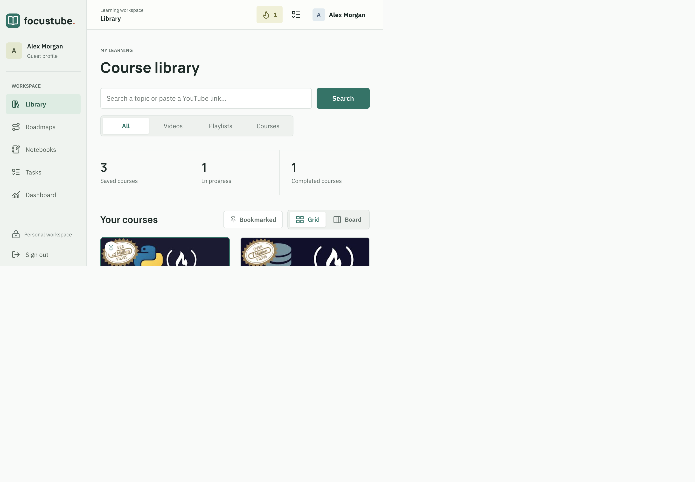
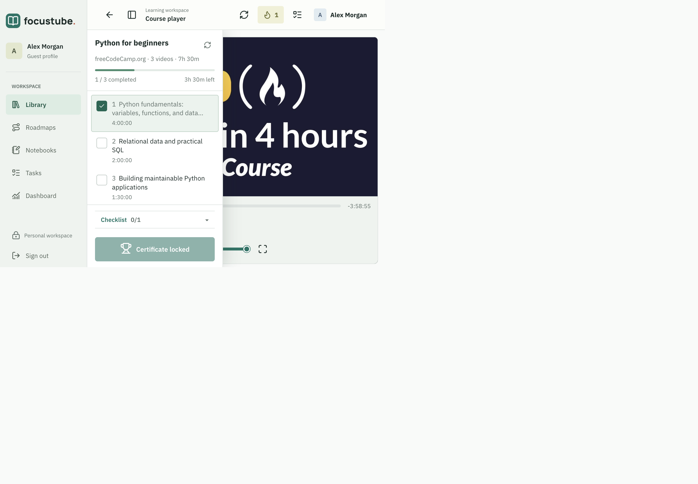
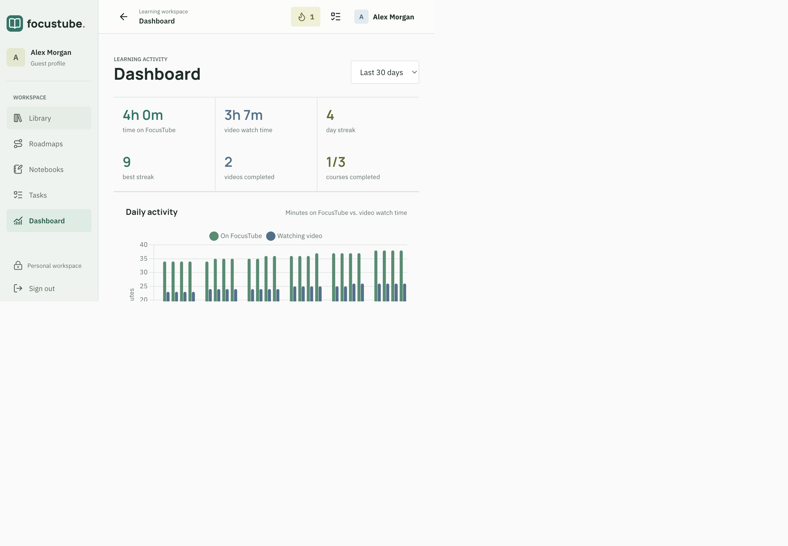
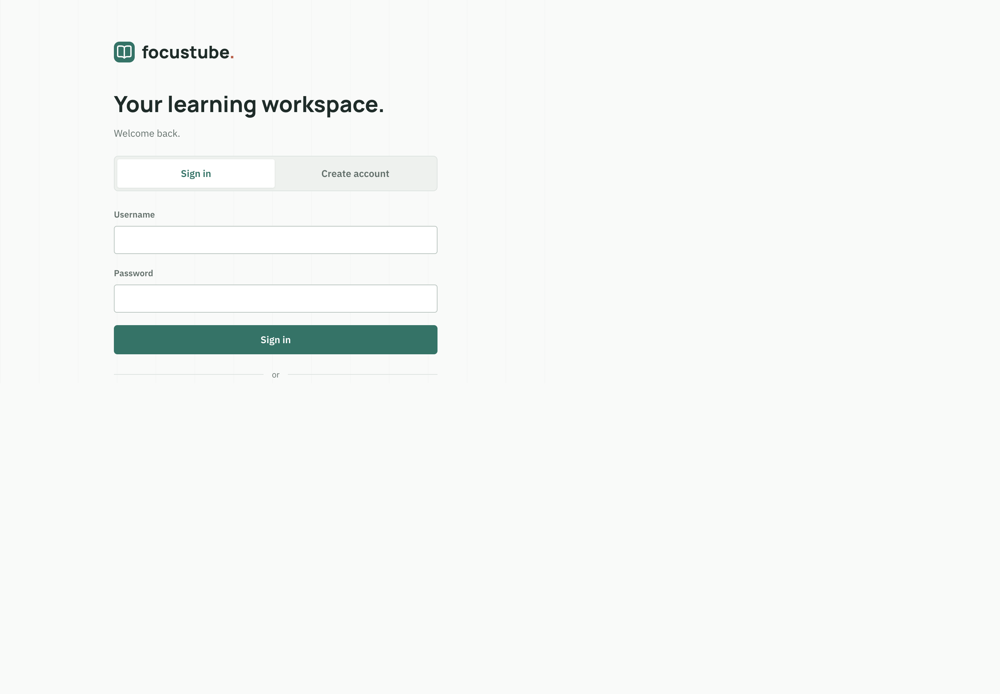
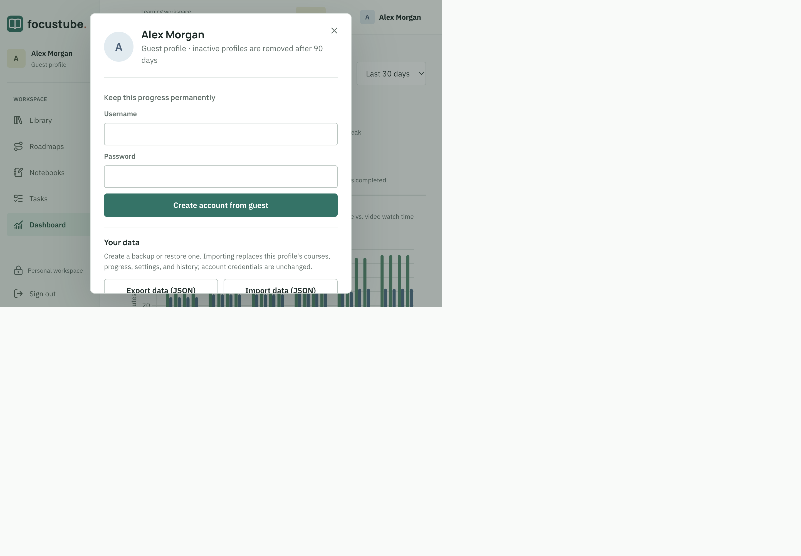
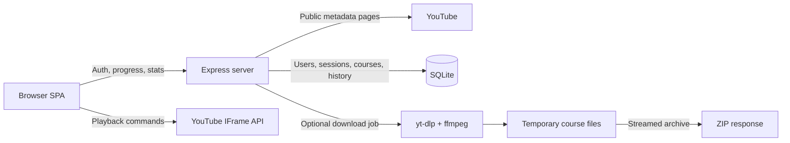

<div align="center">

# FocusTube

**Turn YouTube playlists and individual videos into focused, trackable courses.**

No recommendation feed. No comments. No unrelated rabbit holes.

[](https://nodejs.org/)
[](https://expressjs.com/)
[](https://www.sqlite.org/)
[](#validation)

</div>



## Overview

FocusTube is a local-first web application that converts a public YouTube playlist or a single YouTube video into a distraction-free learning workspace. It combines a custom player, course progress, profiles, streaks, analytics, certificates, and data export in one self-hosted application.

Discover videos and playlists by keyword, or import a YouTube link directly. The application does not require a YouTube Data API key. Search results, playlist data, and video metadata are read from public YouTube pages, while playback uses the YouTube IFrame API.

## Documentation

- [timeline.html](timeline.html): newest-first feature history, commit links, changed files, branch stages, bugs, and pending work.
- [docs/timeline.md](docs/timeline.md): timeline provenance and the `npm run timeline:update` refresh workflow.
- [Quick start](#quick-start): local installation, Docker, and the first-run workflow.
- [docs/youtube-search.md](docs/youtube-search.md): keyword search, filters, course creation, API examples, troubleshooting, and contributor verification.
- [Configuration](#configuration): ports, host validation, and hosted deployments.
- [API overview](#api-overview): metadata, authentication, search, profile, and download endpoints.

## Screenshots

<table>
  <tr>
    <td width="50%">
      
      <br /><strong>Course player</strong><br />Custom controls, progress, chapters, captions, quality, and completion tracking.
    </td>
    <td width="50%">
      
      <br /><strong>Learning dashboard</strong><br />Watch time, site time, streaks, course focus, heatmap, and history.
    </td>
  </tr>
  <tr>
    <td width="50%">
      
      <br /><strong>Profiles and guest access</strong><br />Secure accounts plus a zero-friction guest workflow.
    </td>
    <td width="50%">
      
      <br /><strong>Profile ownership</strong><br />Upgrade a guest without losing progress and export all user data as JSON.
    </td>
  </tr>
</table>

## Features

### Course creation

- Searches YouTube by keyword with **All**, **Videos**, **Playlists**, and **Courses** filters, without an API key.
- Shows up to 24 results with thumbnails, creators, available descriptions or lesson previews, durations, and playlist counts.
- Creates courses from search results without leaving the results. Saved items show **In library** and **Open course** instead of being added again.
- **Courses** refines the query with `full course` unless it already contains `course`; it can return videos and playlists. A **Course** label on an individual result reflects YouTube's metadata, not an automatic quality or topic-match guarantee.
- Accepts public YouTube playlist URLs, watch URLs, `youtu.be` links, Shorts, live and embed URLs, and playlist IDs for direct import.
- Treats plain text, including raw video IDs, as a search so eleven-character keywords are not mistaken for links. Use a video URL for immediate import; the metadata API still accepts raw video IDs directly.
- Supports both full playlists and single-video courses.
- Handles long playlists through YouTube continuation tokens.
- Skips private and deleted videos.
- Refreshes playlists manually or automatically to discover newly added videos without losing progress.

### Distraction-free player

- Custom play/pause, previous/next, seek, +/-10 seconds, volume, mute, and fullscreen controls.
- Playback speed menu from `0.25x` to `4x`.
- Quality selector populated from the levels available to the embedded player.
- YouTube captions toggle and keyboard shortcuts.
- Pause and completion overlays hide recommendation UI; a **Show full frame** option reveals the entire paused frame when needed.
- Remembers playback position and preferred speed per course.
- Covers YouTube UI while keeping playback inside the official embed.

> [!NOTE]
> YouTube may clamp embedded playback to `2x` and may override a requested quality when bandwidth or content restrictions require it. FocusTube detects the applied speed and reports the actual value.

### Learning workflow

- Collapsible course sidebar with active-video state.
- Manual and automatic completion tracking.
- Per-course progress, time remaining, and completion timestamps.
- Automatic next-video countdown.
- Full descriptions with safe external links.
- YouTube chapters and description timestamps as clickable seek targets.
- Chapter markers on the seek bar and live current-chapter display.
- Confetti rewards and a downloadable PDF completion certificate.

### Learning workspace

- Switch between the course grid and a status board with automatic Backlog, Learning, and Completed columns.
- Add, rename, and remove custom columns; reorder cards by drag and drop or use move controls.
- Create weekly, biweekly, or monthly sprints and assign courses or tasks to them.
- Track tasks with notes, priority, due dates, status, and optional course association in the task page or quick panel.
- Add per-course checklists and ordered roadmaps with combined progress and a continue-learning action.
- Save boards, tasks, sprints, checklists, and roadmaps in the revisioned profile, with export/import support.

### Profiles and persistence

- Username/password accounts using scrypt password hashing.
- Guest profiles with a one-click start.
- Guest-to-account upgrade without losing courses or history.
- HttpOnly, SameSite session cookies backed by hashed 256-bit session tokens.
- Per-user SQLite persistence for courses, settings, statistics, and viewing history.
- One-time import of legacy progress previously stored in the browser.
- Revision-based writes and idempotent telemetry batches to prevent silent duplicate or stale updates.
- Guest profiles are removed after 90 days of inactivity.

### Dashboard and history

- Total time on FocusTube and actual video watch time are tracked separately.
- Current streak, best streak, active days, completed videos, and completed courses.
- 30-day, 90-day, and all-time views.
- Daily activity bar chart.
- Course-focus doughnut chart.
- 20-week activity heatmap.
- Per-course progress overview.
- Paginated, date-grouped watch history showing course, video, time watched, and completion state.

### Data ownership

The profile menu can export a pretty-printed, versioned JSON file containing:

- Safe profile metadata
- Every saved course and video
- Completion timestamps and playback positions
- User settings and aggregate statistics
- Daily site activity
- Complete watch history
- Export schema and source metadata

Password hashes, salts, session cookies, and session tokens are never included.

The same menu can import a FocusTube schema-version-1 JSON export. Importing atomically replaces the current profile's courses, progress, settings, daily activity, and watch history while preserving its username, password, and sessions. A confirmation shows the number of courses and history records before anything changes.

Workspace boards, tasks, checklists, sprints, and roadmaps are included in new exports and restored on import. Older exports without workspace data restore an empty workspace.

### Backend download API

Course downloads are not exposed in the website. The existing authenticated API is retained for compatibility. When `yt-dlp` and `ffmpeg` are installed, API clients can download a course as a ZIP with a selectable quality:

- `1080p`
- `720p` (default)
- `480p`
- `360p`
- Audio only (`M4A`)

The API supports permission confirmation, live Server-Sent Events progress, cancellation, recovery of active jobs, and streamed ZIP output.

> [!IMPORTANT]
> Download only videos you own or have permission to download. Users are responsible for complying with YouTube's Terms of Service and applicable copyright law.

## Tech stack

| Layer | Technology |
| --- | --- |
| Frontend | Vanilla JavaScript, HTML, CSS |
| Server | Node.js, Express |
| Database | SQLite via `better-sqlite3` |
| Authentication | Node `crypto.scrypt`, HttpOnly session cookies |
| Playback | YouTube IFrame API |
| Charts | Chart.js |
| PDF certificates | jsPDF |
| Rewards | canvas-confetti |
| ZIP streaming | Archiver |
| Optional media download | yt-dlp and ffmpeg |

All browser libraries are pinned npm dependencies and served locally by the Express application. The authentication page does not depend on third-party CDN scripts.

## Architecture



### Request flow

1. A user signs in, registers, or starts a guest profile.
2. The server creates an HttpOnly session and loads that user's revisioned profile snapshot.
3. The user searches YouTube by keyword and selects a result, or pastes a playlist or video URL. The selected URL is resolved into a common course structure.
4. The frontend plays videos through the YouTube embed and batches progress/activity updates.
5. The server stores course state, active time, watch time, and completion history in SQLite.
6. Dashboard endpoints aggregate the logs without exposing other users' data.

## Prerequisites

### Required

- [Node.js](https://nodejs.org/) `22` or newer
- npm
- Internet access for YouTube metadata, thumbnails, and embedded playback

### Optional: course ZIP downloads

On macOS with Homebrew:

```bash
brew install yt-dlp ffmpeg
```

These tools are optional and only needed by the backend download API; the website has no course-download option.

## Quick start

```bash
git clone https://github.com/chakshusalgotra/focus-tube.git
cd focus-tube
npm ci
npm start
```

Open [http://localhost:3000](http://localhost:3000).

If port `3000` is already in use:

```bash
PORT=3001 npm start
```

Then open [http://localhost:3001](http://localhost:3001).

### Docker Compose

The Docker setup is intentionally basic and intended only for local use. The app listens on port `3000` inside the container and is exposed only at `127.0.0.1:3002` on the host.

```bash
git clone https://github.com/chakshusalgotra/focus-tube.git
cd focus-tube
docker compose up --build -d
```

Open [http://localhost:3002](http://localhost:3002).

Useful operations:

```bash
# Follow application logs
docker compose logs -f app

# Check the app
docker compose ps
curl http://localhost:3002/api/health

# Stop containers while preserving data
docker compose down

# Stop containers and permanently delete application data
docker compose down -v
```

Compose stores SQLite data in the `focustube-data` volume. The fixed port mapping is:

```text
127.0.0.1:3002 -> container:3000
```

The basic local image does not bundle the optional `yt-dlp` and `ffmpeg` tools, so the backend course-download API is unavailable in this container. All website features work normally. For API downloads, run FocusTube natively after installing the tools listed under [Optional: course ZIP downloads](#optional-course-zip-downloads).

### First-run workflow

1. Choose **Create account**, **Sign in**, or **Continue as guest**.
2. Search for a topic, or paste a public YouTube playlist or video URL to import it directly.
3. For a keyword search, choose a result type, review the creator and description, and select **Create course** on a matching result. **Open on YouTube** opens the original search, and result titles open their source video or playlist.
4. Open a saved course and select a video from its sidebar.
5. Use the dashboard to inspect progress, streaks, watch time, and history.
6. Upgrade a guest profile at any time without losing its data.

## Configuration

FocusTube is intentionally bound to loopback by default.

| Environment variable | Default | Description |
| --- | --- | --- |
| `PORT` | `3000` | HTTP port used by Express. |
| `HOST` | `127.0.0.1` | Interface to bind. Keep this value for local use. |
| `ALLOWED_HOSTS` | empty | Comma-separated additional `Host` header values accepted by the server. Include ports where applicable. |
| `TRUST_PROXY` | unset | Express proxy-trust setting. Configure only behind a known reverse proxy. |

Example local run on another port:

```bash
HOST=127.0.0.1 PORT=3001 npm start
```

### Network or hosted deployment

The repository is secure-by-default for a single-machine local deployment. Before exposing it to a network:

1. Put the Node process behind an HTTPS reverse proxy.
2. Set `HOST` to the intended bind interface.
3. Add the public hostname and port to `ALLOWED_HOSTS`.
4. Configure `TRUST_PROXY` only for the actual proxy boundary.
5. Mount the `data/` directory on persistent, backed-up storage.
6. Run Node under a process manager or container supervisor.
7. Install `yt-dlp` and `ffmpeg` on the host only if downloads are enabled.
8. Review retention, backup, logging, and resource policies for your environment.

Do not expose the default HTTP service directly to the public internet.

## Data storage

Runtime data is stored in:

```text
data/focustube.db
```

The database uses SQLite WAL mode and contains:

- Users
- Hashed sessions
- Revisioned profile snapshots
- Daily active-time rows
- Per-video watch history
- Idempotency records for activity batches

The entire `data/` directory is excluded from Git. Back up the database and its WAL files consistently when the server is stopped, or use SQLite-aware backup tooling.

### JSON export format

Exports use the versioned schema:

```json
{
  "schema": "focustube-user-export",
  "schemaVersion": 1,
  "exportedAt": "2026-08-04T00:00:00.000Z",
  "profile": {},
  "courses": {},
  "stats": {},
  "settings": {},
  "dashboard": {
    "summary": {},
    "dailyActivity": [],
    "watchHistory": []
  },
  "source": {}
}
```

Schema-version-1 exports can be restored from the profile menu. New exports include workspace data; older exports without it restore an empty workspace.

## Security model

- Passwords are derived with scrypt and a per-user random salt.
- Raw passwords are never stored.
- Session tokens are random 256-bit values and are hashed before database storage.
- Cookies are HttpOnly and SameSite=Lax; `Secure` is added when served behind HTTPS.
- Login, registration, and guest creation have bounded rate limits.
- State-changing API requests enforce same-origin checks.
- Host headers are allowlisted to reduce DNS rebinding exposure.
- Content Security Policy, frame restrictions, MIME sniffing protection, and restrictive browser permissions are enabled.
- Profiles are scoped by authenticated user ID on every private data route.
- Export files explicitly exclude authentication secrets.
- The server binds to `127.0.0.1` unless configured otherwise.

## Download safeguards

The optional media worker enforces:

- One active global download job
- One active job per user
- Maximum 500 videos per course ZIP
- Maximum 20 GB temporary output per job
- Minimum 2 GB remaining free disk space
- Maximum 2 hours per video
- Maximum 12 hours per job
- Periodic stale temporary-directory cleanup
- Permission confirmation before a job starts

Completed ZIPs remain available for a limited retry window and are streamed instead of copied into a second archive file on disk.

## API overview

### Public metadata

| Method | Endpoint | Purpose |
| --- | --- | --- |
| `GET` | `/api/health` | Report process and SQLite readiness for health checks. |
| `GET` | `/api/playlist?url=...` | Resolve a playlist, playlist ID, or single video into a course. |
| `GET` | `/api/video/:id` | Fetch a video's description, duration, and chapter markers. |

### Authentication

| Method | Endpoint | Purpose |
| --- | --- | --- |
| `GET` | `/api/auth/me` | Return the current safe user profile. |
| `POST` | `/api/auth/register` | Create a username/password account. |
| `POST` | `/api/auth/login` | Start an authenticated session. |
| `POST` | `/api/auth/guest` | Create a temporary guest profile. |
| `POST` | `/api/auth/upgrade` | Convert the current guest into a permanent account. |
| `POST` | `/api/auth/logout` | Revoke the current session. |

### Authenticated search

| Method | Endpoint | Purpose |
| --- | --- | --- |
| `GET` | `/api/search?q=...&type=all` | Search public YouTube videos and playlists, including course-focused results. |

Requires an account or guest session. `q` must contain 1-200 characters after trimming. Optional `type` is `all` (default), `video`, `playlist`, or `course`. The response contains `query`, `type`, `youtubeUrl`, and up to 24 `results`, each with its real import type and canonical YouTube URL. Searches use the first results page; **Open on YouTube** provides access to additional results.

Invalid input returns `400`, missing authentication returns `401`, and upstream failures or timeouts return `502` or `504`. YouTube requests time out after 15 seconds. Search results are transient; only selected courses are saved to the current user's library through the existing revisioned profile flow.

### Authenticated profile and analytics

| Method | Endpoint | Purpose |
| --- | --- | --- |
| `GET` | `/api/data` | Load the current revisioned profile snapshot. |
| `PUT` | `/api/data` | Save courses, statistics, and settings with revision checking. |
| `GET` | `/api/export` | Download the complete safe user-data JSON export. |
| `POST` | `/api/import?revision=...` | Validate and restore a version-1 export, including workspace data, while preserving account identity. |
| `POST` | `/api/track` | Store an idempotent active/watch-time batch. |
| `GET` | `/api/stats/summary` | Return aggregate dashboard totals and streaks. |
| `GET` | `/api/stats/daily` | Return day-level active and watch time. |
| `GET` | `/api/stats/courses` | Return watch-time distribution by course. |
| `GET` | `/api/stats/history` | Return paginated watch history. |

### Authenticated downloads

| Method | Endpoint | Purpose |
| --- | --- | --- |
| `GET` | `/api/downloads/status` | Check yt-dlp/ffmpeg availability. |
| `GET` | `/api/downloads/current` | Recover the current user's active or ready job. |
| `POST` | `/api/downloads` | Start a permission-confirmed course job. |
| `GET` | `/api/downloads/:id/events` | Stream job progress with Server-Sent Events. |
| `DELETE` | `/api/downloads/:id` | Cancel a job. |
| `GET` | `/api/downloads/:id/file` | Stream the completed ZIP. |

## Project structure

```text
focus-tube/
├── Dockerfile              # Basic local application image
├── compose.yaml            # Local port 3002 and persistent SQLite volume
├── .dockerignore           # Minimal Docker build context
├── auth.js                 # Password hashing, sessions, auth routes, rate limits
├── db.js                   # SQLite schema, persistence, analytics, export queries
├── downloads.js            # yt-dlp/ffmpeg job manager and ZIP streaming
├── server.js               # Express app, security headers, metadata and API routes
├── youtube-search.js       # Search request validation and YouTube result parsing
├── timeline.html           # Standalone generated change timeline
├── scripts/
│   └── update-timeline.js  # Git history and branch-stage snapshot generator
├── test/
│   ├── timeline.test.js    # Timeline ordering, provenance, and rendering tests
│   ├── workspace-persistence.test.js # Isolated workspace restore regression tests
│   └── youtube-search.test.js # Deterministic search parsing and filter tests
├── public/
│   ├── app.js              # Authenticated SPA, player, dashboard, sync, exports
│   ├── index.html          # Application views and dialogs
│   └── styles.css          # Responsive application styling
├── docs/
│   ├── timeline.md          # Timeline maintenance and stage definitions
│   ├── timeline-notes.json  # Feature rationale and dated observations
│   ├── youtube-search.md    # Search usage, API contract, troubleshooting, and tests
│   └── screenshots/        # README screenshots
├── data/                   # Runtime SQLite files; ignored by Git
├── package.json
└── package-lock.json
```

## Keyboard shortcuts

| Shortcut | Action |
| --- | --- |
| `Space` or `K` | Play/pause |
| `J` / `L` | Back/forward 10 seconds |
| `Left` / `Right` | Back/forward 5 seconds |
| `Up` / `Down` | Volume |
| `<` / `>` | Playback speed |
| `M` | Mute |
| `C` | Captions |
| `F` | Fullscreen |
| `N` / `P` | Next/previous video |
| `[` | Toggle course sidebar |

## Validation

The current implementation has been checked with:

```bash
node --check server.js
node --check auth.js
node --check db.js
node --check downloads.js
node --check public/app.js
node --check youtube-search.js
npm test
npm audit --omit=dev
```

The latest validation reported:

- No JavaScript syntax errors
- No VS Code diagnostics
- Zero known production dependency vulnerabilities
- Successful account, guest upgrade, logout/login, profile persistence, dashboard, export, and PDF browser flows
- Verified revision-conflict handling and idempotent activity tracking
- Verified loopback-only default binding

`npm test` runs deterministic search, workspace persistence, and timeline tests. Coverage includes YouTube renderer formats and filters, safe result URLs, workspace export/import round trips and revision conflicts, chronological ordering, branch-stage evidence, and safe snapshot embedding. The tests require no network access; database tests use isolated in-memory SQLite databases. Live YouTube search and browser workflows should also be checked when the upstream page format changes.

## Troubleshooting

### Port is already in use

```bash
PORT=3001 npm start
```

### `Invalid Host header`

FocusTube rejects unknown hostnames. Use `localhost`/`127.0.0.1`, or add the exact hostname and port to `ALLOWED_HOSTS`.

```bash
ALLOWED_HOSTS=focus.example.com HOST=0.0.0.0 npm start
```

Use that configuration only behind a properly configured HTTPS reverse proxy.

### `better-sqlite3` fails to install

Use a supported Node.js release. If npm cannot obtain a prebuilt binary on macOS, install the Apple command-line build tools:

```bash
xcode-select --install
npm ci
```

### Download API tools are unavailable

For direct use of the backend download API, install the optional system tools:

```bash
brew install yt-dlp ffmpeg
```

### A video cannot be embedded

Some creators disable playback outside YouTube. FocusTube displays an **Open on YouTube** action and lets the learner continue to the next item.

### A playlist or chapter list stopped parsing

FocusTube reads public YouTube page data rather than using an API key. YouTube can change this internal page structure. Check network access first; if the public page still works, the parser may need an update.

### YouTube search is unavailable

Use **Retry search** for a temporary failure, or **Open on YouTube** to view the same query and type filter directly. Consent pages, rate limits, network restrictions, and changes to YouTube's internal result format can prevent in-app search. Public playlist and video links can still be imported independently of the search parser.

### Requested speed or quality does not stick

The YouTube IFrame API retains final control over playback levels. FocusTube reports an applied speed clamp and repopulates quality choices from the current video's supported levels.

## Known limitations

- Public YouTube page formats are not a stable API and may change.
- Private, deleted, age-restricted, region-restricted, or embedding-disabled videos may be unavailable.
- Quality selection and speeds above `2x` are best-effort constraints imposed by the YouTube embed.
- Password recovery, email verification, OAuth, and account deletion are not implemented.
- The current server is designed for local-first use; internet deployment requires additional operational configuration.

## Roadmap

- Password change, recovery, and account deletion
- Automated API and browser test suites
- Structured database backups
- Deployment templates for HTTPS-hosted environments
- Optional OAuth providers

## Contributing

1. Fork the repository.
2. Create a focused feature branch.
3. Keep runtime data and credentials out of Git.
4. Run the validation commands above.
5. Open a pull request describing behavior changes and test coverage.

## License

No open-source license has been selected yet. Until a license is added, copyright law reserves all rights to the repository owner.

## Responsible use

FocusTube is an independent learning tool and is not affiliated with or endorsed by YouTube or Google. YouTube is a trademark of Google LLC. Use embedded playback and optional download functionality in accordance with platform terms and applicable law.
