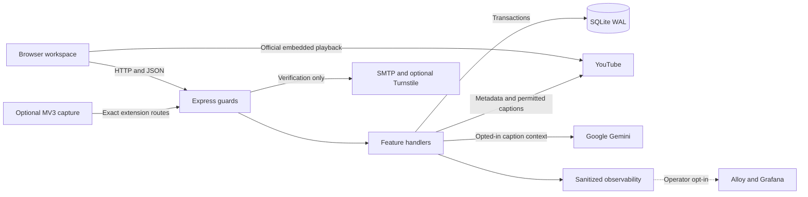
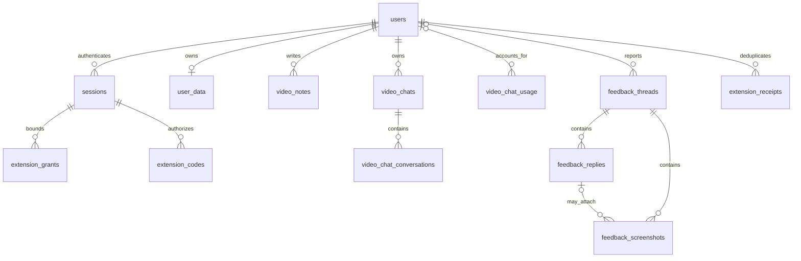

# FocusTube Architecture

Reviewed **2026-09-28**. Scope: the current working tree, including uncommitted changes. The recorded Git base alone does not contain all documented features. See [the source inventory](diagrams/source-inventory.json) for file hashes and [the documentation index](README.md) for ownership.

## System Shape

FocusTube is a same-origin, self-hosted web application: vanilla browser JavaScript and an optional Manifest V3 extension talk to one Express/Node process. SQLite is the durable store. The application does not require a frontend build server, a separate authentication service, Redis, a message broker, or a vector database.

Open the [interactive system map](diagrams/system.html). This compact draft is also readable in Markdown:

Arrows are logical calls, not distinct processes or runtime traffic. The image omits some internal calls to keep the main path readable. Feature flags, provider configuration and current account eligibility decide whether optional paths are usable.

## Repository Structure

| Surface | Files | Responsibility |
| --- | --- | --- |
| HTTP composition | [server.js](../server.js) | Security middleware, static/vendor assets, route mounting, metadata/search, notebook/profile/statistics APIs, health and shutdown |
| Identity | [auth.js](../auth.js), [auth-services.js](../auth-services.js) | Session cookies, password verification, registration, email proof, profile/password changes, admin invitation routes, SMTP and CAPTCHA adapters |
| Core persistence | [db.js](../db.js) | Additive schema setup, ownership queries, immediate transactions, profile/note revisions, activity, invitations, forum and cleanup |
| Learning shell | [public/index.html](../public/index.html), [public/app.js](../public/app.js), [public/styles.css](../public/styles.css) | Hash routing, Library, course player, plans, dashboard, contextual navigation, Settings and account guards |
| Early browser setup | [public/auth-entry.js](../public/auth-entry.js), [public/theme.js](../public/theme.js) | Scrub invitation fragments before application scripts; restore appearance without exposing secrets |
| Notes | [public/notebook-model.js](../public/notebook-model.js), [public/notebook-editor.js](../public/notebook-editor.js), [public/notebooks.js](../public/notebooks.js) | Validated versioned documents, source anchors, Quill integration, draft recovery, autosave/conflicts, append, Markdown and print |
| Ask | [video-chat.js](../video-chat.js), [video-chat-store.js](../video-chat-store.js), [public/video-chat.js](../public/video-chat.js) | Caption acquisition, bounded source context, Gemini streaming, usage reservation, conversations, validation and explicit note proposals |
| Feedback | [feedback.js](../feedback.js), [public/feedback.html](../public/feedback.html), [public/feedback.js](../public/feedback.js) | Separate public/private forum page, replies, screenshot normalization/access and moderation; storage lives in the core DB module |
| Invitations UI | [public/invitations.js](../public/invitations.js) | Copy-once links, status filtering, cursor paging, guarded expiry edits and revocation |
| Capture API | [extension.js](../extension.js), [extension-store.js](../extension-store.js), [public/extension-connect.js](../public/extension-connect.js) | Exact destination/extension identity, cookie-first access, PKCE consent/grants, additive save receipts and revocation |
| Browser extension | [extension/manifest.json](../extension/manifest.json), [extension/service-worker.js](../extension/service-worker.js), [extension/popup.js](../extension/popup.js) | Optional permissions, environment selection, supported-video detection, bounded pending queue and user-confirmed saves |
| Search and downloads | [youtube-search.js](../youtube-search.js), [downloads.js](../downloads.js) | Search normalization; optional authorized media jobs using external tools, not an ordinary player dependency |
| Operations | [observability.js](../observability.js), [compose.monitoring.yaml](../compose.monitoring.yaml), [ops/monitoring/config.alloy](../ops/monitoring/config.alloy) | Bounded logs/metrics, private scrapes and opt-in collector export |
| Tooling | [scripts/auth-admin.js](../scripts/auth-admin.js), [scripts/package-extension.js](../scripts/package-extension.js), [scripts/update-timeline.js](../scripts/update-timeline.js), [scripts/update-architecture.js](../scripts/update-architecture.js) | Local bootstrap/capacity, extension packaging, history generation and architecture documentation |

Dependencies and exact installed versions are owned by [package.json](../package.json) and [package-lock.json](../package-lock.json). Important libraries include Express, better-sqlite3, Quill, Nodemailer, Sharp, the official Google Gen AI SDK, the bounded streaming JSON parser, subtitle parsing, and public-caption retrieval. Local fonts and Lucide icons are served through vendor routes.

## Request Boundaries

The server applies monitoring, the independent internal-metrics guard, allowed Host validation and browser security headers. Ordinary `/api` requests then validate the approved web origin; mutations require exact Origin, including scheme and port. Only enumerated extension POST/preflight paths have a narrow extension-origin exception. Body parsers have per-feature limits before the generic parser. Authentication resolves the current session and active account before feature-specific authorization.

- `AUTH_PUBLIC_ORIGINS` authorizes a web origin; `ALLOWED_HOSTS` by itself does not. HTTPS trust depends on the actual, correctly configured proxy boundary.
- Sessions are opaque random tokens; only hashes are stored. Cookies are HttpOnly, SameSite=Strict and Secure over HTTPS. There is no browser JWT or password-reset flow.
- `X-Profile-Account` is mandatory on profile GET/PUT. Notebook, chat, forum and invitation clients use their own account-binding headers to reject stale tabs. These headers supplement session authorization; they are never credentials.
- Anonymous access exists for auth status, public forum reads, public metadata endpoints and health under their respective host/origin rules. In particular, playlist/video metadata handlers are not member-only; keyword search is member-only. Public-facing operators still need ingress abuse controls.
- An administrator can manage invitations, view bounded operational metadata and moderate private forum reports. That role does not grant another member's library, notes, chat, export or download access.
- The private metrics endpoint requires its own internal Host, source-IP allowance and bearer token. An administrator's session does not satisfy that guard.

Exact route contracts are in [api.md](api.md). Authentication details and historical migrations remain in [invite-only-auth-spec.md](invite-only-auth-spec.md).

## Data Ownership

SQLite uses WAL, foreign keys and a bounded busy timeout. Core schema changes use guarded additive migrations; transactional operations serialize with `BEGIN IMMEDIATE` through better-sqlite3 where required. Do not mistake a logical module boundary for a separate database.

The source declares **25 application tables**, excluding SQLite's own internal tables. Extension tables are initialized lazily by the extension store, so an instance that has never used capture may not contain all 25. Legacy feedback integration tables may remain on older installations without being created or processed by the current forum. This is a source inventory, not a query of a live database.

| Tables | Ownership and purpose |
| --- | --- |
| `users`, `sessions` | Stable identity, credentials and active-account session lookup; user deletion cascades to sessions |
| `auth_workspace`, `invitations` | Member-capacity singleton and nonreused invitation IDs, use counts, expiry, revocation and revision |
| `login_budgets`, `email_verifications` | Persistent action budgets and bounded, invitation/session-bound email proofs |
| `user_data` | One revisioned JSON profile per user: courses, stats, settings and planning workspace; separate notes/chat revision counters |
| `video_notes` | One document per user/course/video, independent revisions and retained deletion markers |
| `activity_log`, `watch_log`, `activity_batches` | Daily active time, per-video watch history and batch deduplication |
| `user_usage`, `usage_days`, `presence_leases`, `auth_audit` | Bounded operational activity, current-presence challenges and successful account-event records |
| `feedback_threads`, `feedback_replies`, `feedback_screenshots` | Shared forum with public/private ownership and moderation; screenshot BLOBs inherit parent access |
| `video_chats`, `video_chat_conversations` | Per-user/course/video shared transcript and generation/revision, plus up to 20 named message histories |
| `video_chat_usage` | Request identity, state, cost reservation and actual/unknown usage; account deletion detaches ownership rather than resetting spending |
| `extension_receipts`, `extension_codes`, `extension_grants`, `extension_session_revocations` | Additive capture deduplication, hashed short-lived PKCE codes, parent-session grants and replacement/disconnect revocation |

This is an ownership sketch, not an exhaustive column-level SQL schema. Course/video keys in notes and chat refer to application IDs; courses themselves live in profile JSON, not a separate `courses` table. The authoritative constraints and migration logic are in [db.js](../db.js), [video-chat-store.js](../video-chat-store.js) and [extension-store.js](../extension-store.js).

## State and Failure Semantics

| State | Durable source | Recovery boundary |
| --- | --- | --- |
| Course progress, layout mode, tasks/roadmaps | Revisioned profile JSON | Account binding and revision checks prevent blind stale replacement; local pending state is not proof of a completed save |
| Note text | Independently revisioned notebook record | Per-account/tab recovery drafts and explicit conflict resolution; Saved requires server acknowledgement |
| Note pane and appearance | Browser preferences | Panel resize/hide does not recreate the editor or change document ownership |
| Search and current route | Browser memory/hash | Stale responses are ignored or aborted; queries are not a stored search history |
| Chat question/provisional text | Browser state until validated completion | Never insert partial output; pre-dispatch preparation failures differ from uncertain dispatched requests |
| Completed chats and provider accounting | Conversation records and usage ledger | Same request ID does not generate twice; stopping/clearing chat is not a refund or ledger reset |
| Forum report/reply and images | One SQLite transaction | Same submission ID and payload return the existing result; visibility is checked on every image read |
| Extension pending operation | Trusted extension storage | Bounded manual Retry/Discard; a receipt is required before reporting a save as confirmed |
| Download jobs and traffic graph | Process memory; temporary download files | Not durable queues/history; process restart is a different boundary from a stored learning record |

An operational database backup is not a learning export. Schema-4 learning exports contain profile/planning, notebook documents, transcripts and named completed conversations, plus learning history. They omit passwords, sessions, grants, cost ledgers and shared feedback. Import replaces the current member's learning state after confirmation and revision checks; it does not restore an entire instance.

## Deployment and Operations

| Configuration | Boundary |
| --- | --- |
| Native `npm start` | Node >=22, loopback host by default, port 3000, chosen data directory |
| [compose.yaml](../compose.yaml) | Local project `focustube`, loopback 3002 to container 3000, persistent data and log volumes |
| [compose.dev.yaml](../compose.dev.yaml) | `focustube-dev`, intended HTTPS development origin, loopback host port 3002 and isolated project volumes |
| [compose.prod.yaml](../compose.prod.yaml) | `focustube-prod`, intended production HTTPS origin, loopback host port 3003 and isolated project volumes |
| [compose.monitoring.yaml](../compose.monitoring.yaml) | Opt-in private Alloy network and sanitized metrics/log export, not direct database or Docker-socket access |

Local and development configurations both use host port 3002 and cannot bind it simultaneously on the same host. Different hostnames do not make them share accounts or database state. The checked-in tunnel comments are intended ingress configuration, not proof that a tunnel currently exists.

[Deployment flow](diagrams/deployment.html) describes the current GitHub Actions files: pushes to `dev` or `main` choose the corresponding Tailscale/SSH job, synchronize the intended WSL checkout, build/start that Compose project and prune unused images. The separate main-branch PR guard checks that its head is `dev`. These workflows do **not** run the full tests, create a SQLite backup, wait for health, enforce all operator approval gates, or prove application acceptance. A green job is not sufficient evidence of a successful release.

[Draft release gates](diagrams/release-draft.html) proposes a scoped artifact, tests, populated-copy recovery rehearsal, explicit environment approval, controlled cutover and recorded acceptance. It does not install that automation. Before any actual rollout, follow the existing [backup/rollback procedure](v1-release.md#rollout-backup-and-rollback), preserve exact runtime settings and data volumes, and avoid old application writers against migrated chat/invitation data. No deployment was performed for this documentation refresh.

## Maintaining the Diagrams

The globally installed skill is **Archify**, publisher [tt-a1i/archify](https://github.com/tt-a1i/archify), packaged version `2.17` from source commit `9e35d2b0b39b155553ba9fcfe0b4f2a5198dd993`. The downloaded package SHA-256 is `d2296515b0091fb8f00580ea9e0b665d91ca5839fde651abe3ecd57a3ca178ec`. It is installed under `~/.copilot/skills/archify`, with its license and notices. FocusTube has no new Archify runtime dependency.

For a new machine, install the same skill revision into the personal skills folder. The publisher also documents `npx skills add tt-a1i/archify -g`; that follows its current upstream state, so review the resulting version before regenerating these artifacts. Set `ARCHIFY_SKILL_DIR` when your installation is elsewhere. The bundled CLI needs Node >=18; FocusTube itself requires >=22.

1. Review the code path and update the owning Markdown guide before changing its chart. Keep current and draft claims distinct. Do not read secrets or populate real user data in diagrams.
2. Edit the corresponding typed JSON in [diagrams/catalog.json](diagrams/catalog.json). Use stable IDs, real relationships and sparse labels. Workflow charts use schema version 2; all charts use showcase quality. Never hand-edit generated HTML.
3. Run `npm run docs:build`. Each HTML is replaced only after Archify's nine deterministic artifact checks pass. If source code changed, this command fails until the docs/specs have been reviewed and you explicitly use `npm run docs:build -- --refresh-evidence`.
4. Run `npm run docs:check` and `node --test test/architecture.test.js`. The drift check verifies allowlisted source hashes, table declarations, evidence anchors, JSON/HTML byte receipts, the atlas index and local Markdown file links. It is not an automatic understanding of source semantics and cannot prove every sentence remains true.
5. For a desktop authoring session, use `npm run docs:preview -- system` (or another catalog ID). The watcher binds only to loopback and retains the last-good diagram when edits fail validation. It does not connect to the running FocusTube API. Stop it after editing and rebuild the receipts.
6. After delivery, run `ARCHIFY_UPDATE_CHECK_DISABLED=1 node "$HOME/.copilot/skills/archify/bin/archify.mjs" visual-check docs/diagrams/system.html --json` for each changed chart, then inspect the actual screenshots. Keep deterministic validation, automated browser evidence, and human/image review separate.

[receipts.json](diagrams/receipts.json) binds exact specification and HTML bytes. [source-inventory.json](diagrams/source-inventory.json) records the reviewed working-tree hashes; it intentionally does not claim public Git source links for uncommitted code. [verification.json](diagrams/verification.json) summarizes artifact-bound browser evidence and visual review. Regenerating an HTML makes prior visual evidence stale even if its filename is unchanged.

The atlas and diagrams are local documentation, not a new public application route. Their core content is self-contained and network-independent. Trace motion illustrates authored paths; it is not a traffic monitor, performance benchmark or automatic architecture discovery engine. Archify's optional update checker is disabled by the build commands.