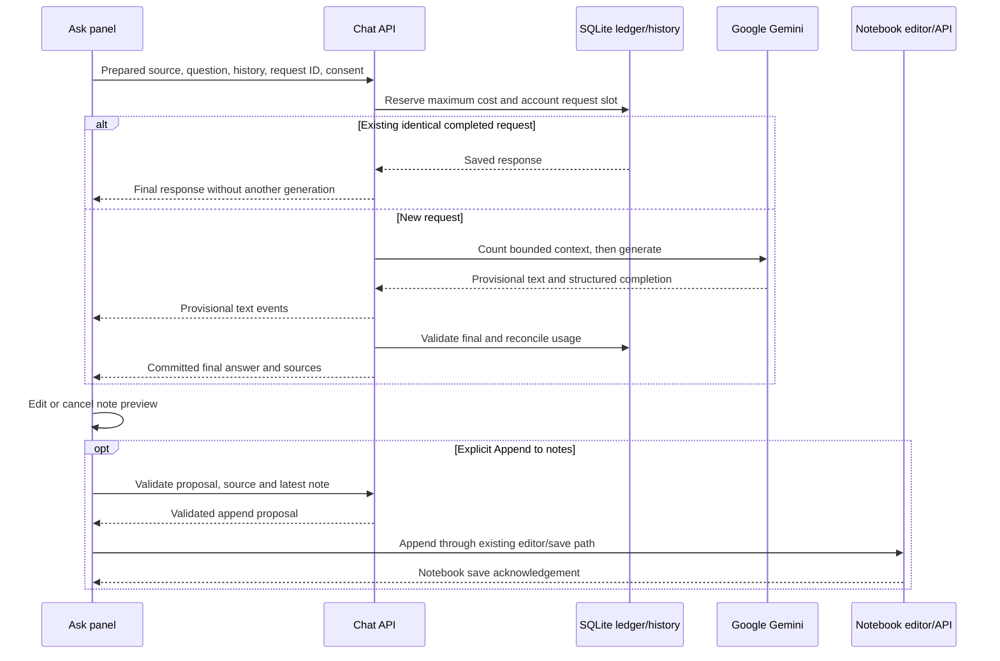

# Website Flows

Reviewed **2026-09-28** against current working-tree code. Use [the interactive atlas](diagrams/index.html) for animated paths, [architecture.md](architecture.md) for ownership, and [api.md](api.md) for exact endpoints. Diagrams illustrate source behavior; they do not execute requests or observe live users.

## Navigation Map

| Entry | What it opens | Access |
| --- | --- | --- |
| `/` | Sign-in/join screen or the signed-in Library | Public shell; private data needs a session |
| `#join=...` | Invitation capture followed by a scrubbed, nonsecret join route | Bearer invitation is kept only in memory |
| `#c=<courseId>` | Course player and contextual Course content toggle | Current member's saved course |
| `#c=<courseId>&v=<videoId>&t=<seconds>` | A specific lesson/source moment, including zero seconds | Valid current course/video binding |
| `#notebooks`, `#notebook=<courseId>` | Notebook index or a course's written notes | Current member |
| `#roadmaps`, `#roadmap=<id>`, `#tasks`, `#dashboard` | Learning plans and personal analytics | Current member |
| Profile/Settings | Account, Appearance, Data, Policies and eligible Administration sections | Current member; admin controls checked again by the API |
| `/feedback` | Separate public/private forum page | Public reads where allowed; member posting; admin moderation |
| `/policies.html` | Published Terms, Privacy and operator contact information | Public |
| `/extension-connect.html` | First-party extension consent/connection flow | Current member and supported, configured destination |

The taskbar navigation button controls Course content in the player and workspace navigation elsewhere. Course content becomes a drawer on narrow layouts; collapsed content leaves no course-tools rail. Notes and Ask share the study pane while preserving the note editor. Playback remains separate from panel visibility and browser navigation.

## Accounts and Invitations

Open [the signup diagram](diagrams/account.html).

1. A trusted operator bootstraps the first administrator through the local command, not a public endpoint. Active administrators can issue member links with use and expiry limits.
2. Opening the link captures the invitation fragment before other scripts and removes it from the visible URL. Loading a link or requesting a code does not consume a signup.
3. The visitor enters email, display name, required username, password and confirmation. Username feedback is advisory; final uniqueness is checked again. Configured CAPTCHA is enforced server-side.
4. A verification request produces a six-digit email code. The API returns the challenge identity and expiry, never the code. Failed delivery leaves no usable challenge. Codes expire after ten minutes, with a resend cooldown and bounded guesses.
5. Registration rechecks invitation expiry/revocation/capacity, code proof, uniqueness and any bootstrap conditions in its transaction. Account/profile creation, invitation use, proof consumption and session issuance succeed together or roll back together.
6. Existing members sign in with email/username and password. No invitation is required for login. New guest creation is disabled; retained guests can export or convert through the guarded invitation flow.

Settings > Account contains separate Account details, Change password and Account email disclosures. Collapsing a disclosure preserves its current draft; closing Settings applies the existing discard guards. Username changes require the current password. Password changes and email enrollment rotate sessions. A verified email does not expose an arbitrary change-email form. Forgotten-password recovery and self-service account deletion remain unavailable.

Administration separates monitoring, New invitation and the issued list. Member links default to seven days and one signup; admins can choose up to 1,000 signups and expiry within 365 days. Listing is metadata-only with status filtering and cursor paging. Raw links are copy-once. Expiry edits use a revision; an expired usable link requires explicit reactivation. Revoked/exhausted links cannot be revived. Revoking a link does not delete already-created accounts.

Full rules: [Current authentication release](invite-only-auth-spec.md#current-release), [member invitation lifecycle](invite-only-auth-spec.md#17-member-invitation-lifecycle-v1), [Account and admin organization](monitoring.md#account-settings).

## Discover, Save and Learn

Open [the learning diagram](diagrams/learning.html).

1. Search a topic as an active member or paste a supported YouTube link. Typing alone does not dispatch search. The current query/type produces bounded transient results; stale responses do not replace a newer search.
2. Explicitly create a course from a result or link. Metadata comes from public YouTube pages. A single video becomes a one-video course; a playlist contributes available lessons. Public metadata retrieval itself is not the member's durable save.
3. The frontend saves the updated profile with the authenticated account binding and expected revision. Duplicate imports preserve progress and refresh metadata. Capture from the extension uses its separate additive transaction instead of replacing the full profile.
4. Opening the player selects the requested, last-viewed or next incomplete lesson. Course content exposes lessons, progress, remaining time, a checklist and certificate status. Selecting a lesson in the compact drawer closes the drawer without overwriting the saved explicit layout preference.
5. The YouTube IFrame API owns media playback. Native speed/quality selectors are requests that YouTube can clamp or override. Touching the hidden controls reveals them first; it does not silently change the lesson.
6. Playback positions and completion belong to the profile. Activity batches separately update learning/watch statistics. Opening a course alone does not mark it started or completed. Dashboard totals are learning records, not proof of continuous human attention.
7. Tasks, course checklists and ordered roadmaps organize the same account's learning. Removing a course retains written notebooks. A completion certificate is an application record, not accreditation.

Search details and edge cases: [youtube-search.md](youtube-search.md). The app does not require a YouTube Data API key or copy the video into its database.

## Notes and Recovery

Open [the Notes flow](diagrams/notes.html).

Notes have independent per-video documents and revisions, not one blob embedded in course progress. The existing Quill editor supports the validated formatting model, nested lists and checklists. A new paragraph captures a source timestamp only when the matching player provides one; zero seconds is valid and unavailable time is not invented.

An edit updates browser state and recovery storage, then debounces the notebook PUT. The server validates ownership, document limits and expected revision. **Saved** means a server acknowledgement. A network error retains the recovery draft and retry action. A revision conflict retains both local content and the current saved record for an explicit Keep my draft/Use saved choice. A save finishing after more edits must not falsely mark the newer draft saved.

Read/Edit selection, manual content, source anchors, resize preferences and pending work survive panel changes. Selecting a source paragraph seeks its original moment; toggling a checklist does not seek the video. Course notebook view combines written lesson documents without starting playback. Markdown and print/PDF preserve supported structure and source links. Notebook deletion clears content while retaining revision markers to prevent stale resurrection.

## Ask and Confirmed Note Append

Open [the chat diagram](diagrams/chat.html). Chat is a configured pilot, not a default provider call. Opening a lesson does not start inference.

1. The user asks a question or selects one of the two starters. On the first question for that video/page session, a permission prompt explains use of the content with Google. Declining starts no caption/model request.
2. The client prepares available permitted captions and reuses the shared source across histories. The current UI does not expose transcript upload or scope controls; compatibility API paths still support their documented forms. Unavailable captions fail explicitly, without an audio-download or fabricated-transcript fallback.
3. The API checks account/session, course/video ownership, feature eligibility, source/history revision and request identity. SQLite reserves cost and enforces one active request per account across histories/processes sharing the database, plus per-minute/day limits.
4. The provider receives bounded captions, question and completed exchanges in the selected history, not all histories, private notes or unrelated videos. Server-side token counting precedes generation. The SDK streams provisional text; the browser displays it but does not make partial output insertable.
5. A completed structured result is validated against the selected source, then committed with usage accounting. Only a supported final answer exposes citations and optional note actions. Up to two follow-up suggestions come from the same response, not another paid call.
6. New chat creates another history for the same video. Switching histories preserves unsent browser drafts and edited previews. Rename/delete are revision checked. Changing/removing the shared transcript invalidates all histories/proposals for that video, but does not erase already-appended notes.
7. **Add to notes** opens an editable preview. **Cancel** writes nothing. **Append to notes** rechecks the destination, source and latest note; the editor appends with stable proposal/block IDs and normal autosave. Immediate Undo groups that append. Saved to notes requires the notebook acknowledgement.

No automatic paid generation retry occurs. A pre-dispatch caption/input failure is retryable preparation, not a fabricated interrupted answer. An uncertain dispatched request must be reconciled; Stop is not a refund guarantee. Same-ID replays do not generate twice. Clearing chat, importing a learning backup or restarting does not reset the spending ledger. Details, limits, pricing assumptions and dated live-provider evidence: [v1-release.md](v1-release.md#chat-and-confirmed-notes).

## Feedback and Screenshots

Open [the forum flow](diagrams/feedback.html).

The separate feedback page can be opened without replacing the current player or note draft. A member chooses a category and visibility, fills the report and optionally selects up to three PNG/JPEG/WebP screenshots. Private is the default; public consent covers text, username and images. Each original image is limited to 5 MiB and 16 megapixels. Sharp validates actual image bytes, strips metadata, applies orientation and stores bounded PNGs atomically with the parent record. Removing metadata does not redact secrets visible in pixels.

| State | Read report/images | Reply |
| --- | --- | --- |
| Public, visible | Anyone | Active members/admins when not locked |
| Private, visible | Original reporter and active admins | Reporter/admins when permitted by lock state |
| Hidden thread | Original reporter and active admins | Nobody while hidden |
| Hidden reply and its images | Active admins only | Parent-thread rules still apply |

An admin may reply to a locked but visible thread. A copied image URL is not a permission bypass. Responses are no-store, private image reads reauthorize, and ordinary responses never contain image BLOBs or account email addresses. Admins can change status, lock/unlock and hide/restore with expected revisions. Resolved/Closed status alone does not lock replies; hiding is not deletion. Same submission ID and identical bytes return the saved result on retry. An uncertain response freezes the exact draft rather than generating a new identity.

No feedback email or GitHub issue is created by forum v1. Retained legacy integration records are dormant. See [the forum contract](../README.md#feedback-forum-v1) for quotas and retention.

## Extension Capture

Open [the capture flow](diagrams/capture.html).

The optional Chrome/Edge MV3 extension saves one supported YouTube video to the selected environment. It does not scrape the whole page, capture arbitrary browsing history, import a full playlist or replace the user's profile. Production, development and the explicitly opted-in temporary Local target keep accounts, operations and grants separate.

The user grants optional host permission and connects a current account. The cookie-first path uses credentialed requests without reading HttpOnly cookies. When needed, the first-party Connect screen uses explicit consent, exact extension ID/destination, PKCE S256, state and a short-lived single-use code. The opaque grant is hashed server-side and bounded by its parent session. Login replacement, logout, password/email rotation, expiry, disabling an account or successful Disconnect invalidate relevant access.

Save binds the video, account, environment and request ID before dispatch. The server validates/fetches metadata, rechecks the principal, and commits the unstarted course plus receipt atomically. An identical retry returns the existing receipt; a receipt for a subsequently removed course does not silently resurrect it. Library foreground synchronization incorporates an additive capture without discarding local pending writes.

At most 20 pending operations remain for 24 hours with manual Retry/Discard after popup closure or worker restart. Offline Disconnect is not confirmed server revocation until the retry succeeds or the parent session is invalidated. Install, permission, packaging and temporary Local restrictions: [Chrome Capture contract](v1-release.md#chrome-capture) and [temporary Local testing](v1-release.md#temporary-local-testing).

## Administration and Monitoring

The active admin opens Monitoring through workspace navigation or Settings. Overview, Members, Events and System organize charts, filtered/paginated member metadata, bounded account events and process/storage state. Filters run before pagination; overview totals are not silently relabelled as filtered totals. A failed refresh keeps a labelled stale snapshot instead of presenting it as current.

Foreground presence uses a short-lived server challenge and acknowledgement, deduplicated across tabs/sessions and withdrawn on hidden/idle state. It is approximate. The last-hour traffic chart is process memory, not historical outages or unique visitors. The app reports its process and data filesystem, not all physical-host resources. Private scrape credentials are separate from member/admin sessions. External Alloy/Grafana/uptime alerting is opt-in and needs real delivery checks. See [monitoring.md](monitoring.md).

## Export, Restore and Operations

Before exporting, pending chat generation must settle. A schema-4 learning backup contains the current member's courses, planning, notes, transcripts, named completed histories and learning statistics. It excludes credentials, sessions, grants, usage costs and shared feedback. Import validates format and quotas, checks profile/notes/chat revisions and pending work, then replaces that member's learning data transactionally. Older supported versions warn about data they cannot represent.

For an entire instance, use a SQLite-aware backup or stop all writers and capture the database/WAL consistently, plus the private auth-rate key and securely managed runtime configuration. Rehearse restoration on a disposable copy. Do not run an old single-history writer against migrated chat tables or restore an older database over newer writes without a separately approved recovery decision.

The [current deployment chart](diagrams/deployment.html) models checked-in branch-triggered automation. The [draft release chart](diagrams/release-draft.html) adds proposed verification/approval gates; it does not assert that those gates exist in CI. This documentation task does not deploy, reset accounts, call paid providers or send email.