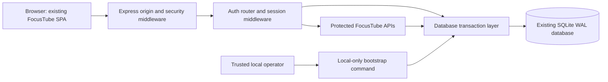

# FocusTube Invite-Only Authentication Specification

Status: the earlier account baseline was verified locally on port 3002. The 2026-09-25 member-invitation lifecycle is implemented with 84 focused authentication/invitation checks reported passed by the implementation handoff; it is not claimed deployed or browser-verified here. Email delivery and optional CAPTCHA require configuration for each installation. Current V1 release evidence and remaining gates live in [v1-release.md](v1-release.md).

## Current Release

| Action | Current behavior |
| --- | --- |
| Join | Requires an unexpired, unrevoked invitation with remaining uses, a verified six-digit email code, matching password confirmation, and a unique username. Format, availability, password length/strength, and confirmation feedback update during input. |
| Sign in | Existing members use email or username and their password. No new invitation is needed. |
| Invite someone | Active administrators choose 1-1,000 signups (default 1) and 1/7/30 days or a custom future expiry (default 7 days, maximum 365 days). Existing dates/counts are unchanged. Bootstrap remains single-use/24-hour and local-operator-only. |
| Manage invitations | Administrators list member links, edit expiry with revision checks, and revoke eligible links. Expired links need explicit reactivation; revoked/exhausted links cannot be revived. Raw links are copy-once and cannot be reconstructed. |
| Edit an account | Settings saves display name and username. Adding or changing the username requires the current password. |
| Change a password | Requires the current password and matching new-password confirmation; revokes old sessions and issues a replacement to the current browser atomically. |
| Verify an existing account | Members retain access while unverified. Email verification requires a code and current password; no invented address or automatic verification is applied. |
| Keep existing data | Migration preserves member identities and learning data. Existing guests may export or convert with an invitation; new guest creation is disabled. |
| Configure protection | Exact origins, persistent rate limits, and per-user data checks apply on the backend. SMTP is required for new registration; Turnstile is optional for the operator. |

Forgotten-password recovery, arbitrary email changes, self-service account deletion, and Google/GitHub OAuth are not implemented. Public Terms and Privacy are baseline notices that still need operator review.

For installation, use the [administrator setup](../README.md#administrator-setup), [email configuration](../README.md#email-verification-and-optional-captcha), and [deployment prerequisites](../README.md#review-and-deployment). Sections 14-17 record the email, account, invitation, and input-feedback extensions; section 17 is the current invitation lifecycle contract. Sections 1-13 retain the original inspection/design history, and section 15 describes the earlier reusable-link implementation. Their old 24-hour member expiry and no-revocation statements are historical, not current behavior. Ordinary auth/invitation routes retain same-origin protection; the separate, narrow extension-origin contract is documented in [v1-release.md](v1-release.md).

## Original Scope

The confirmed target is FocusTube in this workspace, adapting the Find Job sample. Retain the existing Express application, same-origin web frontend, better-sqlite3, and SQLite WAL database. Do not introduce FastAPI, SQLAlchemy, PostgreSQL, an authentication microservice, JWTs, or an email delivery service for this feature.

Account creation must require an invitation on the backend. Subsequent sign-in must require credentials, not another invitation. Email/password sign-in is a proposed identity migration: this application currently uses usernames. Existing accounts and their private data must not be silently replaced or assigned invented email addresses.

## 1. Verified Baseline

These facts describe the pre-change files inspected on 2026-09-13, not the current release. The evidence links name the original implementation surfaces; line positions may have moved as the code changed.

| Area | Existing behavior | Evidence |
| --- | --- | --- |
| Runtime | Express serves both the frontend and API; authentication runs in that process. SQLite uses WAL and foreign keys. | [server.js](../server.js#L12), [db.js](../db.js#L10), [package.json](../package.json#L1) |
| Users | Integer IDs; nullable, case-insensitive unique username; password hash and salt; guest flag. Display name is derived. No email, administrator flag, or account lifecycle state. | [db.js](../db.js#L15), [db.js](../db.js#L253) |
| Passwords | Node's asynchronous scrypt, a random 16-byte salt, 64-byte derived hash, and timing-safe comparison. No Argon2id dependency. Unknown users skip password verification. | [auth.js](../auth.js#L28), [auth.js](../auth.js#L163) |
| Registration | Anyone can register. User and initial profile creation are atomic, but session creation happens afterward, outside that transaction. | [auth.js](../auth.js#L139), [db.js](../db.js#L265) |
| Other entry paths | Anonymous guest creation and guest-to-member upgrade also require no invitation. Upgrade preserves the user ID, revokes old sessions, and issues a new session, but those operations are not one transaction. | [auth.js](../auth.js#L183), [auth.js](../auth.js#L197) |
| Sessions | Random 32-byte base64url tokens; only SHA-256 hashes stored; fixed 30-day expiry. Cookie is HttpOnly, Path=/, SameSite=Lax. Secure is selected using TLS or the supplied X-Forwarded-Proto header. | [auth.js](../auth.js#L98), [db.js](../db.js#L26) |
| Login limits | In-memory maps, 15-minute windows, five failed attempts per socket address plus normalized username. Register: ten requests per address/window; guest: twenty. Upgrade has no explicit action budget. Maps are pruned and bounded, not durable. | [auth.js](../auth.js#L48), [auth.js](../auth.js#L87) |
| Origin protection | Host allowlist exists. Mutations without Origin are allowed; otherwise only the parsed host and port are compared, not the scheme. | [server.js](../server.js#L20), [server.js](../server.js#L57) |
| Ownership | Private data, notes, imports/exports, activity, and statistics use the session-derived user ID. Download jobs also check their owner. Public playlist/video metadata endpoints currently lack an authentication guard. | [server.js](../server.js#L606), [server.js](../server.js#L635), [downloads.js](../downloads.js#L285) |
| Revocation | Logout deletes the current session. Guest upgrade revokes all sessions for that user. User deletion cascades to sessions; inactive guests are purged after 90 days. No password-change, recovery, or account-deletion API exists. | [auth.js](../auth.js#L115), [db.js](../db.js#L684), [README.md](../README.md#L621) |
| Missing entities | No invitation table, persistent login budgets, administrator bootstrap mechanism, total member limit, or shared authentication workspace record. The existing workspace JSON is private per-user planning data, not an authentication lock. | [db.js](../db.js#L15), [db.js](../db.js#L33) |
| Local boundary | Native server defaults to 127.0.0.1. Local Compose publishes only 127.0.0.1:3002; the application binds 0.0.0.0 inside the container. | [server.js](../server.js#L13), [compose.yaml](../compose.yaml#L1), [Dockerfile](../Dockerfile#L16) |

Eight isolated baseline checks exercised the actual auth handlers and origin middleware with an in-memory SQLite database. They confirmed anonymous session status, unrestricted registration, private-data authentication, the scheme-check gap, guest creation/upgrade and session rotation, a committed account surviving an injected session-insert failure, absent sample endpoints, and logout revocation. No saved profiles or running application instances were changed. The download router was stubbed; its authorization findings above are source inspection, not runtime coverage.

All six requested sample paths under `/api/v1` returned 404. They must not be described as existing FocusTube APIs. Existing notebook HTTP tests mock authentication, so they do not establish the correctness of real login or session handling: [test/notebooks.test.js](../test/notebooks.test.js#L388).

## 2. Security Invariants

- Visitors may sign in or submit an invitation to register. No HTTP endpoint may create a new user without a valid invitation, including legacy guest and upgrade routes.
- Active members may access only their own resources. An administrator flag permits issuing member invitations; it does not grant access to other members' courses, notes, exports, or download jobs.
- An active administrator may create ordinary member invitations only. The browser cannot choose a recipient user ID, account lifecycle state, or administrator flag.
- Only a trusted local operator may create an administrator bootstrap invitation, and only when there is no active administrator. Redemption must independently recheck that condition in its transaction.
- Being the first visitor, possessing a loopback IP address, or sending a special HTTP header is never administrator authorization.
- An invitation is a bearer credential, not an email-bound invitation. Possession does not verify ownership of the submitted email address.
- Opening, previewing, or checking the syntax of a link never consumes an invitation. Only a successful registration transaction consumes it.
- Every authorization decision uses current server-side session and user records, not a client-supplied identity or cached browser role.
- A failed registration transaction leaves no new account, profile, session, or consumed invitation. A committed transaction remains committed even if the HTTP response is subsequently lost.

## 3. Architecture



The gateway, auth router, and resource APIs are logical boundaries inside the existing process, not new services. The store owns transactional account creation, invitation consumption, and session persistence. Cookie serialization occurs only after the store commits. Keep resource ownership in the current per-user tables and queries.

Preserve the local Compose loopback publication and existing data volume. Do not modify development/production deployment files as part of this local feature. The HTTP cookie exception must be an explicitly approved loopback deployment mode, not a conclusion drawn from the Host header alone. A container's internal 0.0.0.0 listener is acceptable only behind the approved loopback host publication; untrusted container/network access requires separate review.

## 4. Data Model

Retain integer user IDs, current password hashes/salts, profile foreign keys, and existing data revisions. Continue the repository's canonical UTC ISO-8601 timestamp representation. All connections must enable foreign keys. New hash columns contain lowercase 64-character SHA-256 hex digests; validate the format and enforce uniqueness in SQLite.

| Entity | Fields and constraints | Indexes and behavior |
| --- | --- | --- |
| `users` | Existing `id`, `username`, `password_hash`, `salt`, `is_guest`, preferences and timestamps. Add `email_normalized`, `display_name`, `is_admin INTEGER NOT NULL DEFAULT 0 CHECK(is_admin IN (0,1))`, and `account_state TEXT NOT NULL DEFAULT 'active' CHECK(account_state IN ('active','disabled','deleted'))`. Administrators cannot be guests. | Keep username's existing unique NOCASE constraint. Add unique email index and an index supporting active-administrator lookup. Session resolution must require an active account. |
| `invitations` | `id INTEGER PRIMARY KEY`, `token_hash TEXT NOT NULL UNIQUE`, `is_admin INTEGER NOT NULL DEFAULT 0 CHECK(is_admin IN (0,1))`, `created_at`, `expires_at`, nullable `consumed_at`. Require expiry after creation and, when present, consumption at or after creation and before expiry. | Unique token-hash index; expiry index for unused-invitation cleanup. Expiry and consumption are authoritative, not a separate mutable status string. |
| `sessions` | Preserve hash primary key, user foreign key with ON DELETE CASCADE, creation time and expiry. Add digest-format and timestamp-order constraints when safely rebuilding the table. | Keep expiry index; add `user_id` index for revoking all sessions. No raw token column. |
| `login_budgets` | `budget_key_hash TEXT PRIMARY KEY`, `attempt_count INTEGER NOT NULL CHECK(attempt_count >= 0)`, `window_started_at TEXT NOT NULL`. Encode the action and identifier scope into the hashed key. | Window-start index for pruning expired budgets. Atomic reservation/update; active budgets are never evicted to make room for new attack identifiers. |
| `auth_workspace` | Exactly one seeded row: `id INTEGER PRIMARY KEY CHECK(id = 1)`, `max_members INTEGER NOT NULL CHECK(max_members > 0)`. Missing singleton means registration/bootstrap fails closed. | Shared admission-policy record. SQLite's transaction writer lock, not a row read, supplies serialization. This is not `user_data.workspace_json`. |

Email policy: accept a documented ASCII email format up to 254 characters, trim surrounding whitespace, and lowercase the full address as an explicit case-insensitive application identity policy. Apply the same normalization before uniqueness checks and login-budget key generation. Do not remove plus tags or dots or perform provider-specific alias folding. Do not label an email as verified. Internationalized email support is not assumed.

Require normalized email and a nonblank display name of 1-80 characters for new members and guest conversions. Reject control characters in display names; render them as text. SQLite permits null email/display name for migrated username-only accounts and guests; the new registration handler must not use that compatibility allowance. Add checks rejecting non-null blank, oversized, or noncanonical emails. Existing username-only accounts keep their IDs and credentials until they supply an email through an authenticated migration flow.

Member capacity counts all non-guest accounts in `active` or `disabled` state, including administrators. Guest conversion consumes a member slot; disabled accounts do not free one. A soft-deleted account remains unable to authenticate and retains its email reservation until an explicitly approved purge. Choose `max_members` before rollout: there is no existing total-user limit to preserve. If capacity is already exceeded, existing members may still sign in, but registration and bootstrap redemption remain blocked. The operator must resolve capacity explicitly rather than use a browser override.

## 5. Invitation Lifecycle

Generate 32 random bytes with Node crypto and encode canonical unpadded base64url, producing a 43-character token. Validate decoding length and canonical round-trip encoding before use. Hash the canonical token string with SHA-256, consistent with the existing session-token helper. Store only the hash. Creation and expiry timestamps are server-generated; invitations expire exactly 24 hours after creation, with `now >= expires_at` treated as expired.

An active administrator's create-invite operation uses an immediate transaction, rereads the calling session and account, requires that both are still valid and the account is still an active administrator, and inserts `is_admin = 0`. The browser sends no privilege fields. Return the raw link once, after commit, for private manual sharing. Never provide a later endpoint that retrieves the raw secret.

The proposed operator command is local-only and uses OS/database access, not an unauthenticated HTTP bootstrap route. It must identify the intended database/environment, take the same immediate transaction, read the singleton, and reject issuance if an active administrator exists. Only this trusted path inserts `is_admin = 1`. Do not automatically promote an existing or first-created account.

Multiple outstanding bootstrap invitations are possible while no administrator exists. That is safe only because redemption serializes and rechecks the active-administrator predicate; at most one competing redemption may create an active administrator. A losing redemption must roll back without consuming its invitation. Issuing an invitation does not reserve a member-capacity slot.

### Secret Handling

Example link shape: `http://localhost:3002/#join=<token>`; the actual origin must come from approved deployment configuration, not an unvalidated request header.

1. A small synchronous, self-hosted auth-entry script must capture the fragment before other scripts, routing, analytics, or error instrumentation run. The existing early theme script and deferred vendor scripts make load order an explicit implementation requirement.
2. Parse with URL/URLSearchParams, retain the token only in an in-memory closure, and immediately use `history.replaceState` to replace the secret-bearing fragment with a nonsecret join route. Do not put it in `history.state` or a hidden persistent application model.
3. Keep tokens out of query strings, path segments, localStorage, sessionStorage, IndexedDB, profile JSON, logs, telemetry, exception details, and automatic clipboard writes. Send an invitation only in the JSON body of registration or an authorized guest-conversion POST.
4. Clear the in-memory token on success, cancellation, sign-out, and page departure. On a reload after URL scrubbing, require reopening the original link; do not persist the secret for convenience. A syntax-valid token is not presented as server-validated.
5. Set `Cache-Control: no-store` on authentication/invitation responses and `Referrer-Policy: no-referrer` on the invitation entry document. Do not render third-party embeds on the registration screen. Log allowlisted event metadata only, never credential bodies or cookies.

Fragments are not sent in HTTP requests or referrers, but page scripts can read them. URL scrubbing cannot guarantee erasure from external chat clients, browser synchronization, clipboard history, screenshots, or malicious extensions. The issuer's explicit Copy action is a deliberate manual-sharing exception, with the usual clipboard exposure.

Invitations are not revocable in this scope. Disabling their issuer does not automatically revoke previously issued ordinary member invitations. They remain usable until consumed or expired; administrator bootstrap invitations additionally remain subject to the active-administrator check at redemption.

## 6. Registration Transaction

```mermaid
sequenceDiagram
    participant Browser
    participant API as Express Auth
    participant DB as SQLite
    Browser->>Browser: Capture fragment and scrub visible URL
    Browser->>API: POST register with invite, email, display name, password
    API->>API: Enforce origin, request shape and size
    API->>DB: Reserve persistent rate budgets and commit
    API->>API: Normalize input, hash password, generate session token
    API->>DB: BEGIN IMMEDIATE
    API->>DB: Read singleton and invite; check expiry, capacity and admin condition
    alt Admission checks and all writes succeed
        API->>DB: Insert user and profile; consume invite; insert session hash
        API->>DB: COMMIT
        API-->>Browser: 201 public user and session cookie
    else Invalid invite, conflict or storage failure
        API->>DB: ROLLBACK
        API-->>Browser: Stable error without secrets
    end
```

SQLite has no PostgreSQL-style `SELECT FOR UPDATE`. Use `better-sqlite3`'s `db.transaction(callback).immediate()` or an equivalent explicit `BEGIN IMMEDIATE` transaction. All authoritative checks and writes use the same connection and transaction. The writer lock serializes registration, bootstrap issuance/redemption, and competing lifecycle writes across connections/processes sharing the database. Reading the singleton or using the default deferred transaction alone is not the intended locking strategy.

Run expensive password hashing outside the write transaction. Retain the current 8-128-character password input limits for compatibility; do not trim, lowercase, normalize, log, or silently truncate passwords. Strictly check types and impose an auth-specific 8 KiB JSON-body limit before the current general 3 MiB parser. Reuse Node scrypt and current hashes for this adaptation; Argon2id is not an existing library here. Versioned KDF parameters and calibrated work factors remain a separate security-hardening decision, not an implied completed migration.

An optional nonconsuming invitation lookup may reject obviously invalid tokens before expensive hashing. It never replaces the locked recheck. Use a bounded KDF concurrency limit and a bounded database busy timeout, proposed at five seconds; saturation/busy errors return a retryable 503 without partially admitting an account.

Transaction pseudocode, not implementation:

```text
require_exact_origin_and_bounded_json(request)
reserve_and_commit_rate_budgets(request_source, registration_action)
validate_registration_fields(request)
email = normalize_email(request.email)
invite_hash = sha256(validate_canonical_token(request.inviteToken))
password_hash, salt = await existing_scrypt_hash(request.password)
session_token = random_base64url_32_bytes()

try:
    BEGIN IMMEDIATE
    workspace = require_auth_workspace_row()
    now = server_utc_time_after_lock_acquisition()
    invitation = find_invitation_by_hash(invite_hash)
    require invitation exists, consumed_at is null, expires_at > now
    if invitation.is_admin:
        require operation is new_registration, not guest_conversion
        require count_active_administrators() == 0
    require count_capacity_members() < workspace.max_members
    require normalized_email_is_unused(email)

    if operation is guest_conversion:
        guest = reauthenticate_guest_session_from_cookie_inside_transaction()
        require guest is eligible and invitation.is_admin == false
        user = convert_same_user_id_to_member(guest, email, display_name, password_hash, salt)
        delete_all_sessions_for(user.id)
    else:
        require request is not switching an authenticated member to a new account
        user = insert_active_user(email, display_name, password_hash, salt,
                                  is_admin=invitation.is_admin, is_guest=false)
        insert_initial_user_data(user.id)

    changed = consume_invitation_where_unused_and_unexpired(invite_hash, now)
    require changed == 1
    insert_session(sha256(session_token), user.id, now, now + session_ttl)
    COMMIT
except admission_or_storage_error:
    ROLLBACK if transaction_started
    return sanitized_error

return public_user(user), cookie_for(session_token)
```

The conditional consumption update must repeat `consumed_at IS NULL AND expires_at > now`. Database uniqueness constraints, not just preflight queries, reject duplicate email or token hashes. Any failure in user creation, profile insertion, guest conversion, invitation consumption, session insertion, or commit rolls back the whole admission transaction. Rate budgets remain charged because their reservation was committed separately.

If commit succeeds but cookie delivery or the response fails, do not undo the account or pretend the invitation remains available. The client should check its session and offer ordinary sign-in. Retrying the consumed invitation must not create a second account or grant another session merely because the caller presents the old invitation.

## 7. Login and Sessions

```mermaid
sequenceDiagram
    participant Browser
    participant API as Express Auth
    participant DB as SQLite
    Browser->>API: POST login with email and password, no invitation
    API->>API: Check exact origin, input and resource limits
    API->>DB: Reserve persistent login budgets; find account
    API->>API: Verify real password hash or equal-cost dummy hash
    alt Existing active account and correct password
        API->>DB: Begin transaction; recheck state and credential version; insert fresh session hash
        API->>DB: Commit
        API-->>Browser: 200 public user and HttpOnly cookie
        Browser->>API: Protected request with cookie
        API->>DB: Resolve unexpired session and active user; query only owned data
        API-->>Browser: Authorized response
    else Unknown, disabled, deleted, or wrong credentials
        API-->>Browser: 401 Invalid email or password
    end
```

- Never create an account from the login path. Unknown and inactive accounts receive the same credential error as a bad password. Run real verification or a precomputed dummy scrypt hash with matching work parameters; do not generate a new dummy hash for every attempt or skip work on unknown accounts.
- After asynchronous verification, recheck account state and the verified password hash/salt inside the session-creation transaction. This prevents a concurrent disable, password change, or recovery operation from admitting a session using stale credentials.
- Generate a fresh independent 32-byte session token per successful login/registration. Store only its hash and configured absolute expiry. Preserve the current 30-day default unless explicitly changed; `touchUser` must not extend session lifetime.
- Set `ft_session` with `HttpOnly; SameSite=Strict; Path=/; Max-Age=<configured TTL>` and no Domain attribute. Add Secure for every HTTPS deployment. Plain HTTP is permitted only for the approved loopback runtime. Never directly trust X-Forwarded-Proto; accept forwarding metadata only from an explicitly trusted proxy that overwrites client-supplied headers.
- Resolve the session and active user from the database for every protected request. Reject expired/revoked sessions even before cleanup has removed their rows. Parse malformed cookies defensively so bad percent encoding or invalid token length produces an anonymous/401 outcome, not a 500 or secret-bearing error.
- Logout deletes the presented database session and clears the cookie using matching name, Path, SameSite, HttpOnly, and transport-appropriate Secure attributes, with Max-Age=0. It is idempotent for absent/expired sessions. If database deletion fails, report failure rather than claiming confirmed revocation; the current frontend's swallowed logout errors must change.
- Guest conversion must continue revoking all of that user's old sessions while preserving the user ID and private data, now atomically with invitation consumption and the replacement session.
- There are no existing password-change/recovery/account-deletion routes to preserve. When introduced, password change or recovery must revoke all prior sessions in the same transaction as the credential update; disabling a user must block existing sessions; hard deletion must retain the existing session/data cascade. This specification does not add those workflows or claim they are tested.

Revocation is enforced at subsequent authorization checks. Immediately terminating already-running download streams or SSE connections is separate hardening; do not claim continuous revocation of those connections without implementing and testing it.

## 8. Origin and Rate Controls

For all API mutations, require a single valid Origin exactly matching the request's configured public origin: scheme, host, and effective port. Resolve that expected origin from the validated Host and trusted deployment configuration, not arbitrary forwarding headers. A second allowed local hostname is a distinct origin, not permission to send cross-origin mutations to the first. Reject missing, null, malformed, credential-bearing, or non-origin URL values and different schemes/ports with 403. Do not exempt logout, login, registration, guest conversion, imports, or administrator actions. Local operator commands use the database path rather than an HTTP origin bypass.

Retain the Host allowlist and restrictive CORS policy. Require application/json for credential-bearing and invite-creation bodies; a genuinely bodyless logout needs no Content-Type. Do origin checks before parsing large bodies or performing KDF work. Origin checks defend browser requests; they do not authenticate command-line clients, which can supply Origin themselves.

Replace process-local maps with committed atomic budget reservations. Hash identifiers using HMAC-SHA-256 with a stable operator-managed secret and action-specific domain separation; bare hashing of predictable emails/IPs does not protect them from offline dictionary enumeration. Do not store raw identifiers in the budget table or exports. Use a trusted socket/proxy source address, never an arbitrary browser-supplied IP.

Proposed starting limits, explicitly not all existing behavior:

| Scope | Limit per 15-minute window |
| --- | --- |
| Login, source address plus normalized identity | 5 attempts |
| All HTTP authentication mutations, source address | 100 attempts |
| Registration and guest conversion combined, source address | 10 attempts |
| Member-invite creation, administrator user ID | 20 attempts |
| Legacy email enrollment, authenticated user ID | 5 attempts |

Count attempts, including successful attempts, to make concurrent reservation unambiguous; this intentionally tightens the current failed-login-only budget. Reject over-budget requests before hashing with 429 and Retry-After. Reserve related budgets atomically. Retain expired-budget cleanup and a 5,000-active-key starting bound, but deny new keys when full rather than evict active limits. Persist budgets across restarts; do not reset them on login, worker changes, or registration rollback. Proxy/NAT users may share an address, so deployment-specific tuning remains necessary.

Charging policy: invalid origins, unsupported media types, oversized bodies, and malformed JSON are rejected before credential-budget allocation. For accepted JSON, reserve the source/action budgets before semantic field validation, so missing fields, bad tokens, and duplicate accounts still count. Add an identity-scoped reservation only when an identifier can be normalized; never run a KDF without every applicable reservation. A denied identity reservation does not refund an already charged source attempt.

## 9. API Contracts

### Existing FocusTube Routes

Current public-user shape is `{id, username, displayName, isGuest, downloadQuality, createdAt}`. Current errors use `{error: string}`. The existing global middleware may also return 400 for invalid Host/JSON, 403 for a rejected origin, or 413 for oversized JSON.

| Route | Current authorization and request | Current success | Current route-level failures |
| --- | --- | --- | --- |
| `GET /api/auth/me` | Optional session; no body | 200 `{user: publicUserOrNull}` | No explicit unauthenticated 401 |
| `POST /api/auth/register` | Public; `{username,password}` | 201 `{user}`, session cookie | 400 validation, 409 duplicate username, 429 action budget, 500 storage/hash error |
| `POST /api/auth/login` | Public; `{username,password}` | 200 `{user}`, session cookie | 401 generic credentials, 429 failed-login budget, 500 internal error |
| `POST /api/auth/logout` | Optional session; no body | 204 and cleared cookie | No explicit auth requirement |
| `POST /api/auth/guest` | Public; empty body/object | 201 `{user}`, session cookie | 429 action budget, 500 internal error |
| `POST /api/auth/upgrade` | Authenticated guest; `{username,password}` | 200 `{user}`, replacement cookie | 401 no session; 400 nonguest/validation; 409 duplicate username; 500 internal error |

### Proposed FocusTube Mapping

Retain the unversioned namespace rather than adding an unnecessary parallel API. The sample's join operation maps to the existing registration route, which must be tightened, not left as an open compatibility bypass. No `/api/v1` aliases are required.

| Sample path, currently 404 | Proposed FocusTube route | Authorization and request | Success and principal errors |
| --- | --- | --- | --- |
| `GET /api/v1/auth/status` | `GET /api/auth/status` (new) | Public; no token parameter | 200 `{registration:"invite-only",authenticated:boolean}`. No administrator count, invitation lookup, or identity enumeration. |
| `POST /api/v1/auth/join` | `POST /api/auth/register` (tightened) | Visitor; `{inviteToken,email,displayName,password}` | 201 `{user}` and cookie. 400 invalid request/invitation; 409 registration conflict; 429 budget. |
| `POST /api/v1/auth/login` | `POST /api/auth/login` (extended) | Public; `{email,password}`; legacy form described below | 200 `{user}` and cookie. 400 malformed request; 401 generic credentials; 429 budget. No invitation field. |
| `POST /api/v1/auth/logout` | `POST /api/auth/logout` | Optional session; no body | 204; always clear a successfully revoked, absent, or expired session cookie. 503 when revocation cannot be confirmed due to database failure. |
| `GET /api/v1/me` | `GET /api/auth/me` (tightened) | Valid session; no body | 200 `{user}`; 401 absent, expired, revoked, or inactive account. A legacy guest receives only its migration profile. |
| `POST /api/v1/invites` | `POST /api/invites` (new) | Active administrator; `{}` | 201 `{id,inviteUrl,expiresAt}`; raw secret exists only in this one-time URL response. 401 no valid session; 403 insufficient role; 400 unexpected fields; 429 budget. |

Proposed public user extends the current shape with `email`, `isAdmin`, and `accountState`; these are display data, not permission inputs. Never serialize password hashes, salts, session hashes, budget identifiers, or raw session tokens. On the tightened me endpoint, the frontend must treat 401 as ordinary signed-out state, not "server unreachable"; public status remains 200 for anonymous visitors.

Use `{error: string, code: string}` for proposed failures, preserving the frontend's current error-string handling. Invalid, expired, reused, or malformed invitations return the same 400 `INVALID_INVITATION`. After invitation validation, duplicate email, member-capacity exhaustion, and a failed bootstrap-administrator predicate return a generic 409 `REGISTRATION_CONFLICT`; they do not consume the invitation. Unknown/inactive/wrong-password login uses the same 401 `INVALID_CREDENTIALS`. Do not echo input secrets or raw database errors.

Common proposed errors: 403 for disallowed origin/authorization, 413 for oversized auth bodies, 415 for unsupported body media type, 429 with Retry-After for rate limits, 503 with retry guidance for bounded database/KDF unavailability, and sanitized 500 for unexpected failures. Reject unknown fields, including `isAdmin`, `is_admin`, `userId`, and `accountState`, rather than mass-assigning request JSON.

### Legacy Paths and Identity Migration

- `POST /api/auth/guest` must return 403 `INVITATION_REQUIRED` without inserting a user or session. Removing the button is only a UI change, not the control.
- `POST /api/auth/upgrade` remains available only to a current legacy guest session. Require `{inviteToken,email,displayName,password}`, an ordinary member invitation, and the shared registration budget. Return 200 with the same user ID and a rotated session; use the same atomic admission transaction. Administrator invitations cannot upgrade guests.
- Keep `{username,password}` login temporarily for existing username-only non-guest accounts with null email. Accept exactly one identifier field. Do not allow new username-only registration or auto-link accounts based on display name or submitted email.
- To complete email migration without lockout, propose `POST /api/auth/email` for an authenticated, active, username-only member: `{email,password}` reauthenticates the current password, claims a unique normalized email, revokes old sessions, and issues a new one atomically. Return 200 `{user}` plus cookie; use 400 invalid input, 401 failed credentials, 409 already-enrolled/duplicate email, and 429 enrollment budget. Recheck the session and verified credential hash inside the transaction. This is identifier enrollment, not email verification or recovery; subsequent email changes are outside scope.
- Existing members remain members without retroactively needing an invitation. Recommended guest transition: preserve data but limit old guest sessions to their own profile, export, invitation-backed upgrade, and logout until their existing session expires. Do not grant ordinary member API access to a migration-only guest. Approve that access change and an export window before rollout; never delete guest data merely to enable invitation gating.

## 10. Essential UI States

| State | Required behavior |
| --- | --- |
| Signed out | Email/password sign-in, with a clearly distinguished temporary legacy-username option. No invitation needed for returning members. No Continue as guest action. |
| Registration without invitation | Show invitation-required state; do not offer a working unguarded signup submission or an automatic guest fallback. |
| Invitation captured | Scrub the URL, show email/display-name/new-password form, and keep the token in memory only. Do not claim validity before the server accepts it. |
| Submitting | Disable duplicate submission; preserve the existing auth-transition/session-generation protections so stale responses cannot switch profiles. |
| Invalid/expired/used invitation | One neutral error state and sign-in option; no account or invite metadata disclosure. Clear unusable credentials from memory. |
| Validation/conflict | Show safe field or generic registration error; retain a still-usable invitation in memory for correction. Do not consume it on duplicate email. |
| Rate limit/offline/server failure | Respect Retry-After, allow an intentional retry, and distinguish network failure from credential rejection. After ambiguous registration delivery, check session status or offer sign-in before resubmitting. |
| Already signed in with an invitation link | Do not consume the invite or silently replace the current session. Offer continuing the current account or explicitly signing out before joining. |
| Administrator | A server-authorized Create invitation action, pending/error states, then a one-time link with expiry and explicit Copy action. No administrator-role selector, resend-secret action, or unimplemented revoke control. |
| Legacy member/guest | Authenticated email enrollment for a member; own-data export and invite-backed conversion for a migration-only guest. No merging or reassignment by client-provided user ID. |
| Logout failure/session expiry | Clear local private state on confirmed logout or rejected session. Do not claim database revocation succeeded when the request failed. |

Keep FocusTube's current visual language, focus management, accessible labels, and mobile layout. No new marketing landing page is needed.

## 11. Acceptance Tests

These are implementation requirements, not tests already passed by an invite implementation. Reuse the repository's Node test runner and nearby in-memory store pattern, but use the real auth router and middleware. A focused auth test file is justified; do not replace its authorization with the notebook suite's test-user header. Use disposable databases only.

| Area | Required cases and assertions |
| --- | --- |
| Backend gating | Direct POST registration without a token fails; removed UI, legacy route names, forged role fields, anonymous guest creation, and invitation-free upgrade cannot create an account/session. |
| Token validation | Missing, malformed, wrong-length, noncanonical, random, expired, exactly-at-expiry, and previously consumed tokens return the same safe invitation error without writes. |
| Link preview | Initial GET, reload, browser preview, and fragment capture do not consume an invitation or create a user. Auth status never accepts or validates an invitation secret. |
| Normal registration | One user, one initial private profile, one consumed invitation, and one hashed session appear together; correct email normalization and database-derived role. |
| Concurrent redemption | Two independent connections/processes redeem the same invite concurrently: exactly one account/session and one consumption commit. Use a temporary on-disk SQLite database and a synchronization barrier, not only two callbacks sharing one connection. |
| Duplicate email | Existing email and case/whitespace variants conflict without consuming the invitation. Two different invites racing to create the same normalized email produce one account; the losing invitation remains unused. |
| Transaction rollback | Inject failures after user insert, profile insert, invitation update, session insert, and at commit. All admission writes roll back. Guest-conversion failures restore the guest and old sessions. Rate reservations remain charged. |
| Response loss | Disconnect after commit: account/invite/session remain committed; a second redemption cannot create another account; ordinary login succeeds. |
| Capacity | At-limit registration and guest conversion fail without writes. Concurrent different-invite registrations for the last slot admit only one member. Disabled members still count; bootstrap has no hidden exemption. |
| Bootstrap issuance | Browser/member/admin HTTP calls cannot issue administrator invitations. Local issuance rejects when any active administrator exists. No first-user or special-header promotion. |
| Administrator races | Competing bootstrap redemptions produce at most one active administrator. An administrator activated between issuance and redemption blocks redemption. Recheck authorization when an issuer's session expires/is revoked or administrator is disabled before invite insertion. |
| Invite authorization | Anonymous callers receive 401, ordinary/migration-only users 403, active administrators create only `is_admin=0`; forged browser privilege/identity fields are rejected. |
| Login | Valid active email account logs in without an invite; unknown, inactive, and wrong-password cases use the same error and perform equivalent-cost verification. Assert KDF invocation/parameters rather than relying only on noisy timing thresholds. No login branch registers a user. |
| Credential races | Password/state change during password verification prevents session issuance against stale credentials. Future password-change/recovery implementations must add their actual revocation tests, not mocked claims of support. |
| Budgets | Check boundaries, concurrent reservations, expiry/reset windows, process restart persistence, malformed-request charging policy, key-capacity denial, Retry-After, proxy-source handling, and rejection before KDF work. Successful attempts must count as specified. |
| Origin/transport | Every mutation rejects foreign host, wrong scheme, wrong port, missing/null/malformed Origin, and forged forwarding metadata. Exact-origin JSON works; bodyless logout works; invalid Host and oversized/form bodies fail safely. HTTP exceptions cannot enable an unapproved remote runtime. |
| Cookie/session | Verify 32-byte entropy, hash-only storage, HttpOnly/Strict/Path attributes, HTTPS Secure and approved local HTTP behavior, matching deletion scope, malformed cookies, absolute expiry, expired-but-not-cleaned rows, and revocation on subsequent requests. |
| Logout | Current session becomes unusable; another account's session is unaffected. Repeated logout is safe. Database failure is surfaced and the UI does not report confirmed revocation. |
| Owner isolation | With real cookies for two members, probe data, notebooks, import/export, telemetry/statistics, and download metadata/events/files. Forged IDs in URL, body, query, headers, and import content never change the session-derived owner. Administrator status gives no private-data bypass. |
| Migration | Existing member IDs, scrypt hashes, progress, notes, and revisions survive. Legacy username login works only for eligible accounts; email enrollment is unique and reauthenticated. Guest conversion preserves ID/data and revokes all old sessions. Old guest sessions have only the approved migration access. |
| Secret exposure | Inspect browser URL/history state, storage, request URLs, logs, telemetry and errors: no raw invite/password/session secret. Raw invitation appears only in its creation response, explicit user-mediated sharing, transient memory, and redemption body; session token only in cookie transport. |
| Browser states | Desktop/mobile keyboard-accessible sign-in/join/admin/legacy flows; duplicated submit, stale response, reload, signed-in invite opening, invalid link, offline ambiguity and rate-limit behavior. Confirm no third-party scripts/embeds inspect the initial invitation fragment. |

Required implementation gates: focused real-auth tests, cross-connection race/rollback tests, existing `npm test`, and browser verification of invitation-secret handling and migration flows. Merely hiding registration controls or passing tests that mock authentication is insufficient.

## 12. Rollout and Open Decisions

1. Approve email migration, the legacy-guest export/access window, member capacity, rate defaults, and the HTTP/HTTPS origin configuration. Those are new policies, not settings discovered in this repository.
2. Back up and validate the SQLite database before migrations. Add schema changes transactionally, preserving IDs, foreign-key relationships, password material, per-user workspace JSON, and data/note revisions. Test upgrades from an existing populated database, not only an empty schema.
3. Roll out backend guards and matching frontend changes together while preventing an older, unrestricted server process/image from continuing to accept registrations against the same database. A stale browser must still encounter backend invitation enforcement.
4. Validate loopback publication and trusted forwarding configuration. Distribute the stable rate-budget secret privately. Set capacity in the singleton so the server and operator command share the same limit.
5. Use the trusted operator path to issue the first administrator invitation, redeem it once, and verify that subsequent HTTP invitations are member-only. Do not infer administrator ownership from an existing username or client preference.

All invitation, administrator, durable-budget, email, lifecycle, and stronger-cookie/origin behavior in this document is proposed. Only the baseline described in Section 1 was exercised. The actual runtime database's account inventory, migration feasibility on that data, deployment proxy configuration, KDF work-factor tuning, and target race/security tests have not been verified.

Email verification, SMTP, invitation revocation, password recovery/change UI, account deletion UI, multi-instance scaling beyond a shared local SQLite database, immediate termination of existing streams, and production readiness are not assumed or delivered by this specification. Public playlist/video metadata authentication is an additional abuse-control decision, not evidence of cross-user private-data access. Internet deployment and dependency/security auditing require their own review.

## 13. Initial Invitation Implementation

- The existing Express/SQLite/scrypt architecture is retained. Authentication is implemented in [auth.js](../auth.js), transactional admission and schema migration in [db.js](../db.js), and origin/transport enforcement in [server.js](../server.js). No authentication framework or new dependency was added.
- The initial capacity is 100 active/disabled members, including administrators, and is changed through [scripts/auth-admin.js](../scripts/auth-admin.js) `set-limit`. The same script provides local-only `bootstrap`; it requires an explicit existing database directory and application origin. Bootstrap and limit changes are separate commands.
- Existing member IDs, password hashes/salts, data, and sessions are preserved. Username login remains available only until authenticated email enrollment. Legacy guests retain profile, export, invite-backed conversion, and logout until session expiry; the existing 90-day inactive guest cleanup remains. New guest creation is disabled.
- Older on-disk databases receive a SQLite snapshot before the auth migration. The operator command also snapshots before changes. Tests inspect a populated pre-migration backup and verify rerunning migration preserves identity and credentials.
- The HMAC budget key is generated once in the private `.auth-rate-key` file beside the database with mode 0600 and reused on restart. It is not in profile exports. Preserve it during backup/restore; operator-managed retention and filesystem permissions remain operational responsibilities.
- Session TTL is configured with `AUTH_SESSION_DAYS` (30 by default). Native loopback HTTP is allowed; container loopback HTTP requires `AUTH_ALLOW_LOOPBACK_HTTP=1` and configured `AUTH_PUBLIC_ORIGINS`. Local Compose is configured; development/production deployment files were not changed.
- [public/auth-entry.js](../public/auth-entry.js) runs before the theme/vendor/application scripts, scrubs the invitation fragment, and keeps the secret only in memory. [public/app.js](../public/app.js) implements join/login, guest conversion/export, legacy email enrollment, one-time member invitation sharing, and explicit logout failure handling.
- [test/auth.test.js](../test/auth.test.js) uses real auth middleware, disposable SQLite databases, cross-connection worker races, injected write/commit failures, and populated migration fixtures. Download authorization uses the actual router with external processes/filesystem operations stubbed; it does not claim real media-download coverage.
- Browser checks use an isolated preview database, not the user's saved profiles. Confirmed flows include bootstrap registration, member invitation/registration, returning-member login, invitation reuse rejection, URL scrubbing, reload losing the secret, legacy email enrollment preserving identity, guest conversion preserving a saved task, and logout failure remaining visible. Light/dark auth layout checks cover 320, 375, 768, and 1440 CSS pixels. Cookie attributes are checked through HTTP tests because the integrated browser lacks the cookie-inspection protocol method.

The detailed setup commands are in [README.md](../README.md#administrator-setup). The running local Docker instance and its volume are not automatically upgraded by writing these files. Restart/rebuild an intended instance with matching frontend/backend code before issuing its first administrator invitation. The original non-goals remain unchanged: no email verification, invitation revocation, password recovery, account-deletion workflow, or production-readiness claim.

## 14. Verified Email and Signup Controls

This extension supersedes the initial no-SMTP/no-email-verification scope and the temporary username-only login restriction. The application remains invite-only and uses the existing Express, SQLite, opaque-session, and scrypt architecture.

- Signup and guest conversion now require `passwordConfirmation` equal to `password`, enforced in both the UI and backend. An optional 3-32-character username uses the existing case-insensitive unique constraint. Members may sign in with email or username; both aliases share a per-account login budget.
- `POST /api/auth/verification/request` sends a six-digit email code through [auth-services.js](../auth-services.js) and the pinned Nodemailer transport. SMTP requires authenticated TLS or an operator-approved TLS relay. There is no runtime test mailbox, console-code response, or automatic verification fallback.
- `email_verifications` stores only a random challenge token hash and an HMAC-SHA-256 code hash, bound to the normalized email, invitation, purpose, and current user/session where relevant. Challenges expire after ten minutes and allow at most five wrong guesses. Wrong guesses are committed independently so a failed registration cannot refund the guessing budget.
- Verification requests have separate source and recipient budgets plus a 60-second resend cooldown. Resend replaces only the matching challenge context. Challenges become usable only after the SMTP transport accepts delivery; a send failure deletes the new challenge. SMTP acceptance is not a guarantee of inbox delivery.
- The final registration transaction rechecks and consumes the email challenge together with invitation consumption, user/profile creation and session insertion. Database failures roll back both proofs and all account changes. Username/email conflicts do not consume either proof. A delivered code does not by itself create an account, consume an invitation, or prove control of a different address.
- `users.email_verified_at` records successful verification. Existing users remain unverified until they prove mailbox access and are not locked out by this migration. `/api/auth/email` now requires the email code and current password; it can verify the existing address or initially enroll an address for a username-only account, and rotates all old sessions. It does not provide arbitrary email changes or password recovery.
- `POST /api/auth/profile` saves the current member's display name and username. Adding or changing a username requires the current password and an atomic case-insensitive uniqueness check. The server rechecks the session and account snapshot before saving; the frontend updates account details without recreating the player or notebook.
- The signed-in password-change extension (15 September 2026) adds `POST /api/auth/password` with `{currentPassword,newPassword,passwordConfirmation}`. The existing member/session/Origin checks and a five-attempt account budget precede password work. A fresh scrypt hash, revocation of old sessions, cleanup of bound email challenges, and replacement session are committed atomically after rechecking the credential/session snapshot. Errors or concurrent stale updates cannot partially rotate credentials. The current browser stays signed in; learning records and email verification are preserved. This supersedes the initial password-change UI non-goal, not the separate forgotten-password recovery non-goal.
- Basic Terms and Privacy are public at `/policies.html#terms` and `/policies.html#privacy`; sign-in and Settings link to them without losing the active form/player. This publishes baseline notices, not a claim of deployment-specific legal compliance or a record that existing members accepted a new policy.
- Optional Cloudflare Turnstile is enabled only when both keys are configured. The backend validates success, hostname, expected action, age, and provider-enforced single use. Siteverify timeouts/failures fail closed; only the site key is public. The browser loads Cloudflare only when enabled, after invitation-fragment capture. Widgets reset after submissions and are removed when forms close.
- Google and GitHub are visible, disabled "Coming soon" options only. No OAuth routes, credentials, provider-linked identities, or implicit email-based account merging were introduced. Future OAuth must preserve invitation gating, state/PKCE, issuer/subject binding, verified-email handling, and explicit reauthenticated linking.

Configuration names and safe defaults are in [.env.example](../.env.example); setup instructions are in [README.md](../README.md#email-verification-and-optional-captcha). Local Compose passes these settings through on port 3002. Development/production deployments were not reconfigured: supply their approved HTTPS origins, proxy boundary, SMTP settings, and backups before merging a branch that triggers deployment. The 2026-09-15 dependency audit still reports four moderate findings in existing Express/query-parsing and PDF dependency chains, not in Nodemailer.

Verification includes real-route tests for required confirmation, usernames, email-code context/expiry/guess limits, delivery failure, resend replacement, verification rollback, account-session binding, password rotation, and optional CAPTCHA enforcement. Browser fixtures cover confirmation before requests, two-stage signup, profile verification, CAPTCHA-required behavior, cleanup, and no browser-storage persistence. The full deterministic suite passed 119 tests on 2026-09-15 without sending real email.

The initial email tests used controlled delivery because local SMTP was not configured at that time. A separate local SMTP check on 2026-09-14 subsequently authenticated with verified TLS and received provider acceptance for a labeled test message. That does not establish inbox delivery or hosted mail readiness. Live Turnstile challenges and inbox delivery are not claimed. An installation without SMTP still correctly disables new signup while preserving existing-member sign-in and learning data.

## 15. Reusable Member Invitations

Historical reusable-link extension (2026-09-15): section 17 supersedes this section's expiry, API-field, listing, and no-revocation restrictions while preserving signup-count enforcement.

This extension supersedes the single-use-only member-invitation contract above. **Settings > Administration > Member invitations** includes an **Allowed signups** numeric input from 1 to 1,000, defaulting to 1. The Site monitoring control and other settings remain available. `POST /api/invites` accepts only optional `maxUses`; invalid types, fractions, zero, negative values, and values above 1,000 are rejected. Its response adds `maxUses` and initial `useCount: 0` to the existing ID, secret link, and expiry. The UI displays the selected limit and expiry, not invitation history or live usage.

- `invitations.max_uses` and `use_count` are constrained integers. The additive transaction maps every old link to a limit of 1, with already-consumed links at count 1; reopening the database never resets counts. Bootstrap administrator invitations are constrained to one use in both the store and schema.
- Registration and guest conversion recheck remaining uses inside the existing immediate SQLite transaction. A guarded increment commits with the email proof, account, profile, session, and auth audit event. `consumed_at` is set only when the final place is used. Failed attempts and transaction failures leave the count unchanged; visits and email challenges never reserve places.
- The 24-hour expiry, email verification/CAPTCHA rules, admin-only issuance, normal-member role, and total workspace member cap are unchanged. A larger invitation limit cannot bypass workspace capacity or source rate limits.
- Tests cover legacy migration, restart persistence, guest conversion, expiry, rollback, real-route validation/exhaustion, and independent SQLite connections competing for remaining invitation uses and the workspace's last member slot. Form regressions cover validation, duplicate submission, closed/account-changed views, and request errors.
- The link remains a bearer credential and uses the approved request origin. External onboarding requires the existing reachable HTTPS deployment; a localhost URL is not a public invitation. This feature does not add revocation, an invitation dashboard, a new delivery provider, or public network exposure.

Back up the target database and deploy frontend/backend together. An older application image treats every invitation as single-use, so image rollback does not retain reusable-link behavior. Existing accounts, credentials, sessions, and learning records are not rewritten by this migration.

## 16. Required Usernames and Immediate Password Feedback

This extension supersedes the optional-new-username behavior in section 14. Both registration and legacy guest conversion require a 3-32-character username containing letters, numbers, dots, dashes, or underscores. The backend trims and lowercases it and preserves case-insensitive uniqueness. Existing username-less accounts remain supported; there is no account migration or automatic username assignment.

- `POST /api/auth/username/check` accepts `{username,inviteToken}` from anonymous/guest visitors with an available invitation, or `{username}` from an active member. It returns only normalized `username` and boolean `available`, with no-store responses and the existing exact-Origin/JSON/body-size guards. The member's own name is available to that member; occupied names, including disabled accounts, are unavailable to others.
- Availability has a separate persistent limit of 180 requests per source per 15 minutes so typing does not consume the signup/login source budget. Checks do not consume invitation uses, send email, or reserve a name. Final registration remains authoritative and returns `USERNAME_TAKEN` without consuming the invitation or email proof on a collision.
- The form checks valid names immediately on input, cancels superseded requests, ignores stale responses, and waits for the current result before requesting a code or submitting registration. Invalid, taken, timeout, network-error, and rate-limit states remain distinct; failures never imply availability.
- Signup, sign-in, and signup confirmation have independent, keyboard-labeled reveal/hide buttons with 44px touch targets. Values are preserved when toggled and masked on mode changes, submission, reset, and page exit.
- Password length, advisory strength, and confirmation matching update synchronously on every input, including the first character, paste, and change events. Pinned, self-hosted zxcvbn runs locally; no strength-check request or password storage is added. Strength is an estimate, not a guarantee or a new complexity requirement. The existing 8-128-character backend policy and scrypt hashing are unchanged.

Verification uses real-route security/transaction tests and isolated browser fixtures. Native Chromium touch and typing checks cover sign-in/signup in both themes at 320, 375, 768, 1024, and 1440 CSS pixels, plus per-character feedback, full-target reveal, username conflicts and retry, and masking after failed sign-in. Physical iOS/Safari, real inbox delivery, and live CAPTCHA are not claimed by these checks.

## 17. Member Invitation Lifecycle V1

Implemented contract as of **2026-09-25**. This supersedes earlier member-expiry, no-listing, and no-revocation restrictions, not invitation-only registration or the bootstrap boundary.

### Lifetime and Administration

- New member links default to server-now plus **seven days** when `expiresAt` is omitted. Settings offers **1 day / 7 days / 30 days / Custom date and time**, with seven selected. Custom input is displayed in the browser's stated timezone and submitted as canonical UTC `YYYY-MM-DDTHH:mm:ss.sssZ`. The returned expiry is authoritative.
- Creation and expiry edits require a finite future timestamp no more than **365 days from that operation**; there is no never-expiring value. At `now >= expiresAt` a link is expired. Editing cannot move expiry before its creation.
- Existing stored expiry dates, signup limits, and use counts are not automatically rewritten. `maxUses` remains 1-1,000, default 1; expiry edits never reset `useCount`, add places, or bypass workspace capacity. Only successful registration/conversion consumes a place.
- **Issued invitations** lists Active, Expired, Exhausted, and Revoked member links, including expiry and used/remaining places. Refresh and cursor pagination do not expose secrets. Edit/Revoke operate on the current revision, so a concurrent edit or signup requires reloading stale details.
- Extending an expired link with unused places requires the explicit **Reactivate** confirmation and `reactivate:true`. Revoked or exhausted links cannot be revived by expiry editing; create a new link. Revoke is available for active/expired, unexhausted member links, requires confirmation, and blocks future redemption without changing accounts already created.
- Bootstrap administrator links remain **one signup / 24 hours**, issued only by the trusted local command when no active administrator exists. They cannot take a custom expiry and are excluded from browser list/edit/revoke operations. Redemption rechecks the active-administrator condition.

### Current API

All routes require a current active administrator. Mutation bodies remain bounded JSON with the exact web Origin; browser role/identity fields are rejected. The optional `X-Invite-Account` header binds the view to its displayed administrator and cannot grant authorization. Create/edit/revoke share the existing 20-attempt administrator budget per 15 minutes, in addition to source controls.

| Method and route | Request | Result |
| --- | --- | --- |
| `POST /api/invites` | `{maxUses?,expiresAt?}` | `201`, safe metadata plus the **one-time** `inviteUrl`; `{}` means one signup/seven days. |
| `GET /api/invites` | Optional `before` positive ID cursor and `limit` 1-50 (default 50) | `{invitations,nextCursor}`, newest IDs first, member links only. |
| `PATCH /api/invites/:id` | `{expiresAt,revision,reactivate?}` | Updated metadata; expired links require `reactivate:true`. |
| `DELETE /api/invites/:id` | `{revision}` | Revoked metadata; unused invitation-bound email proofs invalidated. This is revocation, not erasure of the record. |

Safe metadata is `{id,createdAt,expiresAt,maxUses,useCount,remaining,status,revision}`. No list/edit/revoke response contains `inviteUrl`, a token, or a token hash. Only a SHA-256 token hash is stored, so a lost raw link cannot be reconstructed. Copy privately at creation; the existing fragment scrubbing and memory-only join-secret handling remain.

Stale revisions return `INVITATION_CHANGED`; explicit reactivation is enforced with `INVITATION_REACTIVATION_REQUIRED`. Invalid expiry is `INVALID_INVITATION_EXPIRY`. Exhausted and revoked edits fail distinctly for administrators, while anonymous signup continues receiving the shared neutral invalid-invitation response. Missing/pruned member records cannot be edited back into existence.

### Transactions and Retention

The additive migration adds revocation/revision state without rewriting old dates or counts. Invitation IDs are monotonic across cleanup, avoiding stale links to reused administration IDs. Status precedence is Revoked, Exhausted, Expired, then Active. Availability requires a non-revoked, non-consumed link with remaining uses and future expiry, shared by preflight checks, email-proof issuance, and final redemption.

Issue, expiry edit, revoke, and redemption revalidate authority inside immediate SQLite transactions. A final signup racing an expiry edit or revocation is governed by committed transaction order. Revocation deletes unused bound email challenges; final redemption also rechecks availability. Failed admission must not consume a proof/place or partially create an account. Existing `consumed_at < expires_at` constraints, signup counts, and member-cap enforcement remain intact.

Periodic cleanup removes invitations whose expiry is at least **30 days old**. This is not a permanent invitation history; legacy pruned records and secrets cannot be recovered through the UI. Revocation prevents use immediately at authorization checks, regardless of eventual cleanup. Operator backups have separately managed retention.

### Verification and Rollout

On **2026-09-25**, all **84 focused authentication/invitation checks** passed, followed by **266 integrated tests on both host and built container**. An isolated Chromium/HTTPS run verified native create/seven-day default/expiry edit/revoke controls and desktop/mobile rendering with synthetic accounts. Real SMTP, CAPTCHA and hosted signup were not exercised; these local results do not certify provider configuration or the deployed instance.

Before rollout, run the full release checks and populated-backup migration rehearsal, verify create/list/edit/reactivate/revoke and stale-view behavior in the actual browser, and preserve the target database, rate key, SMTP, proxy, ports, and volumes. Do not roll back to an older handler that ignores `revoked_at` or the new session/extension protections. The canonical evidence, remaining gates, and compatible-image rollback procedure are in [v1-release.md](v1-release.md).