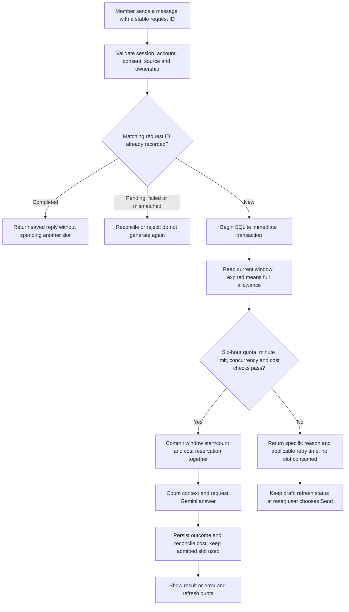

lets# Six-Hour Video Chat Quota: Approval Plan

Status: **Approved and implemented locally on 2026-10-01.** The owner approved **30 requests per account per six hours** and then requested implementation. PR publication was requested on 2026-10-01; deployment remains a separate approval step.

This document records the approved design and local implementation; it does not claim to reproduce Gemini, Claude or ChatGPT's proprietary quota policies. Code changes are isolated in the `Local-course-chat-quota` worktree based on `dev` commit `40bf96fa9ae3ed93e658f58db916195593f80796`, because concurrent edits replaced the chat files in the earlier checkout. Those edits were not reverted. No real account permissions, private provider settings, budgets or deployed containers were changed.

Proposed flow source: [diagrams/video-chat-quota.workflow.json](diagrams/video-chat-quota.workflow.json). The standalone review diagram is [diagrams/video-chat-quota.html](diagrams/video-chat-quota.html).

## Recommendation

Use an **account-scoped, first-request-anchored fixed window**: a configurable number of admitted requests, with the owner-selected allowance of **30**, every **six hours**. The clock starts only when the server accepts the first new request into that window. This is not a sliding window, not a reset six hours after exhaustion, and not a universal midnight reset.

| Decision | Proposed behavior |
| --- | --- |
| Eligible users | All active, registered, signed-in members, including administrators, once chat is configured and enabled. No pilot-ID maintenance. |
| Allowance | 30 newly admitted requests per account per six-hour window, approved and implemented locally. |
| Window | First admitted request starts six hours measured by server time. Later requests never extend it. |
| Scope | Shared across all of that account's videos, conversations, tabs, devices and sessions in the same installation. Dev and production remain separate. |
| Expiry | At `now >= resetAt`, the full allowance becomes available. The next admitted request starts the next window; unused requests do not accumulate. |
| Existing daily limit | Replace the 20-per-UTC-day request check, rather than leave a hidden daily block after the six-hour reset. |
| Burst/concurrency limits | Keep five admitted attempts per minute and one in-flight answer per account. Administrators have no quota exemption. |
| Cost limit | Keep the existing shared UTC-month spending cap and conservative cost reservation. No budget increase is included. |

Example: the first accepted request is at 09:20, so the reset is at 15:20. If all 30 requests are used by 10:00, new generation waits until 15:20, not 16:00. If the next accepted request is at 16:05, that next window ends at 22:05. Opening chat, loading status or sending a rejected request does not start a window.

Fixed windows can allow a burst around a boundary; the separate minute limit still applies. This replaces, and can permit more total daily usage than, the previous 20/day policy. The current Compose budget defaults are $1/month for dev, $4 for production and $5 for native/local; these are independent per-database caps, not a combined provider-account cap. A displayed request allowance is not a guarantee that shared spending capacity or provider capacity remains.

## Request Flow



Backend decisions remain authoritative. The browser's countdown neither grants access nor automatically resubmits a question. An answer admitted before the deadline may finish afterward; it belongs to the old window and must not increment a newly opened one.

## What Counts

One request is one **new, durably admitted answer-generation attempt**, not a button click, token, caption segment or streamed chunk.

| Action | Six-hour allowance |
| --- | --- |
| Ask, Summarize video, Explain key ideas, selected follow-up, or AI-generated note draft | One slot after all admission checks and the reservation commit. |
| Read history, switch/create/rename a chat, open Notes, or append an already generated answer to notes | No slot. |
| Decline provider consent, invalid question, unavailable captions before admission, stale source/account, quota/rate/budget rejection | No slot; no six-hour window is created or extended. |
| Repeat an already completed request ID with the same bound payload | Return the stored result; no additional slot or provider call. |
| Repeat a pending/failed ID or reuse an ID for different content | Keep existing reconciliation/conflict behavior; never silently issue another provider request. |
| Failure, timeout, cancellation or disconnect after a reservation committed | The admitted slot stays used, including context-counting failures before generation. This preserves the existing attempt-counting policy and prevents retry/cancel loops. |
| Explicit new request after reviewing a failure | A new request ID uses a new slot if admitted. No automatic paid retries. |

Request quota and cost accounting are independent. Known pre-generation failures can still have zero recorded generation cost; unknown dispatched costs retain the current conservative reservation. Resetting request allowance never clears the financial ledger. A more generous proven-failure refund policy can be a later, separately tested change; it is not silently included here.

## Backend Design

Keep Express, SQLite and the existing `video_chat_usage` request/cost ledger. No Redis, new service, cron reset, provider integration or client-side authority is needed.

1. Add one bounded `video_chat_quota_windows` table with `user_id` as the primary key/foreign key, `window_started_at` in server epoch milliseconds, and `used_requests` as a nonnegative integer. One row per participating account; no messages, emails, API keys or demographic data. Account deletion cascades the quota row; the existing cost-ledger retention is unchanged.
2. Add a shared quota-status calculation to the chat store. Read-only status computes an expired/absent row as a full unused allowance, without writing a new window. Remaining is clamped to zero; an operator-lowered limit never produces a negative count.
3. Extend the existing `reserve(...).immediate()` transaction. Preserve matching-request replay and thread/source checks; take one server timestamp, evaluate burst/concurrency/window/cost checks, then upsert the window count and insert the usage reservation atomically. Any error rolls back both writes. Concurrent workers cannot spend the last slot twice.
4. Replace the old daily query. Keep the existing `(user_id, created_at)` ledger index for the minute limit and the existing monthly spending queries. Finishing a request updates its existing usage record, not the quota counter.
5. Add one validated operator setting, proposed `VIDEO_CHAT_REQUESTS_PER_WINDOW=30`; keep the window fixed at six hours for v1. Invalid configuration fails closed for generation with a nonsecret operator diagnostic. Existing keys, model, monthly budgets, caption rules and master enable switch remain.
6. Replace the pilot-ID eligibility condition with active registered membership, still enforcing current sessions and course ownership. Remove `VIDEO_CHAT_ALLOWED_USER_IDS` from tracked examples/Compose wiring and current docs; an obsolete private value becomes unused, never interpreted as broader privileges. The owner approved this policy expansion as part of implementation; deploying it still requires approval.

Keep quota status out of the existing `available` capability boolean: exhaustion blocks new generation, not reading existing chats, editing notes, or app access. This distinction also prevents the current shared availability guard from unnecessarily blocking conversation-management routes.

## API Contract

Extend the existing authenticated `GET /api/video-chat/config` and chat snapshots additively with an own-account `quota` object: `limit`, `used`, `remaining`, `windowSeconds: 21600`, `windowStartedAt`, `resetAt`, and `serverNow`. An absent/expired window reports full remaining allowance with null window/reset timestamps until a new request is admitted. Use UTC timestamps on the wire and private/no-store responses with existing account/session guards.

When the six-hour allowance is exhausted, reject before starting NDJSON or calling Gemini:

- HTTP `429`, code `CHAT_WINDOW_LIMIT`, `quota`, and a positive integer `retryAfterSeconds`.
- HTTP `Retry-After` header in seconds, derived from the server deadline.
- Message identifies the six-hour request limit and reset time, not administrator configuration, account eligibility or the monthly budget.

Minute-rate limit, another answer in progress, local monthly spending cap, and provider-side throttling retain distinct reasons. Only present a reset deadline that is known; never claim that a six-hour refill fixes an exhausted monthly budget or Gemini's separate provider quota. Preserve normal JSON and NDJSON clients and existing idempotent completed-request replay.

## User Experience

- A compact quota status beside the chat composer, such as "27 of 30 requests remaining". During an active window, show "Resets at 15:20" in the user's locale, with date when needed. No new dashboard or marketing screen.
- At exhaustion, keep the question draft editable and history/notes usable. Disable new Send/starters/follow-up generation with a visible reason and announce the state once accessibly. Do not announce a countdown every second.
- Refresh status when opening/focusing chat, after an attempt settles, on relevant errors, and once at the server-provided deadline. Derive any local display timer from `serverNow`; recheck the server before indicating renewed access. No per-second network polling.
- Preserve current account/video generation guards and abort late responses. Tab/device counts are snapshots that can be briefly stale; every Send still goes through the atomic server check.
- A background tab waking after expiry rechecks immediately. If offline at reset, keep the draft and show that quota could not be refreshed; don't fabricate a successful refill.
- Include 320px mobile, desktop, 200% text, keyboard, screen-reader names/status, reduced motion and both themes in acceptance. This is responsive web work, not a claim to have native iOS/Android clients.

## Migration And Release

The added table does not rewrite accounts, conversations, transcripts, notes or the spending ledger. Initial activation gives existing accounts a fresh six-hour allowance on their first post-change admitted request; historical 20/day counts are not converted, but historical financial and minute-limit records stay in force. This one-time fresh request window is part of the policy approval, not an accidental restart reset.

Subsequent logins, new sessions, server restarts, conversation deletion and ordinary profile imports must not reset quota rows. Keep quota counters out of user learning exports/imports so a user cannot restore an allowance. A full operator database restore can rewind both quota and spending state, so use the existing maintenance/backup recovery procedure rather than claiming immunity to it. Clock rollback must not open a fresh window early; server clock accuracy remains an operational prerequisite.

Implementation and local synthetic exhausted/reset testing are complete. PR publication was requested on 2026-10-01; deployment still requires separate approval. Deploy to dev first, preserving its private key and budget, with a SQLite-aware backup and migration rehearsal. Verify same-account behavior across devices and the new account policy before separately promoting production. Keep the master chat switch as the kill switch; do not use an older writer against the new quota policy without a reviewed rollback plan.

## Implementation Slices

| Slice | Existing owner | Changes |
| --- | --- | --- |
| Storage and enforcement | [video-chat-store.js](../video-chat-store.js#L211), [test/video-chat.test.js](../test/video-chat.test.js#L1) | Quota table/status and atomic reservation; replace daily check; deterministic clock/race tests. |
| Eligibility and API | [video-chat.js](../video-chat.js#L287) | Active-member access, validated limit config, quota snapshots and 429/retry metadata. |
| Chat UI | [public/video-chat.js](../public/video-chat.js#L1), [public/index.html](../public/index.html#L1), [public/styles.css](../public/styles.css#L1) | Composer quota state, preserved drafts, status refresh and reset handling. |
| Configuration | [.env.example](../.env.example#L1), [compose.yaml](../compose.yaml#L1), [compose.dev.yaml](../compose.dev.yaml#L1), [compose.prod.yaml](../compose.prod.yaml#L1) | New count setting; remove old pilot allowlist; preserve existing enable/budget defaults. |
| Contracts and evidence | [README.md](../README.md#L1), [v1-release.md](v1-release.md), [test/design-language.test.js](../test/design-language.test.js#L1) | Updated quota/access behavior and verified release evidence, not hypothetical test passes. |

## Acceptance Gates

1. With an injected server clock and the other admission checks satisfied, requests 1-30 are admitted; request 31 is rejected without a quota/usage insert or Gemini call. Just before the deadline remains blocked; exactly at it admits the next new request and starts a new six-hour window. Blocked requests never extend the deadline.
2. Two separate SQLite connections/workers compete for the last slot: exactly one new reservation commits. Same-ID replay does not increment twice, including after expiry or a lost response; pending/failed/mismatched IDs keep their rejection/reconciliation semantics.
3. Quota persists across process restart, logout/login, tabs/devices, video/history switches, clears/deletes and user-profile import. Different accounts and dev/prod installations remain isolated. An in-flight old-window request finishing after expiry cannot alter a new-window count.
4. Guest, signed-out, disabled/deleted and stale-session users remain rejected. Active ordinary members no longer need a pilot ID; administrators receive the same quota and burst/cost checks.
5. Test invalid input, missing consent/captions, budget and burst rejection, cancellation, provider failure, timeout, oversize context and database rollback against the counting table above. No automatic resubmission or double charging; request counts and financial reconciliation remain distinct.
6. Zero/invalid configuration, exhausted shared budget, provider 429, minute throttling and six-hour exhaustion each show the correct reason. UI countdown expiry, focus refresh, offline recovery and late cross-account responses cannot grant quota themselves.
7. Run focused existing tests, full suite and the exact candidate image using synthetic providers; verify backed-up populated migration and responsive/browser behavior. Report native-device, real-provider and hosted gaps separately. No billable test without authorization.

## Diagram Verification

These checks apply only to the proposed workflow artifact, not to a running quota implementation. The automated browser receipt is [diagrams/video-chat-quota.visual-check.json](diagrams/video-chat-quota.visual-check.json), with [captured views](diagrams/video-chat-quota.visual-check.html). Image viewing returned references without a visible image in this session, so no perceptual-review pass is claimed.

```text
diagram_type: workflow
output: docs/diagrams/video-chat-quota.html
specification_sha256: 9272fa4f071d17bc9e44893a3a9c6544917a752f83a793286d5d4bc81967ef1e
artifact_sha256: 4d0c8cfc72f32a9ab19f87e449ef44f85b108e710960ef581c918f0f3956dbc4
validation: 9/9 showcase, 0 errors, 0 warnings
browser_evidence: passed
visual_review: skipped (image reader unavailable)
correction_rounds: 0
```

The 30-request revision passed fresh containment/readability checks at 1440x900, 1600x1000, 1920x1080 and 2048x1320, with endpoint light/dark captures bound to the updated HTML hash. No application implementation, provider call, deployment, commit or push is authorized by this allowance-only revision.

## Local Verification

- **321 host tests and 321 exact-image tests passed**, with zero failures, skips or TODOs. Tests use synthetic providers, independent SQLite workers and injected clocks; no paid inference was performed.
- Image: `focustube-chat-quota-check:20261001`, SHA-256 `45696c1acfd2a1c6eadad4112520a0ac45c7ddccfe52925be2c1182069fe0b35`. Runtime files match the frozen source. Six Compose checks cover default/overridden counts while retaining disabled generation, blank keys and the existing per-environment budgets.
- Browser checks passed for ordinary-member sign-in, the last allowed request, exhausted Send/Enter, editable drafts, history/new-chat and existing note actions, exact server-side refill and first post-reset admission. Twenty-four light/dark layouts cover ready/last-slot/exhausted at 1440, 768, 375 and 320px; enlarged text at 320x460 also fits. Responses/captions were explicitly scripted and external requests blocked. The preview clock was restored after the reset test.
- Automatic deadline refresh, offline recovery, stale/account-changed responses, replay across expiry, transaction rollback, migration preservation and import/restart isolation are covered by the deterministic tests. The request window is never restored by a learning-data import; financial accounting remains independent.
- Private machine-local test receipt: `/tmp/focustube-quota-verification-location-20261001.json`. Synthetic preview: `http://127.0.0.1:53521/`. No normal browser cookies or user databases were used.
- Physical iOS/Android, assistive-technology users, real YouTube/Gemini, hosted proxy behavior and populated live-data rollout remain unverified. Image viewing returned references rather than a visible preview; no perceptual-review pass is claimed. The earlier proposal diagram is preserved as a design artifact, not proof of runtime verification.

## Approved Scope

The owner approved these rules with the implementation request on 2026-10-01:

1. **30 requests per account per six hours** as the starting configurable allowance, confirmed by the owner on 2026-10-01.
2. **First-accepted-request window**, with full refill at its six-hour deadline and no unused-request rollover.
3. **All active registered members**, removing the manual pilot-ID requirement; guests and disabled accounts stay excluded.
4. **Replace the 20/day limit**, count all post-reservation attempts including failures/cancellations, give existing accounts an initial fresh quota window, and keep minute/concurrency/monthly cost protections unchanged.