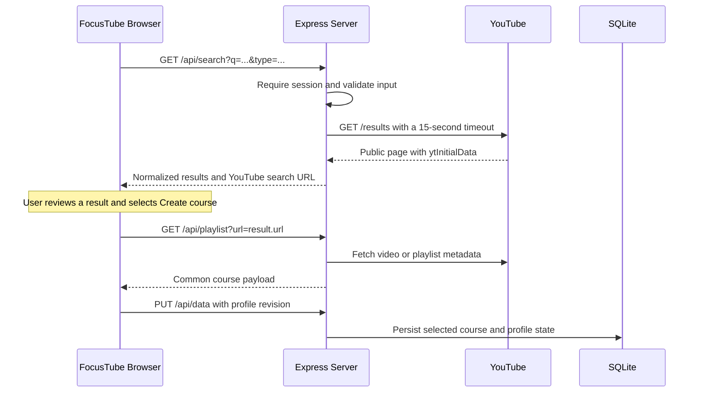

# YouTube Search and Course Creation

Find public YouTube videos and playlists by keyword, review the results, and add a matching item to your FocusTube library as a course. A video becomes a one-video course; a playlist becomes a course containing its available videos.

No YouTube Data API key, YouTube account connection, or additional dependency is required. FocusTube reads public YouTube search pages. Result availability depends on YouTube and the server's network access.

## Start Here

Follow the [quick start](../README.md#quick-start) to run FocusTube, then sign in or choose **Continue as guest**. Both account types can search and save courses.

1. On the library page, enter a topic such as `python programming`, `SQL window functions`, or `React testing`.
2. The **All**, **Videos**, **Playlists**, and **Courses** controls appear once keyword input is non-empty. Choose a result type to search, or select **Search** or press Enter. Typing alone does not issue a request.
3. Review the title, creator, description snippet or lesson previews, and available duration or video count.
4. Select **Create course** on a matching result. FocusTube fetches its current metadata and adds the course to your library while leaving the search results open.
5. The result changes to **In library** with an **Open course** button. Open it to start learning, or continue adding other results.

Result titles and thumbnails open the original video or playlist in a new tab. **Open on YouTube**, above the results, opens the current search with the same query refinement and type filter. The back-arrow control labeled **Back to library** clears the search results and input.

Empty or whitespace-only input hides the result-type controls. Clearing the input also cancels an in-flight search so a late response cannot restore old results. These controls are separate from the saved library's status and Bookmarked filters, which are not reset when YouTube search is cleared.

FocusTube does not automatically decide whether a result exactly matches your description. Review the content before adding it; search snippets can be incomplete.

## Choose a Filter

| Filter | Behavior | Typical use |
| --- | --- | --- |
| All | Searches the entered keyword and shows supported video and playlist results. | Explore a topic across formats. |
| Videos | Applies YouTube's video type filter and includes only video results. | Find a single tutorial, lecture, or long-form video. |
| Playlists | Applies YouTube's playlist type filter and includes only playlist results. | Find an ordered series of lessons. |
| Courses | Adds `full course` unless the query already contains the standalone word `course`, ignoring case. Results can be videos or playlists. | Find course-focused learning material. |

For example, `python` with **Courses** searches YouTube for `python full course`. `Python course` remains unchanged.

The **Courses** filter is a query refinement, not an official course-only search filter. A **Course** label on a result comes from YouTube's course metadata. The label does not guarantee completeness, quality, certification, or an exact match. A full-course video can still display **Video**, and a course-labeled playlist remains a playlist for import purposes.

## Paste a Link Instead

The same input also supports direct import. Recognized link input changes the submit button to **Create course** and hides the keyword filters. A successful direct import opens the course immediately.

| Input | Behavior |
| --- | --- |
| `https://www.youtube.com/watch?v=VIDEO_ID` | Import a single-video course. |
| `https://youtu.be/VIDEO_ID` or `youtu.be/VIDEO_ID` | Import a single-video course; the short link need not include a scheme. |
| `https://www.youtube.com/playlist?list=PLAYLIST_ID` | Import the playlist's available videos. |
| Supported Shorts, live, or embed URL | Import the linked video. |
| A recognized raw playlist ID | Import that playlist directly. |
| Plain text, including an eleven-character raw video ID | Perform a keyword search. Use the full video URL for immediate import. |

`VIDEO_ID` and `PLAYLIST_ID` above are placeholders. For raw playlist IDs, the home input recognizes the prefixes `PL`, `UU`, `FL`, `OL`, and `RD` followed by at least five letters, digits, underscores, or hyphens. `RD` identifies an auto-generated Mix and is rejected by the importer; a Mix URL containing a valid video ID falls back to that video.

For a watch URL containing both a video ID and a real playlist ID, the playlist takes precedence. Use a watch URL without `list=` to import only that video. Search results already use canonical video or playlist URLs, so selecting a video result does not accidentally import its surrounding playlist.

Other HTTP or HTTPS URLs are sent to the link importer and rejected if they are not supported YouTube links. A URL is not used as a keyword search.

## What Gets Saved

- Browsing results does not create courses. Only an explicit **Create course** action adds an item.
- Search queries and results are transient frontend state, not a saved search history in the profile. Clearing the search, reloading, or resetting the session removes them.
- Newer searches cancel older client requests. A late response cannot replace a newer search result set.
- Course imports are guarded against a response from an earlier signed-in session being applied to the current profile.
- A result already in the library opens its saved course instead of adding a duplicate.
- Re-importing a saved course by URL refreshes metadata while preserving completion, playback positions, speed, pin state, and its original added time.
- Imported courses use the existing debounced, revisioned profile save flow. If saving fails, the app reports the error; wait for a successful sync before leaving the page.

The count shown in a search result is YouTube's advertised count. The imported course contains the videos the metadata importer can retrieve, excluding private, deleted, or otherwise unplayable entries. The two counts can differ.

## API Reference

### Request

```http
GET /api/search?q=python&type=course
```

An authenticated FocusTube account or guest session is required. Same-origin requests from the signed-in app use its HttpOnly session cookie automatically. No YouTube credential is required.

| Parameter | Required | Accepted values |
| --- | --- | --- |
| `q` | Yes | A string containing 1-200 characters after trimming leading and trailing whitespace. |
| `type` | No | `all` (default), `video`, `playlist`, or `course`. Values are case-sensitive. |

The server validates the trimmed query length before collapsing repeated whitespace into single spaces. It requests English-language results (`hl=en`).

Run this example in the browser console of a signed-in FocusTube page:

```js
const parameters = new URLSearchParams({ q: 'python', type: 'course' });
const response = await fetch('/api/search?' + parameters, {
  credentials: 'same-origin',
});
const payload = await response.json();
if (!response.ok) throw new Error(payload.error);
console.table(payload.results);
```

This is a read-only search. It does not add any result to the library.

### Successful Response

The following is an illustrative response, not a live YouTube result:

```json
{
  "query": "python",
  "type": "course",
  "youtubeUrl": "https://www.youtube.com/results?search_query=python+full+course&hl=en",
  "results": [
    {
      "id": "abcdefghijk",
      "type": "video",
      "isCourse": false,
      "title": "Python fundamentals",
      "author": "Example instructor",
      "description": "An introductory Python lesson.",
      "thumbnail": "https://i.ytimg.com/vi/abcdefghijk/mqdefault.jpg",
      "duration": "12:00",
      "videoCount": 1,
      "metadata": "",
      "url": "https://www.youtube.com/watch?v=abcdefghijk"
    }
  ]
}
```

The top-level `query` is the normalized user query, not the expanded course query. `youtubeUrl` contains the actual YouTube search URL, including any course refinement or video/playlist type filter. `results` contains at most 24 supported items from the first search page, deduplicated by type and ID in encounter order.

| Result field | Meaning |
| --- | --- |
| `id` | Validated YouTube video or playlist ID. |
| `type` | Real import type: `video` or `playlist`, even when the requested filter is `course`. |
| `isCourse` | Whether the supported renderer exposes YouTube course metadata. |
| `title` | Result title, limited to 500 characters. |
| `author` | Creator name, limited to 200 characters; can be empty. |
| `description` | Available snippet or lesson previews, limited to 1,200 characters; can be empty. Not necessarily the full description. |
| `thumbnail` | Canonical HTTPS image URL on `i.ytimg.com`, or an empty string if no supported thumbnail is found. |
| `duration` | Video duration label when available, such as `12:00` or `2:05:10`; otherwise an empty string. |
| `videoCount` | `1` for a video; advertised playlist or lesson count, or `null` when unavailable. |
| `metadata` | Available view-count and publication text from supported classic video renderers, or an empty string. |
| `url` | Canonical YouTube watch or playlist URL suitable for the existing metadata importer. |

### Errors and Limits

Errors use a JSON body such as:

```json
{
  "error": "Enter a search term between 1 and 200 characters."
}
```

| Status | Meaning |
| --- | --- |
| `200` with `results: []` | A recognized search page contained no supported results. This is not an upstream failure. |
| `400` | Missing or invalid query, array/object query input, excessive length, or unsupported type. |
| `401` | No valid FocusTube session. Sign in or start a guest session. |
| `502` | YouTube request failed, redirected, returned an unsuccessful status, or returned an unsupported page structure. |
| `504` | The upstream request exceeded its 15-second timeout. |

The endpoint sends `Cache-Control: no-store`. It has no pagination or continuation parameter; use **Open on YouTube** for more results. Channels, ads, Mixes, unsupported renderer types, and nested playlist preview videos are not imported as search results. Search results do not guarantee that a video can be played or embedded.

## Implementation Flow



The search endpoint only reads metadata. `/api/playlist` resolves an item but does not itself save it. The frontend's existing course import and profile persistence flow performs the library update; no search-specific database schema is needed.

| Source | Responsibility |
| --- | --- |
| [../youtube-search.js](../youtube-search.js) | Query validation, type filters, classic and modern renderer parsing, safe URLs, result bounds, and deduplication. |
| [../server.js](../server.js) | Authenticated search route, upstream request, initial JSON extraction, timeout, and HTTP error mapping. |
| [../public/app.js](../public/app.js) | Link detection, search cancellation, result rendering, import actions, and session-aware state updates. |
| [../public/index.html](../public/index.html) | Search form, accessible filter controls, results region, and recovery actions. |
| [../public/styles.css](../public/styles.css) | Responsive result rows, thumbnails, filters, and library toolbar layout. |
| [../test/youtube-search.test.js](../test/youtube-search.test.js) | Deterministic request and parser regression cases. |
| [../Dockerfile](../Dockerfile) | Explicitly includes the search parser in the application image. |

The parser supports `videoRenderer`, `playlistRenderer`, and compatible `lockupViewModel` entries directly inside primary search sections. It intentionally does not recursively collect nested preview or advertisement results. Source URLs are reconstructed from validated IDs, thumbnails are restricted to YouTube's image host, and the frontend renders upstream text as text rather than HTML.

## Troubleshooting

| Symptom | What to check |
| --- | --- |
| Search is unavailable or times out | Retry once, check the server's outbound access to YouTube, or use **Open on YouTube**. Consent pages, redirects, rate limits, and network restrictions can block the server's request. |
| No results appear | Try a broader keyword or a different type filter. Only supported first-page results are shown. Compare with the original search using **Open on YouTube**. |
| Results appear in YouTube but not FocusTube | YouTube may have changed its renderer structure. Compare the public page payload with supported fixtures before changing the parser. |
| A result cannot be added | The video or playlist may have become private, empty, deleted, or restricted. Use the error shown on that result; try the original URL independently. |
| A saved video cannot play | The creator or YouTube may restrict embedding, age, or region. Search discovery and playback eligibility are separate. |
| A keyword is treated as a playlist ID | It may match a recognized raw playlist prefix and character pattern. Use a more descriptive multi-word keyword. |
| A raw video ID starts a search | This is intentional to avoid confusing eleven-character keywords with video IDs. Paste its full YouTube watch URL instead. |
| The running Docker app has no search controls | Rebuild the image using the same Compose setup used to start that instance; restart alone does not copy new code into an existing image. See the [Docker instructions](../README.md#docker-compose). |

YouTube's public page format is not a stable API. Direct link import uses a separate metadata path and can still work when search parsing is unavailable, but it also depends on YouTube being reachable.

## Contributor Verification

From the repository root:

```bash
npm test
node --check youtube-search.js
node --check server.js
node --check public/app.js
```

The search suite uses Node's built-in test runner and requires no network access. It covers query validation and encoding, type filtering, classic and modern renderers, course labels, video and lesson counts, canonical URLs, deduplication, excluded items, output bounds, and empty versus unsupported pages.

After changes to the parser or search UI, use an isolated guest profile for these live checks. This checklist describes verification to perform, not guarantees of current upstream availability:

1. Search a multi-word keyword and change each filter. Confirm the Videos and Playlists results have the correct import types, and Courses uses the documented query refinement.
2. Compare the fallback YouTube URL with the entered query and filter.
3. Create one video course and one playlist course. Confirm the results stay open and both items show **In library** and **Open course**.
4. Reload after the profile save succeeds and confirm both courses remain. Mark a lesson complete, re-import its course by URL, and confirm completion is retained.
5. Exercise an empty result set, an upstream failure, and retry recovery. Confirm a delayed earlier search cannot replace newer results.
6. Check keyboard access, long result titles, thumbnails, and controls at desktop, tablet, and 375px mobile widths. There should be no horizontal overflow.
7. Confirm unsigned-in API requests return `401` and invalid queries or type filters return `400`.

When adding support for a new YouTube renderer, add a minimal sanitized fixture to the existing tests. Do not include cookies, credentials, tracking payloads, or a complete raw search page in fixtures.